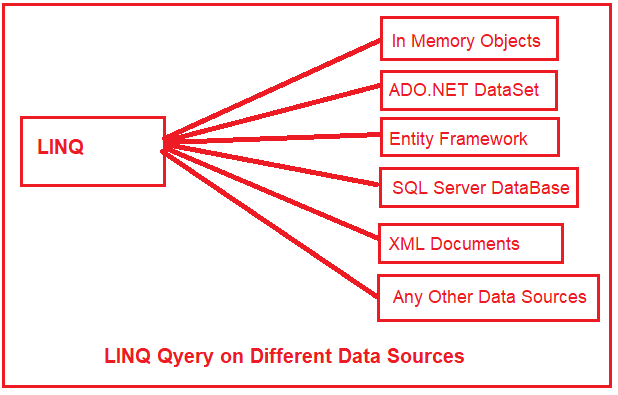
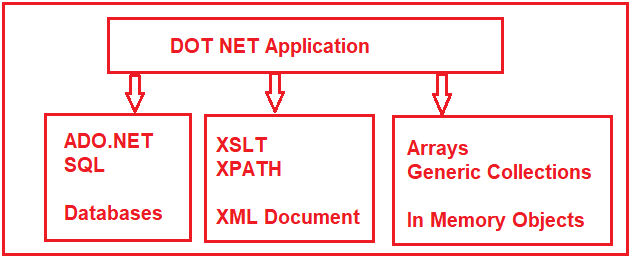
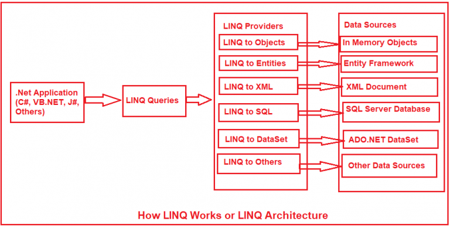

# Linq 아키텍처
이 기사에서는 LINQ의 아키텍처에 대해 논의할 것입니다. LINQ라는 용어는 Language Integrated Query를 의미하며 LINK(링크)로 발음됩니다. 요즘 LINQ 사용이 급격히 증가하고 있습니다. 따라서 개발자는 Linq와 해당 아키텍처를 이해해야 합니다. 이 기사를 마치면 다음 요점들을 매우 잘 이해하게 될 것입니다.

1. LINQ란 무엇인가?
2. 왜 LINQ를 배워야 할까?
3. LINQ 작동방식
4. LINQ Providers란 무엇인가?
5. LINQ 사용의 이점.
6. LINQ 사용의 단점.

## <font color='dodgerblue' size="6">1) LINQ란 무엇인가?</font>
LINQ(Language Integrated Query)는 언어의 일부이지만 완전한 언어는 아닙니다. Microsoft에서 .NET Framework 3.5 및 C# 3.0과 함께 도입했으며 **System.Linq** 네임스페이스에서 사용할 수 있습니다.

LINQ는 다양한 데이터 소스의 데이터를 쿼리할 수 있는 공통 쿼리 구문을 제공합니다. 즉, 단일 쿼리를 사용하여 SQL Server 데이터베이스, XML 문서, ADO.NET Datasets 및 Collections, Generics 등과 같은 기타 메모리 내 개체와 같은 다양한 데이터 소스에서 데이터를 가져오거나 설정할 수 있습니다.

   

## <font color='dodgerblue' size="6">2) 왜 LINQ를 배워야 할까?</font>
예제를 통해 LINQ를 배워야 하는 이유를 알아보겠습니다.

.NET 응용 프로그램을 개발 중이고 해당 응용 프로그램에 다른 데이터 소스의 데이터가 필요하다고 가정합니다. 예를 들어 
1. 응용 프로그램에는 SQL Server 데이터베이스의 데이터가 필요합니다. 따라서 개발자가 SQL Server 데이터베이스의 데이터에 액세스하려면 ADO.NET 및 SQL Server 관련 구문을 이해해야 합니다. 데이터베이스가 Oracle인 경우 Oracle 데이터베이스와 관련된 SQL 구문을 배워야 합니다. 
2. 응용 프로그램에는 XML 문서의 데이터도 필요합니다. 따라서 개발자는 XML 문서로 작업하기 위해 XPath 및 XSLT 쿼리를 이해해야 합니다. 
3. 애플리케이션은 또한 List<Products>, List<Orders> 등과 같은 메모리의 데이터(객체)를 조작해야 합니다. 따라서 개발자는 메모리 내 객체로 작업하는 방법도 이해해야 합니다.


 

LINQ는 다양한 데이터 소스로 작업할 수 있지만 표준을 사용하거나 통합 코딩 스타일이라고 할 수 있는 균일한 프로그래밍 모델 (즉, 공통 쿼리 구문)을 제공합니다. 결과적으로 다른 데이터 소스를 쿼리하기 위해 다른 구문을 배울 필요가 없습니다.

```note
C# 또는 VB.NET 개발자(웹, Windows, 모바일, 콘솔 등)라면 LINQ를 배워야 합니다.
```

## <font color='dodgerblue' size="6">3) LINQ는 어떻게 작동합니까?</font>


   


위의 다이어그램과 같이 C#, VB.NET, J# 등과 같은 .NET 지원 프로그래밍 언어를 사용하여 LINQ 쿼리를 작성할 수 있습니다.

LINQ 공급자는 LINQ 쿼리와 실제 데이터 원본 사이에 있는 소프트웨어 구성 요소입니다. Linq 공급자는 LINQ 쿼리를 기본 데이터 원본에서 이해할 수 있는 형식으로 변환합니다. 예를 들어 LINQ to SQL 공급자는 LINQ 쿼리를 SQL Server 데이터베이스에서 이해할 수 있는 SQL 문으로 변환합니다. 마찬가지로 LINQ to XML 공급자는 쿼리를 XML 문서에서 이해할 수 있는 형식으로 변환합니다

## <font color='dodgerblue' size="6">4) LINQ 공급자란 무엇입니까?</font>

LINQ 공급자는 특정 데이터 원본에 대한 IQueryProvider 및 IQueryable 인터페이스를 구현하는 소프트웨어입니다. 즉, 해당 데이터 소스에 대해 LINQ 쿼리를 작성할 수 있습니다. 사용자 지정 LINQ 공급자를 만들려면 IQueryProvider 및 IQueryable 인터페이스를 구현해야 합니다. LINQ 공급자가 없으면 LINQ 쿼리를 실행할 수 없습니다.

일부 LINQ 공급자와 내부적으로 작동하는 방식에 대해 논의해 보겠습니다.

1. LINQ to Objects:
LINQ to Objects 공급자를 사용하면 배열, 컬렉션 및 제네릭 형식과 같은 메모리 내 개체를 쿼리할 수 있습니다. 최소한의 코드로 필터링, 순서 지정 및 그룹화와 같은 많은 유용한 작업을 수행하는 데 사용할 수 있는 많은 내장 기능을 제공합니다.

2. LINQ to SQL로(DLINQ):
LINQ to SQL 공급자는 SQL Server 데이터베이스에서만 작동하도록 설계되었습니다. 이것은 SQL Server 데이터베이스와 관련 .NET 클래스 간의 일대일 매핑을 허용하는 ORM(개체 관계형 매핑) 프레임워크로 간주할 수 있습니다. 이러한 .NET 클래스는 데이터베이스 테이블을 기반으로 마법사에 의해 자동으로 생성됩니다.

3. LINQ to Dataset:
LINQ to Datasets 공급자는 Dataset에 캐시된 데이터를 쉽고 빠르게 쿼리할 수 있는 유연성을 제공합니다. 또한 LINQ 구문을 사용하여 데이터 집합에서 검색, 필터링, 정렬 등과 ​​같은 추가 데이터 조작 작업을 수행할 수 있습니다.

4. LINQ to Entity:
LINQ to Entities 공급자는 LINQ to SQL처럼 보입니다. 이는 데이터베이스 테이블과 .NET 클래스 간에 일대일, 일대다 및 다대다 매핑을 허용하는 ORM(개체 관계형 매핑) 프레임워크이기도 합니다. 기억해야 할 점은 SQL Server, Oracle, MySQL, DB2 등과 같은 모든 데이터베이스를 쿼리하는 데 사용된다는 것입니다. 이제 ADO.NET Entity Framework라고 합니다.

5. LINQ to XML(XLINQ):
LINQ to XML 공급자는 기본적으로 XML 문서와 함께 작동하도록 설계되었습니다. 따라서 XML 문서에 대한 변경 사항 쿼리 또는 읽기, 조작, 수정 및 저장과 같은 XML 데이터 소스에 대해 다양한 작업을 수행할 수 있습니다. System.Xml.Linq 네임스페이스 에는 LINQ to XML에 필요한 클래스가 포함되어 있습니다.

6. 병렬 LINQ(PLINQ):
병렬 LINQ 또는 PLINQ는 .NET Framework 4.0과 함께 도입되었습니다. 이 공급자는 LINQ to Objects의 병렬 구현 유연성을 제공합니다. PLINQ는 작업 병렬 라이브러리를 대상으로 하는 병렬 프로그래밍의 기능을 사용하는 방식으로 설계되었습니다. 따라서 LINQ 쿼리를 다른 프로세서에서 동시에 또는 병렬로 실행하려면 PLINQ를 사용하여 쿼리를 작성해야 합니다.

## <font color='dodgerblue' size="6">5) LINQ 사용 장점</font>

1. 다른 데이터 소스를 쿼리하는 공통 쿼리 구문을 제공하므로 다른 데이터 소스에 대한 새로운 쿼리 언어 구문을 배울 필요가 없습니다.
2. 기존 접근 방식에 비해 코드가 적습니다. 즉, LINQ를 사용하면 코드를 최소화할 수 있습니다.
3. Visual Studio에서 컴파일 시간 오류 검사 및 인텔리전스 지원을 제공합니다. 이 강력한 기능은 런타임 오류를 방지하는 데 도움이 됩니다.
4. LINQ는 필터링, 순서 지정, 그룹화 등과 같은 다양한 작업을 수행하는 데 사용할 수 있는 내장된 메서드를 많이 제공하여 작업을 쉽게 만듭니다.
5. 해당 쿼리를 재사용할 수 있습니다.

## <font color='dodgerblue' size="6">6) LINQ 사용 단점</font>
LINQ 사용의 단점은 다음과 같습니다.

1. LINQ를 사용하면 SQL과 같은 복잡한 쿼리를 작성하기가 매우 어렵습니다.
2. LINQ는 저장 프로시저에 대한 캐시된 실행 계획과 같은 SQL 기능을 최대한 활용하지 않습니다.
3. 쿼리를 제대로 작성하지 않으면 최악의 성능을 얻게 됩니다.
4. 쿼리를 약간 변경하면 응용 프로그램을 다시 컴파일하고 dll을 서버에 다시 배포해야 합니다.

다음 기사에서는 C#.NET을 사용하여 LINQ 쿼리를 작성 하는 다양한 방법에 대해 설명하겠습니다 . 여기, 이 기사에서는 Linq 아키텍처를 설명하려고 하며 이 Linq 아키텍처 기사를 즐기시기 바랍니다.