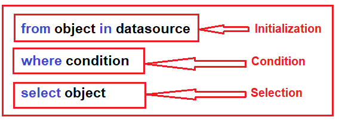
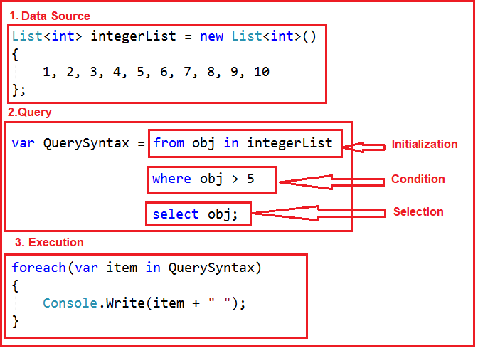
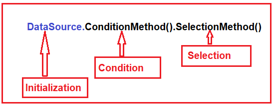
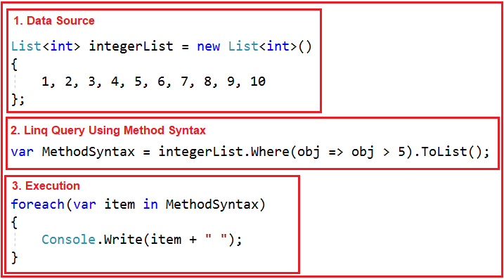
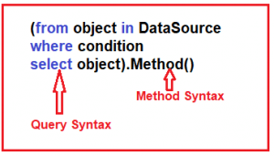
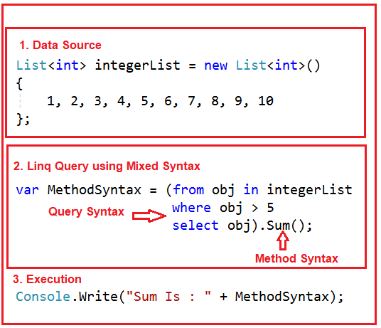

# Linq 쿼리를 작성하는 다양한 방법
이 기사에서는 예제와 함께 LINQ 쿼리, 즉 Linq 쿼리 구문과 Linq 메서드 구문 을 작성하는 다양한 방법에 대해 논의할 것입니다. LINQ의 아키텍처, 즉 LINQ가 작동하는 방식 에 대해 논의한 이전 기사를 읽어보십시오 . 이 기사에서 우리는 다음 포인터에 대해 논의할 것입니다.

1. LINQ 쿼리를 작성하는 데 필요한 다른 사항은 무엇입니까?
2. 쿼리란 무엇입니까?
3. LINQ 쿼리를 작성하는 다양한 방법은 무엇입니까?
4. 메서드와 쿼리 구문을 모두 사용하는 예.

## <font color='dodgerblue' size="6">1) LINQ 쿼리를 작성하는 데 필요한 다양한 사항은 무엇입니까?</font>
LINQ 쿼리를 작성하려면 다음 세 가지가 필요합니다.

1. 데이터 소스(메모리 내 개체, SQL, XML)
2. 쿼리
3. 쿼리 실행

## <font color='dodgerblue' size="6">2) 쿼리란 무엇입니까?</font>
쿼리는 특정 작업(예: CRUD 작업)을 수행하기 위해 데이터 소스(예: 인메모리 개체, SQL, XML 등)에 적용한 다음 해당 쿼리의 출력 형태를 알려주는 명령 집합에 불과합니다. . 즉, 쿼리는 출력 내용에 대한 책임이 아니라 출력 형태에 대한 책임이 있습니다. 이는 특정 값, 특정 목록 또는 개체를 반환할지 여부에 관계없이 해당 쿼리에서 반환되는 내용을 의미합니다.

각 쿼리는 세 가지의 조합입니다. 그것들은 다음과 같습니다:

1. 초기화(특정 데이터 소스로 작업하기 위해)
2. 조건(where, 필터, 정렬 조건)
3. 선택(단일 선택, 그룹 선택 또는 결합)


## <font color='dodgerblue' size="6">3) LINQ 쿼리를 작성하는 다양한 방법은 무엇입니까?</font>

세 가지 다른 방법으로 LINQ 쿼리를 작성할 수 있습니다. 그들은 다음과 같습니다

1. 쿼리 구문
2. 메서드 구문
3. 혼합 구문(쿼리 + 메서드)

참고: 성능 관점에서 보면 위의 세 가지 접근 방식 간에 차이가 없습니다. 따라서 사용해야하는 것은 전적으로 개인 취향에 달려 있습니다. 그러나 염두에 두어야 할 점은 백그라운드에서 쿼리 구문을 사용하여 작성된 LINQ 쿼리가 컴파일되기 전에 람다 식으로 변환된다는 것입니다. 

- ### A. LINQ 쿼리 구문
    이것은 쉽고 읽기 쉬운 형식으로 복잡한 LINQ 쿼리를 작성하는 쉬운 방법 중 하나입니다. 이 쿼리 유형의 구문은 SQL 쿼리와 매우 유사합니다. SQL 쿼리에 익숙하다면 이 쿼리 구문을 사용하여 LINQ 쿼리를 작성하는 것이 쉬울 것입니다. 구문은 아래에 나와 있습니다.

       

    ```cs
    using System;
    using System.Collections.Generic;
    using System.Linq;

    namespace LINQDemo
    {
        class Program
        {
            static void Main(string[] args)
            {
                //Data Source
                List<int> integerList = new List<int>()
                {
                    1, 2, 3, 4, 5, 6, 7, 8, 9, 10
                };

                //LINQ Query using Query Syntax
                var QuerySyntax = from obj in integerList
                                where obj > 5
                                select obj;

                //Execution
                foreach(var item in QuerySyntax)
                {
                    Console.Write(item + " ");
                }

                Console.ReadKey();
            }
        }
    }
    ```

    이제 응용 프로그램을 실행하면 콘솔 창에 예상대로 6 7 8 9 10 값이 표시됩니다. 위의 코드에서 무엇을 했는지 이해합시다.

       

- ### B. LINQ 메쏘드 구문
    메서드 구문은 이제 LINQ 쿼리를 작성하는 데 가장 널리 사용됩니다. 람다 식을 사용하여 쿼리 조건을 정의합니다. 메서드 구문은 특정 데이터 소스에 대한 읽기-쓰기 작업을 수행하는 간단한 쿼리를 작성하기 쉽습니다. 그러나 복잡한 쿼리의 경우 메서드 구문은 쿼리 구문에 비해 작성하기가 약간 어렵습니다.

    이 접근 방식에서는 여러 메서드를 점(.)으로 결합하여 LINQ 쿼리를 작성합니다. 구문은 다음  과 같습니다.

       


    ```cs
    using System;
    using System.Collections.Generic;
    using System.Linq;

    namespace LINQDemo
    {
        class Program
        {
            static void Main(string[] args)
            {
                //Data Source
                List<int> integerList = new List<int>()
                {
                    1, 2, 3, 4, 5, 6, 7, 8, 9, 10
                };

                //LINQ Query using Method Syntax
                var MethodSyntax = integerList.Where(obj => obj > 5).ToList();

                //Execution
                foreach(var item in MethodSyntax)
                {
                    Console.Write(item + " ");
                }
                
                Console.ReadKey();
            }
        }
    }
    ```
    이제 응용 프로그램을 실행하면 예상한 대로 출력이 표시됩니다. 메서드 구문을 이해하기 위해 다음 다이어그램을 살펴보겠습니다.

       

- ### C. LINQ 메쏘드 구문
    이것은 쿼리 및 메서드 구문의 조합입니다. 구문은 아래에 나와 있습니다.

       

    Query Syntax, Method Syntax, Mixed Syntax 사용법을 예제와 함께 알아보자.

    예: 정수 목록이 있고 5보다 큰 모든 정수를 반환하는 LINQ 쿼리를 작성해야 합니다. 콘솔 응용 프로그램을 만들 것입니다.


    요구 사항을 변경해 보겠습니다. 먼저 값이 5보다 큰 목록을 필터링한 다음 합계를 계산해야 합니다.

    ```cs
    using System;
    using System.Collections.Generic;
    using System.Linq;

    namespace LINQDemo
    {
        class Program
        {
            static void Main(string[] args)
            {
                //Data Source
                List<int> integerList = new List<int>()
                {
                    1, 2, 3, 4, 5, 6, 7, 8, 9, 10
                };

                //LINQ Query using Mixed Syntax
                var MethodSyntax = (from obj in integerList
                                    where obj > 5
                                    select obj).Sum();

                //Execution
                Console.Write("Sum Is : " + MethodSyntax);
                
                Console.ReadKey();
            }
        }
    }
    ```
    이제 응용 프로그램을 실행하면 예상대로 출력이 표시됩니다. 다음 이미지를 보고 위의 코드에서 무엇을 했는지 이해합시다

       

    다음 기사에서는 예제 를 통해 LINQ의 IEnumerable 및 IQuerable에 대해 설명하겠습니다. 이 기사를 즐기고 Linq 쿼리 구문과 Linq 메서드 구문을 이해하시기 바랍니다.