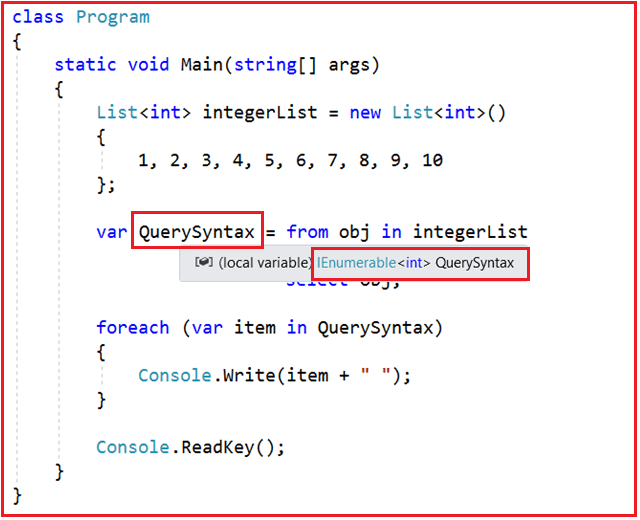
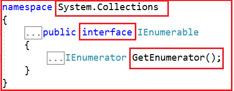
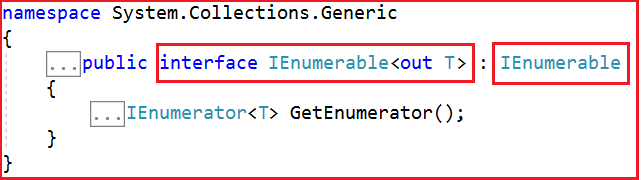
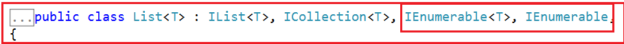
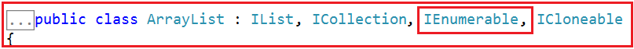
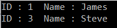
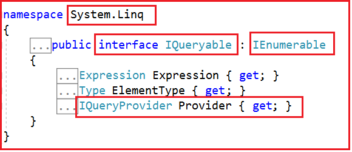
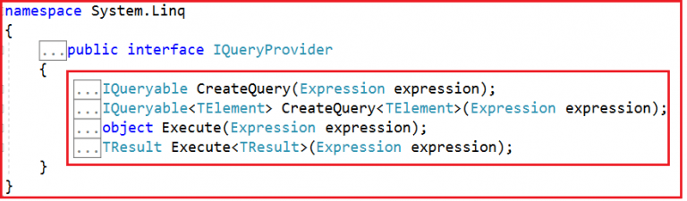
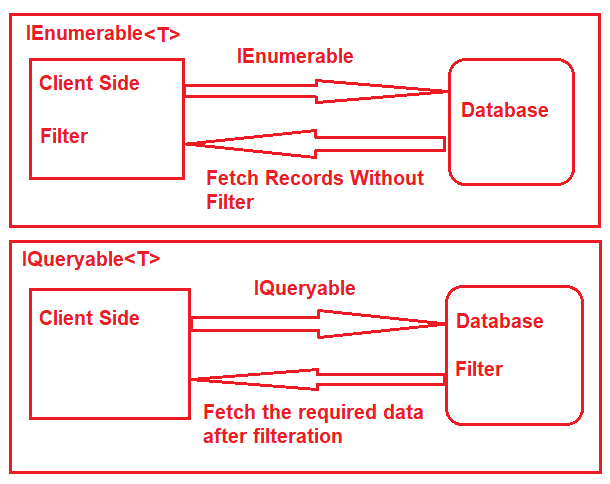
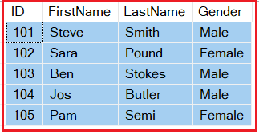

# C#의 IEnumberable 및 IQueryable
이 기사에서는 예제를 사용 하여 C#에서 IEnumerable 및 IQueryable에 대해 설명 합니다. 예제를 사용하여 LINQ 쿼리를 작성 하는 다양한 방법에 대해 논의한 이전 기사를 읽어보십시오 . 이 기사에서는 다음 개념에 대해 자세히 설명합니다.

1. C#에서 IEnumerable이란 무엇입니까?
2. C#에서 IQueryable이란 무엇입니까?
3. IEnumerable 및 IQueryable의 예

이전 기사에서는 LINQ 쿼리 구문을 사용하여 다음 프로그램을 작성했습니다.

   

위의 예에서는 **var** 키워드를 사용하여 변수를 만들고 LINQ 쿼리 결과를 저장합니다. 그럼 변수의 유형이 무엇인지 확인해 볼까요? 이를 확인하기 위해 QuerySynntax 변수에 포인터를 올려 놓으면 유형이 제네릭 유형인 **IEnumerable<int>** 임을 알 수 있습니다. 따라서 IEnumerable이 무엇인지 이해하는 것이 중요합니다.

따라서 위의 예에서  **var** 키워드를 작성하는 대신 **IEnumerable<int>** 도 작성할 수 있으며 아래와 같이 예상대로 작동해야 합니다.

```cs
using System;
using System.Collections.Generic;
using System.Linq;

namespace LINQDemo
{
    class Program
    {
        static void Main(string[] args)
        {
            List<int> integerList = new List<int>()
            {
                1, 2, 3, 4, 5, 6, 7, 8, 9, 10
            };

            IEnumerable<int> QuerySyntax = from obj in integerList
                              where obj > 5
                              select obj;
            
            foreach (var item in QuerySyntax)
            {
                Console.Write(item + " ");
            }

            Console.ReadKey();
        }
    }
}
```

이것을 염두에 두고 IEnumerable이 무엇인지 이해합시다.


## <font color='dodgerblue' size="6">1) C#에서 IEnumerable, IQueryable 정의</font>

- ### A. IEnumerable
    먼저 아래에 제공된 IEnumerable의 정의를 살펴보겠습니다.

     

    위 이미지에서 볼 수 있듯이 **IEnumerable** 은 **System.Collection** 네임스페이스에서 사용할 수 있는 인터페이스입니다. IEnumerable 인터페이스는 일종의 반복 디자인 패턴입니다. 이는 IEnumerable 유형의 컬렉션을 반복할 수 있음을 의미합니다. 위의 정의에서 볼 수 있듯이 IEnumerable 인터페이스에는 컬렉션을 반복 하는 **IEnumerator** 를 반환하는 **GetEnumerator** 라는 메서드가 하나 있습니다.

    **IEnumerable** 인터페이스에는 **IEnumerable<T>** 와 같은 자식 제네릭 인터페이스도 있습니다. **IEnumerable<T>** 인터페이스 의 정의를 살펴보겠습니다 .

      

    기억해야 할 가장 중요한 점은 C#에서 모든 컬렉션 클래스(제네릭 및 비제네릭)가 IEnumerable 인터페이스를 구현한다는 것입니다. 아래 그림과 같이 List<T> 제네릭 컬렉션 클래스의 정의를 방문하여 이를 증명해보자.

      

    이제 제네릭이 아닌 컬렉션 클래스인 ArrayList 컬렉션의 정의를 살펴보겠습니다.

      

    참고: IEnumerable 또는 IEnumerable<T> 인터페이스는 메모리 내 데이터 개체에만 사용해야 합니다. 그 이유를 다음 기사에서 살펴볼 것입니다.

    **복잡한 유형의 C# IEnumerable을 이해하는 예를 살펴보겠습니다.**
    ```cs
    using System;
    using System.Collections.Generic;
    using System.Linq;

    namespace LINQDemo
    {
        class Program
        {
            static void Main(string[] args)
            {
                List<Student> studentList = new List<Student>()
                {
                    new Student(){ID = 1, Name = "James", Gender = "Male"},
                    new Student(){ID = 2, Name = "Sara", Gender = "Female"},
                    new Student(){ID = 3, Name = "Steve", Gender = "Male"},
                    new Student(){ID = 4, Name = "Pam", Gender = "Female"}
                };

                //Linq Query to Fetch all students with Gender Male
                IEnumerable<Student> QuerySyntax = from std in studentList
                                                where std.Gender == "Male"
                                                select std;
                //Iterate through the collection
                foreach (var student in QuerySyntax)
                {
                    Console.WriteLine( $"ID : {student.ID}  Name : {student.Name}");
                }

                Console.ReadKey();
            }
        }

        public class Student
        {
            public int ID { get; set; }
            public string Name { get; set; }
            public string Gender { get; set; }
        }
    }
    ```

    프로그램을 실행하면 아래 이미지와 같이 예상대로 결과가 표시됩니다

      


- ### B. IQueryable

    먼저 아래와 같이 IQueryable의 정의를 살펴보겠습니다.

      

    위 이미지에서 볼 수 있듯이 **IQueryable** 은 인터페이스이며 **System.Linq** 네임스페이스에서 사용할 수 있습니다. IQuerable 인터페이스는 IEnumerable 인터페이스의 자식입니다. 따라서 IEnumerable 유형의 변수에 IQuerable을 저장할 수 있습니다. IQuerable 인터페이스에는 **IQueryProvider** 인터페이스 유형 인 **Provider** 라는 속성이 있습니다. IQueryProvider의 정의를 살펴보겠습니다.

      

    **IQueryProvider** 에서 제공하는 메서드는 모든 Linq 공급자를 만드는 데 사용됩니다. 따라서 이것은 **Linq to SQL, Linq to Entities** 등과 같은 다른 데이터 공급자를 위한 최선의 선택입니다. 그 이유는 다음 기사에서 논의할 것입니다.

    **C# IQueryable 인터페이스를 이해하는 예를 살펴보겠습니다.**
    ```cs
    using System;
    using System.Collections.Generic;
    using System.Linq;

    namespace LINQDemo
    {
        class Program
        {
            static void Main(string[] args)
            {
                List<Student> studentList = new List<Student>()
                {
                    new Student(){ID = 1, Name = "James", Gender = "Male"},
                    new Student(){ID = 2, Name = "Sara", Gender = "Female"},
                    new Student(){ID = 3, Name = "Steve", Gender = "Male"},
                    new Student(){ID = 4, Name = "Pam", Gender = "Female"}
                };
                
                //Linq Query to Fetch all students with Gender Male
                IQueryable<Student> MethodSyntax = studentList.AsQueryable()
                                    .Where(std => std.Gender == "Male");
                                                
                //Iterate through the collection
                foreach (var student in MethodSyntax)
                {
                    Console.WriteLine( $"ID : {student.ID}  Name : {student.Name}");
                }

                Console.ReadKey();
            }
        }

        public class Student
        {
            public int ID { get; set; }
            public string Name { get; set; }
            public string Gender { get; set; }
        }
    }
    ```

    이제 응용 프로그램을 실행하면 예상대로 데이터가 표시됩니다. 기억해야 할 점은 IQueryable 유형의 컬렉션을 반환하려면 먼저 위의 예에서와 같이 컬렉션에서 **AsQueryable()** 메서드를 호출해야 한다는 것입니다.

## <font color='dodgerblue' size="6">2) C#에서 IEnumerable과 IQueryable의 차이점</font> 
IEnumerable 및 IQueryable은 데이터 컬렉션을 보유하는 데 사용되며 비즈니스 요구 사항에 따라 필터링, 정렬, 그룹화 등과 같은 데이터 조작 작업을 수행하는 데도 사용됩니다. 이 기사에서는 예제를 통해 IEnumerable과 IQueryable의 차이점을 살펴보겠습니다.

  

**예시:**

여기 이 데모에서는 Entity Framework 데이터베이스 우선 접근 방식을 사용하여 SQL Server 데이터베이스에서 데이터를 검색하는 콘솔 응용 프로그램을 만듭니다. Student 테이블에서 다음 학생 정보를 가져올 것입니다.

  

아래 SQL 스크립트를 사용하여 필요한 테스트 데이터로 학생 테이블을 만들고 채우십시오.

```sql
-- Create the required Student table
CREATE TABLE Student
(
     ID INT PRIMARY KEY,
     FirstName VARCHAR(50),
     LastName VARCHAR(50),
     Gender VARCHAR(50)
)
GO

-- Insert the required test data
INSERT INTO Student VALUES (101, 'Steve', 'Smith', 'Male')
INSERT INTO Student VALUES (102, 'Sara', 'Pound', 'Female')
INSERT INTO Student VALUES (103, 'Ben', 'Stokes', 'Male')
INSERT INTO Student VALUES (104, 'Jos', 'Butler', 'Male')
INSERT INTO Student VALUES (105, 'Pam', 'Semi', 'Female')
GO
```

필요한 테스트 데이터로 학생 테이블을 만든 다음 새 콘솔 응용 프로그램을 만듭니다. 콘솔 응용 프로그램을 만든 다음 ADO.NET 엔터티 데이터 모델 데이터베이스 접근 방식을 추가합니다.

- ### A. IEnumerable 사용
    Program 클래스를 아래와 같이 수정해 보자.

    ```cs
    using System;
    using System.Collections.Generic;
    using System.Linq;

    namespace LINQDemo
    {
        class Program
        {
            static void Main(string[] args)
            {
                StudentDBContext dBContext = new StudentDBContext();
                IEnumerable<Student> listStudents = dBContext.Students.Where(x => x.Gender == "Male");
                listStudents = listStudents.Take(2);

                foreach(var std in listStudents)
                {
                    Console.WriteLine(std.FirstName + " " + std.LastName);
                }

                Console.ReadKey();
            } 
        }
    }
    ```

    여기에서는 IEnumerable을 사용하여 LINQ 쿼리를 만듭니다. SQL 프로파일러를 사용하여 SQL 스크립트를 기록하십시오. 이제 응용 프로그램을 실행하면 다음 SQL 스크립트가 생성되고 실행되는 것을 볼 수 있습니다.

    ```sql
    SELECT 
        [Extent1].[ID] AS [ID], 
        [Extent1].[FirstName] AS [FirstName], 
        [Extent1].[LastName] AS [LastName], 
        [Extent1].[Gender] AS [Gender]
    FROM [dbo].[Student] AS [Extent1]
    WHERE 'Male' = [Extent1].[Gender]
    ```

    위의 SQL Script를 보면 TOP 절이 사용되지 않는다. 따라서 SQL Server에서 메모리 내로 도든 데이터를 가져온 다음 그 이 후 필터링하는 것이다.

- ### B. Queryable 사용
    IQueryable을 사용하기 위해 아래와 같이 Program 클래스를 수정해 보겠습니다.

    ```cs
    using System;
    using System.Linq;

    namespace LINQDemo
    {
        class Program
        {
            static void Main(string[] args)
            {
                StudentDBContext dBContext = new StudentDBContext();
                IQueryable<Student> listStudents = dBContext.Students
                                    .AsQueryable()
                                    .Where(x => x.Gender == "Male");
                listStudents = listStudents.Take(2);

                foreach(var std in listStudents)
                {
                    Console.WriteLine(std.FirstName + " " + std.LastName);
                }

                Console.ReadKey();
            } 
        }
    }
    ```

    응용 프로그램을 실행하면 다음 SQL 스크립트가 생성됩니다.

    ```sql
    SELECT TOP (2) 
        [Extent1].[ID] AS [ID], 
        [Extent1].[FirstName] AS [FirstName], 
        [Extent1].[LastName] AS [LastName], 
        [Extent1].[Gender] AS [Gender]
        FROM [dbo].[Student] AS [Extent1]
        WHERE 'Male' = [Extent1].[Gender]
    ```

    보시다시피 SQL 스크립트에 TOP 절을 포함하여 데이터를 가져온다. 이를 염두에 두고 IEnumerable과 IQueryable의 차이점에 대해 논의해 보겠다.

## <font color='dodgerblue' size="6">3) 차이점 정리</font> 
C#에서 IEnumerable:

1. IEnumerable은 System.Collections 네임스페이스에서 사용할 수 있는 인터페이스입니다.
2. 데이터베이스에서 데이터를 쿼리하는 동안 IEnumerable은 서버 측(즉, 데이터베이스)에서 "select 문"을 실행하고 클라이언트 측 메모리에 데이터를 로드한 다음 검색된 데이터에만 필터를 적용합니다.
3. 따라서 List, Array 등과 같은 메모리 내 컬렉션에서 데이터를 쿼리해야 하는 경우 IEnumerable을 사용해야 합니다.
4. IEnumerable은 주로 LINQ to Object 및 LINQ to XML 쿼리에 사용됩니다.
5. IEnumerable 컬렉션은 정방향 형식입니다. 즉, 앞으로만 이동할 수 있고 뒤로 및 항목 사이에서 이동할 수 없습니다.
6. IEnumerable은 지연된 실행을 지원합니다.
7. 사용자 지정 쿼리를 지원하지 않습니다.
8. IEnumerable은 지연 로딩을 지원하지 않습니다. 따라서 페이징과 같은 시나리오에는 적합하지 않습니다.

C#에서 IQueryable:

1. IQueryable은 System.Linq 네임스페이스에 있는 인터페이스입니다.
2. 데이터베이스에서 데이터를 쿼리하는 동안 IQueryable은 서버 측, 즉 데이터베이스에서 적용된 필터로 "선택 쿼리"를 실행한 다음 데이터를 검색합니다.
3. 따라서 원격 데이터베이스, 서비스 등과 같은 out-memory에서 데이터를 쿼리하려면 IQueryable을 사용해야 합니다.
4. IQueryable은 주로 LINQ to SQL 및 LINQ to Entities 쿼리에 사용됩니다.
5. IQueryable 유형의 컬렉션은 앞으로만 이동할 수 있으며 항목 간에는 뒤로 이동할 수 없습니다.
6. IQueryable은 지연된 실행을 지원합니다.
7. 또한 CreateQuery 및 Executes 메서드를 사용하여 사용자 지정 쿼리를 지원합니다.
8. IQueryable은 지연 로딩을 지원하므로 페이징과 같은 시나리오에 적합합니다.

where 메소드의 정의로 이동하면 아래와 같이 IQueryable 인터페이스의 확장 메소드로 구현된 것을 볼 수 있습니다.


  