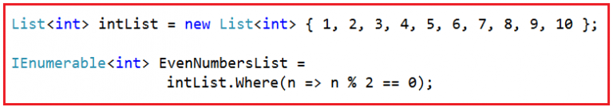
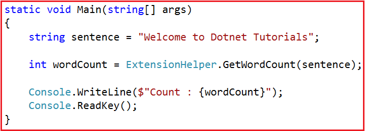
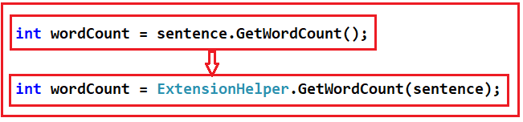

# Linq 확장 메쏘드
이 기사에서는 예제를 사용 하여 C#의 LINQ 확장 메서드에 대해 설명합니다 . C#에서 IEnumerable과 IQueryable의 차이점에 대해 논의한 이 기사로 진행하기 전에 이전 기사를 읽어보십시오 . 이 기사의 끝에서 C#의 다음 세 가지 개념을 이해하게 될 것입니다.

1. C#의 확장 메서드는 무엇입니까?
2. C#에서 확장 메서드를 언제 사용합니까?
3. C#에서 확장 메서드를 구현하는 방법은 무엇입니까?
4. LINQ 확장 방법 이해.


## <font color='dodgerblue' size="6">1) C#의 LINQ 확장 메서드는 무엇입니까?</font>
**select, where** 등과 같은 LINQ의 표준 쿼리  연산자 는 **Enumerable** 클래스 에서 구현됩니다  . 이러한 메서드는 **IEnumerable<T>** 인터페이스 형식의 확장 메서드로 구현됩니다 . 예를 들어 이것을 이해합시다. Main 메서드에 다음 코드가 있습니다.

  

위  **Where()**  메서드는 **List<T>**  클래스에 속하지 않지만 여전히 List<T>  클래스 에 존재하는 것처럼 호출할 수 있다. **List<T>** 개체 를 사용하여 호출할 수 있는 이유를 알아보겠습니다. where 메서드의 정의로 이동하면 다음 정의를 찾을 수 있습니다.

  

서명에서 볼 수 있듯이  Where()  메서드는 IEnumerable<T>  인터페이스 에서 확장 메서드로 구현되며  List<T>  는 IEnumerable<T>  인터페이스를 구현 한다는 것을 알고  있습니다. 이것이 List<T> 개체 를 사용하여 Where() 메서드 를 호출할 수 있는 이유 입니다.

이를 염두에 두고 확장 메서드가 무엇이며 C#에서 어떻게 구현되는지 이해합시다.

- ### A. 확장 방법이란 무엇입니까?

    MSDN에 따르면 확장 메서드를 사용하면 새 파생 형식을 만들거나, 다시 컴파일하거나, 원래 형식을 수정하지 않고도 기존 형식에 메서드를 추가할 수 있습니다. 

    간단히 말해서 확장 메서드는 클래스의 소스 코드를 사용할 수 없거나 권한이 없는 경우 미래에 새 메서드를 추가하여 클래스의 기능을 확장하는 접근 방식으로 사용할 수 있다고 말할 수 있습니다. 클래스를 변경할 때.

    명심해야 할 가장 중요한 점은 확장 메서드는 정적 클래스의 특수한 종류의 정적 메서드이지만 확장 유형의 인스턴스 메서드인 것처럼 호출된다는 것입니다. 


## <font color='dodgerblue' size="6">2) C#에서 확장 메서드를 언제 사용합니까?</font> 
다음 조건 중 하나라도 해당되면 확장 방법을 사용해야 합니다.

1. 기존 유형에 대한 메소드가 필요하고 해당 유형의 소스 코드 소유자가 아닙니다.
2. 기존 유형에 대한 메소드가 필요하고 해당 유형의 소스 코드를 소유하고 있지만 해당 유형은 인터페이스입니다.
3. 기존 유형에 대한 메소드가 필요하고 소스 코드를 소유하고 있으며 해당 유형은 인터페이스가 아니지만 메소드를 추가하면 원하지 않는 결합이 생성됩니다.
4. 그렇지 않으면 실제 유형 자체의 일반적인 방법을 사용해야 합니다.


## <font color='dodgerblue' size="6">3) C#에서 확장 메서드를 구현하는 방법은 무엇입니까?</font> 
예를 들어 이것을 이해합시다. 우리의 요구 사항은 기본 제공 문자열 클래스에 메서드를 추가하려는 것입니다. 이 메서드 를 GetWordCount() 라고 하면 공백으로 구분된 문자열에 있는 단어를 계산합니다.

예를 들어 문자열이 " Welcome to Dotnet Tutorials "이면 단어 수를 4로 반환해야 합니다. 가장 중요한 점은 아래와 같이 String 개체에서 이 메서드를 호출해야 한다는 것입니다.

**int wordCount = 문장.GetWordCount();**

참고: 우리 는 문자열 클래스의 소유자가 아니므로 문자열 클래스에서 직접 GetWordCount() 메서드를 정의할 수 없습니다 . 문자열 클래스 는 .NET 프레임워크가 소유한 System 네임스페이스 에 속합니다 . 따라서 이를 달성하기 위한 대체 솔루션은 아래와 같이 래퍼 클래스를 작성하는 것입니다.

```cs
public class ExtensionHelper
{
    public static int GetWordCount(string str)
    {
        if (!String.IsNullOrEmpty(str))
            return str.Split(' ').Length;
        return 0;
    }
}
```

의 **ExtensionHelper** Wrapper 클래스는 잘 작동하지만 문제는 여기에서 아래와 같이 문자열 개체를 사용하여 GetWordCount() 메서드를 호출할 수 없다는 것입니다.

**int wordCount = 문장.GetWordCount();**

대신 아래와 같이 GetWordCount()  메서드를 호출해야 합니다.

**int wordCount = ExtensionHelper.GetWordCount(문장);**

**위의 GetWordCount() 메서드를 문자열 클래스의 확장 메서드로 변환하는 방법은 무엇입니까?**

이제 GetWordCount() 메서드를 String 클래스의 확장 메서드로 변환해 보겠습니다. 다음 구문을 사용하여 GetWordCount() 메서드 를 호출할 수 있도록 합니다.

**int wordCount = 문장.GetWordCount();**

위의 GetWordCount() 메서드를 확장 메서드로 만들기 위해서는 다음과 같이 두 가지 변경이 필요합니다.

1. 먼저 ExtensionHelper 클래스를 정적 ​​클래스 로 만들어야 합니다 .
2. 둘째, 메서드가 확장하는 유형(즉, string )은 GetWordCount() 메서드 에 " this " 키워드 앞에 오는 첫 번째 매개변수 로 전달되어야 합니다 .

위의 두 가지 변경 사항이 적용되면 이제 GetWordCount() 메서드가 확장 메서드가 되므로 클래스의 인스턴스 메서드를 호출하는 것과 같은 방식으로 GetWordCount()  메서드를 호출할 수 있습니다.

**전체 코드는 아래에 나와 있습니다.**

```cs
using System;
namespace LINQDemo
{
    class Program
    {
        static void Main(string[] args)
        {
            string sentence = "Welcome to Dotnet Tutorials";
            
            int wordCount = sentence.GetWordCount();

            Console.WriteLine($"Count : {wordCount}");
            Console.ReadKey();
        }
    }

    public static class ExtensionHelper
    {
        public static int GetWordCount(this string str)
        {
            if (!String.IsNullOrEmpty(str))
                return str.Split(' ').Length;
            return 0;
        }
    }
}
```

이제 응용 프로그램을 실행하면 콘솔 창에 예상대로 단어 수가 표시됩니다. 여기서 우리는 여전히  래퍼 클래스 스타일 구문을 사용하여 GetWordCount() 확장 메서드를 호출하고 아래와 같이 예상대로 출력을 얻을 수 있습니다.


  

따라서 내가 계속 집중해야 할 점은 배후에서 이것이 확장 메서드가 내부적으로 호출되는 방식이라는 것입니다.

  

즉, 래퍼 클래스 스타일 구문을 사용하여 select, where 등과 같은 LINQ 확장 메서드를 호출할 수도 있습니다. 모든 LINQ 확장 메서드 는 Enumerable 클래스에 구현되어 있으므로 이러한 메서드를 호출하는 구문은 다음과 같아야 합니다.

```cs
using System;
using System.Collections.Generic;
using System.Linq;

namespace LINQDemo
{
    class Program
    {
        static void Main(string[] args)
        {
            List<int> intList = new List<int> { 1, 2, 3, 4, 5, 6, 7, 8, 9, 10 };
            IEnumerable<int> EvenNumbers = Enumerable.Where(intList, n => n % 2 == 0);
            
            Console.ReadKey();
        }
    }
}
```


