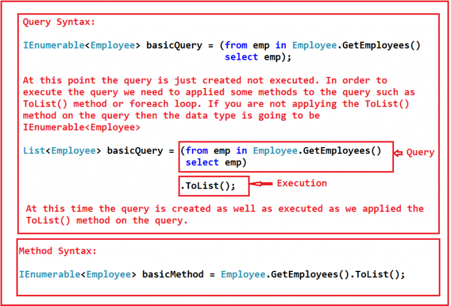
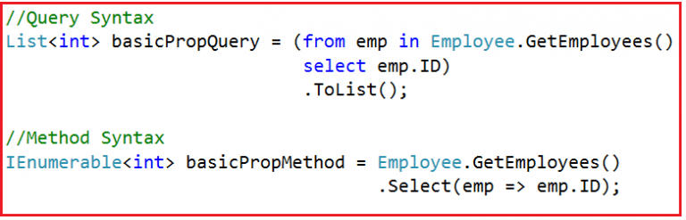
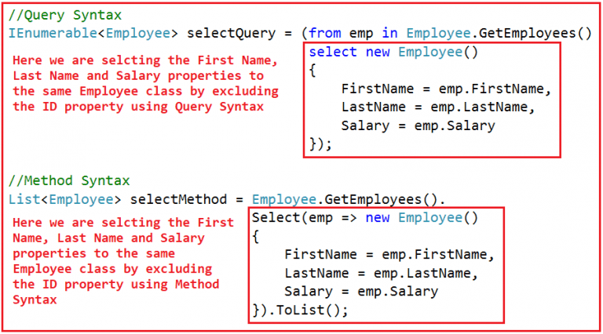
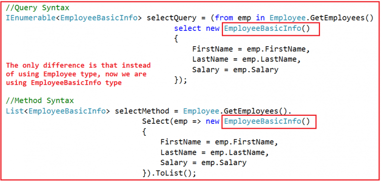
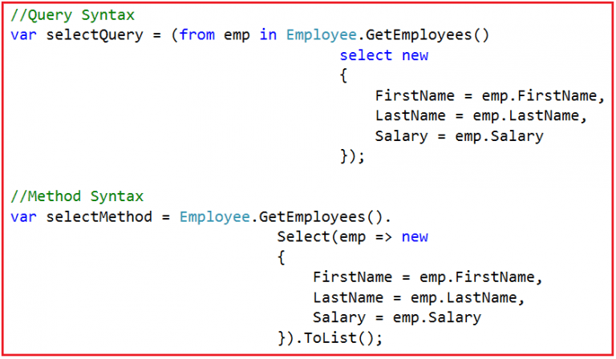
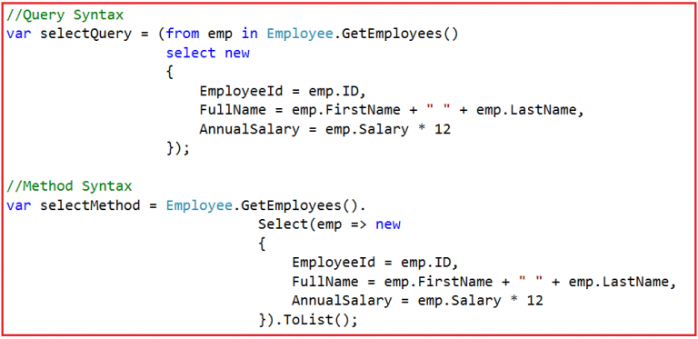
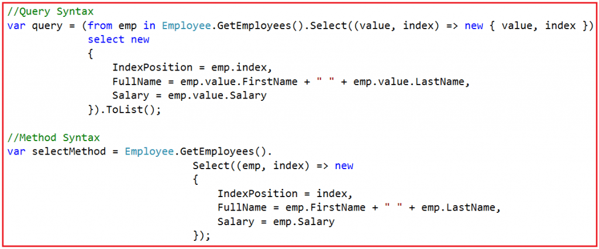

# Linq 연산자들

이 기사에서는 C# 의 LINQ 연산자 에 대해 설명합니다 . LINQ 확장 메서드 와 구현 방법 에 대해 논의한 이전 기사를 읽어보십시오 . 이 기사의 일부로 다음 두 가지 사항에 대해 논의할 것입니다.

1. Linq 연산자란 무엇인가?
2. LINQ 연산자들의 카테고리별 분류


## <font color='dodgerblue' size="6">1). Linq 연산자란 무엇인가?</font>
LINQ 연산자는 LINQ 쿼리를 작성하는 데 사용되는 확장 메서드 집합일 뿐입니다. 이러한 LINQ 확장 메서드는 데이터 원본에 적용할 수 있는 매우 유용한 기능을 많이 제공합니다. 일부 기능은 데이터 필터링, 데이터 정렬, 데이터 그룹화 등입니다.


## <font color='dodgerblue' size="6">2) LINQ 연산자들의 카테고리별 종류</font> 
LINQ에서 연산자는 다음 범주로 나뉩니다.

1. SELECT 프로젝션 연산자
2. 주문 연산자
3. 필터링 연산자
4. 연산자를 설정
5. 수량자 연산자
6. 그룹화 연산자
7. 파티셔닝 연산자
8. 등호 연산자
9. 요소 연산자
10. 변환 연산자
11. 연결 연산자
12. 집계 연산자
13. 생성 연산자
14. 조인 연산자
15. 사용자 지정 시퀀스 연산자
16 기타 연산자


## <font color='dodgerblue' size="6">3) Select 프로젝션 연산자(예제 포함)</font> 
예제와 함께 C#의 LINQ Select Projection Operator에 대해 설명합니다. C#에서 LINQ 연산자 와 LINQ 연산자의 다양한 범주에 대해 논의한 이전 기사를 읽어보십시오 . 이 기사의 끝에서 C#의 Linq Select Projection Operator와 관련된 다음 중요사항들 이해하게 될 것입니다.

1. 프로젝션이란 무엇입니까?
2. LINQ의 프로젝션 연산자 및 메서드는 무엇입니까?
3. SELECT 연산자를 사용하여 단일 속성을 선택하는 방법
4. SELECT 연산자를 사용하여 다른 클래스로부터 데이터를 선택하는 방법
5. SELECT 연산자를 사용하여 익명 타입의 데이터를 선택하는 방법
6. SELECT 연산자를 사용하여 선택한 데이터에 대한 계산을 수행하는 방법
7. 인덱스 값으로 데이터를 선택하는 방법은 무엇입니까?

- ### A. 프로젝션이란 무엇?**  
    프로젝션은 데이터 소스에서 데이터를 선택하는 데 사용되는 메커니즘일 뿐이다. 원본데이터 중에서 동일한 일부분의 데이터만 선택할 수도 있고 아니면 원본을 약간 가공하여 약간만 틀린 형태로 만들어 가져올수도 있다.

- ### B. LINQ의 프로젝션 연산자 및 메서드는 무엇입니까?
    프로젝션에는 두 가지 방법이 있다.

    1. SELECT
    2. SELECTMANY

    앞부분에서는 SELECT 메서드에 대해 설명하고 뒤부분에서는 SELECTMANY 메서드에 대해서도 설명할 것이다.

    - **연산자 선택:**  
        우리가 알고 있듯이  SQL의 Select 절을 사용하면 특정 열을 가져오던지 아니면 모든 모든 열 또는 특정열들만을 지정하여 가져올수 있다.

        같은 방식으로 LINQ의 Select 연산자를 사용하면 동일하게 작업을 할수 있다. 표준 LINQ Select 연산자를 사용하면 일부 계산을 수행할 수도 있습니다.

        - **예시:**  
            몇 가지 예를 들어 선택 프로젝션 연산자를 이해하자. 여기서는 콘솔 응용 프로그램을 사용할 것이며 먼저 LINQDemo 라는 이름으로 프로젝트를 만들어 보자. 그런 다음 Employee.cs라는 이름의 새 클래스 파일을 추가한다. 그리고 Employee.cs의 소스를 다음에서 복사하여 붙여넣는다.

            ```cs
            using System.Collections.Generic;
            namespace LINQDemo
            {
                public class Employee
                {
                    public int ID { get; set; }
                    public string FirstName { get; set; }
                    public string LastName { get; set; }
                    public int Salary { get; set; }

                    public static List<Employee> GetEmployees()
                    {
                        List<Employee> employees = new List<Employee>
                        {
                            new Employee {ID = 101, FirstName = "Preety", LastName = "Tiwary", Salary = 60000 },
                            new Employee {ID = 102, FirstName = "Priyanka", LastName = "Dewangan", Salary = 70000 },
                            new Employee {ID = 103, FirstName = "Hina", LastName = "Sharma", Salary = 80000 },
                            new Employee {ID = 104, FirstName = "Anurag", LastName = "Mohanty", Salary = 90000 },
                            new Employee {ID = 105, FirstName = "Sambit", LastName = "Satapathy", Salary = 100000 },
                            new Employee {ID = 106, FirstName = "Sushanta", LastName = "Jena", Salary = 160000 }
                        };

                        return employees;
                    }
                }
            }
            ```

            보시다시피 ID, FirstName, LastName 및 Salary와 같은 네 가지 속성을 사용하여 Employee 클래스를 만들었으며 또한 데이터 소스 역할을 할 직원 목록을 반환하는 하나의 정적 메서드도 만들었다. LINQ Select 연산자를 이해하기 위한 몇 가지 예를 살펴보자.

            - 예1 :  
                메써드 및 쿼리 구문을 모두 사용하여 데이터 원본에서 모든 데이터를 선택하는 예제이다.

                   

                Program 클래스를 아래와 같이 수정한 전체 코드이다.

                ```cs
                using System;
                using System.Collections.Generic;
                using System.Linq;

                namespace LINQDemo
                {
                    class Program
                    {
                        static void Main(string[] args)
                        {
                            //Using Query Syntax
                            List<Employee> basicQuery = (from emp in Employee.GetEmployees()
                                            select emp).ToList();

                            foreach (Employee emp in basicQuery)
                            {
                                Console.WriteLine($"ID : {emp.ID} Name : {emp.FirstName} {emp.LastName}");
                            }

                            //Using Method Syntax
                            IEnumerable<Employee> basicMethod = Employee.GetEmployees().ToList();
                            foreach (Employee emp in basicMethod)
                            {
                                Console.WriteLine($"ID : {emp.ID} Name : {emp.FirstName} {emp.LastName}");
                            }
                            
                            Console.ReadKey();
                        }
                    }
                }
                ```
    
- ### C. SELECT 연산자를 사용하여 단일 속성을 선택하는 방법  
    메서드와 쿼리 구문을 각각 사용하여 모든 직원 ID만 선택하는 방법이다.

       

    ```note
    쿼리 구문에서 basicPropQuery의 데이터 형식은 List<int>입니다. 이는 쿼리 구문에 적용한 ToList() 메서드 때문이다. 그리고 이 ToList() 메서드가 쿼리가 실행되는 지점이다.
    ```

    하지만 Method 구문의 경우 ToList() 메서드를 적용하지 않았으며 이것이 basicPropMethod 변수의 데이터 유형이 IEnumerable<int> 유형인 이유이다. 그리고 더 중요한 것은 그 시점에서 쿼리가 생성되기만 하고 실행되지는 않는다는 것이다. foreach 루프 내에서 basicPropMethod를 사용할 때 쿼리가 실행된다.

    전체 예제
    ```cs
    namespace LINQDemo
    {
        class Program
        {
            static void Main(string[] args)
            {
                //Using Query Syntax
                List<int> basicPropQuery = (from emp in Employee.GetEmployees()
                                            select emp.ID)
                                            .ToList();

                foreach (var id in basicPropQuery)
                {
                    Console.WriteLine($"ID : {id}");
                }

                //Using Method Syntax
                IEnumerable<int> basicPropMethod = Employee.GetEmployees()
                                                .Select(emp => emp.ID);
                
                foreach (var id in basicPropMethod)
                {
                    Console.WriteLine($"ID : {id}");
                }
                
                Console.ReadKey();
            }
        }
    }
    ```

    **또다른 예제:**  

    이번의 요구 사항은 직원 이름, 성 및 급여 속성만 선택하는 것이다. ID 속성을 선택할 필요가 없다.
    
       

    전체 코드

    ```cs
    using System;
    using System.Collections.Generic;
    using System.Linq;

    namespace LINQDemo
    {
        class Program
        {
            static void Main(string[] args)
            {
                //Query Syntax
                IEnumerable<Employee> selectQuery = (from emp in Employee.GetEmployees()
                                                    select new Employee()
                                                    {
                                                        FirstName = emp.FirstName,
                                                        LastName = emp.LastName,
                                                        Salary = emp.Salary
                                                    });
                
                foreach (var emp in selectQuery)
                {
                    Console.WriteLine($" Name : {emp.FirstName} {emp.LastName} Salary : {emp.Salary} ");
                }
                
                //Method Syntax
                List<Employee> selectMethod = Employee.GetEmployees().
                                            Select(emp => new Employee()
                                            {
                                                FirstName = emp.FirstName,
                                                LastName = emp.LastName,
                                                Salary = emp.Salary
                                            }).ToList();

                foreach (var emp in selectMethod)
                {
                    Console.WriteLine($" Name : {emp.FirstName} {emp.LastName} Salary : {emp.Salary} ");
                }

                Console.ReadKey();
            }
        }
    }
    ```

- ### D. SELECT연산자를 사용하여 다른 클래스로부터 데이터를 선택하는 방법  
    LINQ Select 연산자를 사용하여 다른 클래스로부터의 데이터를 선택할 수도 있다.  
    이전 예제에서는 동일한 Employee 클래스에서 First Name, Last Name 및 Salary 속성을 선택하였다. 이번에는 위의 세 가지 속성만을 가진 새 클래스를 만들어 보겠다. 따라서 EmployeeBasicInfo.cs라는 이름의 새 클래스 파일을 추가하고 다음 코드를 복사하여 붙여넣는다.

    ```cs
    namespace LINQDemo
    {
        public class EmployeeBasicInfo
        {
            public string FirstName { get; set; }
            public string LastName { get; set; }
            public int Salary { get; set; }
        }
    }
    ```

    이제 여기서 해야 할 일은 위에서 새로 만든 EmployeeBasicInfo 클래스에 First Name, Last Name 및 Salary 속성을 반영해야 한다는 것입니다.
    
       

    ```cs
    using System;
    using System.Collections.Generic;
    using System.Linq;

    namespace LINQDemo
    {
        class Program
        {
            static void Main(string[] args)
            {
                //Query Syntax
                IEnumerable<EmployeeBasicInfo> selectQuery = (from emp in Employee.GetEmployees()
                                                    select new EmployeeBasicInfo()
                                                    {
                                                        FirstName = emp.FirstName,
                                                        LastName = emp.LastName,
                                                        Salary = emp.Salary
                                                    });
                
                foreach (var emp in selectQuery)
                {
                    Console.WriteLine($" Name : {emp.FirstName} {emp.LastName} Salary : {emp.Salary} ");
                }


                //Method Syntax
                List<EmployeeBasicInfo> selectMethod = Employee.GetEmployees().
                                            Select(emp => new EmployeeBasicInfo()
                                            {
                                                FirstName = emp.FirstName,
                                                LastName = emp.LastName,
                                                Salary = emp.Salary
                                            }).ToList();
                foreach (var emp in selectMethod)
                {
                    Console.WriteLine($" Name : {emp.FirstName} {emp.LastName} Salary : {emp.Salary} ");
                }

                Console.ReadKey();
            }
        }
    }
    ```

- ### E. SELECT 연산자를 사용하여 익명 타입의 데이터를 선택하는 방법
    Employee 또는 EmployeeBasicInfo와 같은 특정 형식에 데이터를 투영하는 대신 LINQ의 익명 형식에 데이터를 투영할 수도 있다.

       

    ```cs
    using System;
    using System.Collections.Generic;
    using System.Linq;

    namespace LINQDemo
    {
        class Program
        {
            static void Main(string[] args)
            {
                //Query Syntax
                var selectQuery = (from emp in Employee.GetEmployees()
                                                    select new
                                                    {
                                                        FirstName = emp.FirstName,
                                                        LastName = emp.LastName,
                                                        Salary = emp.Salary
                                                    });
                
                foreach (var emp in selectQuery)
                {
                    Console.WriteLine($" Name : {emp.FirstName} {emp.LastName} Salary : {emp.Salary} ");
                }
                
                //Method Syntax
                var selectMethod = Employee.GetEmployees().
                                            Select(emp => new
                                            {
                                                FirstName = emp.FirstName,
                                                LastName = emp.LastName,
                                                Salary = emp.Salary
                                            }).ToList();
                foreach (var emp in selectMethod)
                {
                    Console.WriteLine($" Name : {emp.FirstName} {emp.LastName} Salary : {emp.Salary} ");
                }

                Console.ReadKey();
            }
        }
    }
    ```

- ### F. SELECT 연산자를 사용하여 선택한 데이터에 대한 계산을 수행하는 방법  
    먼저 우리가 달성하고자 하는 것에 대한 수식은 다음과 같다.

    1. 연간 급여 = 급여*12
    2. 성명 = 이름 + " " + 성
    
    그런 다음 익명 유형으로 ID, AnnualSalary 및 FullName을 SELECT로 만들어내자.

      

    ```cs
    using System;
    using System.Collections.Generic;
    using System.Linq;

    namespace LINQDemo
    {
        class Program
        {
            static void Main(string[] args)
            {
                //Query Syntax
                var selectQuery = (from emp in Employee.GetEmployees()
                                select new
                                {
                                    EmployeeId = emp.ID,
                                    FullName = emp.FirstName + " " + emp.LastName,                  
                                    AnnualSalary = emp.Salary * 12
                                });
                
                foreach (var emp in selectQuery)
                {
                    Console.WriteLine($" ID {emp.EmployeeId} Name : {emp.FullName} Annual Salary : {emp.AnnualSalary} ");
                }

                //Method Syntax
                var selectMethod = Employee.GetEmployees().
                                            Select(emp => new
                                            {
                                                EmployeeId = emp.ID,
                                                FullName = emp.FirstName + " " + emp.LastName,
                                                AnnualSalary = emp.Salary * 12
                                            }).ToList();
                foreach (var emp in selectMethod)
                {
                    Console.WriteLine($" ID {emp.EmployeeId} Name : {emp.FullName} Annual Salary : {emp.AnnualSalary} ");
                }

                Console.ReadKey();
            }
        }
    }
    ```

- ### G. 인덱스 값으로 데이터를 선택하는 방법은?
    정수 인덱스를 사용하여 값을 선택하는 것도 가능하다. 인덱스는 0을 기준.

      

    ```cs
    using System;
    using System.Linq;

    namespace LINQDemo
    {
        class Program
        {
            static void Main(string[] args)
            {

                //Query Syntax
                var query = (from emp in Employee.GetEmployees().Select((value, index) => new { value, index })
                            select new
                            {
                                IndexPosition = emp.index,
                                FullName = emp.value.FirstName + " " + emp.value.LastName,
                                Salary = emp.value.Salary
                            }).ToList();
                foreach (var emp in query)
                {
                    Console.WriteLine($" Position {emp.IndexPosition} Name : {emp.FullName} Salary : {emp.Salary} ");
                }

                //Method Syntax
                var selectMethod = Employee.GetEmployees().
                                            Select((emp, index) => new
                                            {
                                                IndexPosition = index,
                                                FullName = emp.FirstName + " " + emp.LastName,
                                                Salary = emp.Salary
                                            });
                
                foreach (var emp in selectMethod)
                {
                    Console.WriteLine($" Position {emp.IndexPosition} Name : {emp.FullName} Salary : {emp.Salary} ");
                }

                Console.ReadKey();
            }
        }
    }
    ```

