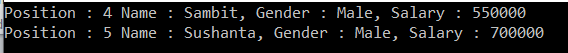

# LINQ 연산자 : Where와 ofType 필터링

## <font color='dodgerblue' size="6">1). Where 필터링 연산자</font>    
이번에는 예제와 함께 LINQ의 Where Filtering Operators에 대해 설명한다.

1. 필터링이란
2. LINQ에서 사용할 수 있는 필터링 방법은 무엇입니까?
3. "where" 연산자 및 메서드와 쿼리 구문을 모두 사용하는 예제
4. 서술부란?

- ### A. 필터링이란 무엇인가?
    필터링은 데이터 소스에서 주어진 조건을 만족하는 요소만 가져오는 프로세스일 뿐입니다. 비즈니스 요구 사항에 따라 둘 이상의 조건으로 데이터 소스에서 데이터를 가져올 수도 있습니다.

    예를 들어:

        급여가 5000만원 이상인 직원.
        특정 배치에서 80% 이상의 점수를 받은 학생.
        경력 6년 이상, 부서는 IT 등

- ### B. LINQ에서 사용할 수 있는 필터링 방법은 무엇입니까?
    필터링에 사용되는 C#의 LINQ에서 제공하는 두 가지 방법이 있습니다. 그들은 다음과 같습니다

        1. Where
        2. OfType

    이번에는 " Where" 연산자에 대해 자세히 설명합니다. 

    LINQ의 필터링 연산자:  
    표준 쿼리 연산자 " where "는 LINQ 의 필터링 연산자 범주에 있습니다.

    where 절을 사용하여 SQL에서 했던 것처럼 일부 조건을 기반으로 데이터 원본의 데이터를 필터링해야 할 때 LINQ에서 표준 쿼리 연산자를 사용해야 합니다. 따라서 간단히 말해서 일부 조건을 기반으로 데이터 소스의 데이터를 필터링하는 데 사용된다고 말할 수 있습니다.

    "where"는 항상 최소한 하나의 조건을 예상하며 서술부를 사용하여 조건을 지정할 수 있습니다. 조건은 다음 기호를 사용하여 작성할 수 있습니다.

    ==, >=, <=, &&, &#124;&#124;, >, < 등

    두 가지 오버로드된 버전의 "where" 연산자를 사용할 수 있습니다. 그들은 다음과 같습니다
    
      

    위의 서명에서 볼 수 있듯이 메서드는 IEnumerable<T> 인터페이스에서 확장 메서드로 구현됩니다. 메소드 서술부는 매개변수로 사용됩니다. 그럼 먼저 서술부가 무엇인지 알아볼까요?

- ### D. 서술부(Predicate)란?
    서술부는 주어진 조건에 대해 각각의 모든 요소를 ​​테스트하는 데 사용되는 함수일 뿐입니다. 예를 들어 이것을 이해합시다.

    아래 예에서 Lambda 표현식( num => num > 5 )은 " intList " 컬렉션 에 있는 모든 요소에 대해 실행됩니다 . 그런 다음 숫자가 5보다 큰지 여부를 확인합니다. 숫자 값이 5보다 크면 부울 값 true가 반환되고 그렇지 않으면 false가 반환됩니다.

    ```cs
    using System;
    using System.Collections.Generic;
    using System.Linq;

    namespace LINQDemo
    {
        class Program
        {
            static void Main(string[] args)
            {
                List<int> intList = new List<int> { 1, 2, 3, 4, 5, 6, 7, 8, 9, 10 };

                //Method Syntax
                IEnumerable<int> filteredData = intList.Where(num => num > 5);

                //Query Syntax
                IEnumerable<int> filteredResult = from num in intList
                                                where num > 5
                                                select num;
                
                foreach (int number in filteredData)
                {
                    Console.WriteLine(number);
                }

                Console.ReadKey();
            }
        }
    }
    ```

    위의 프로그램을 실행하면 예상대로 다음과 같은 출력이 나옵니다.
    
      

    위의 예에서 WHERE  확장 메서드 위로 마우스를 가져가면  Visual Studio Intelligence에 다음이 표시됩니다.
    
      

    위 이미지에서 볼 수 있듯이 서술부(Func<int, bool> 서술부)는 정수 유형의 하나의 입력 매개변수를 예상하고 부울 값을 리턴합니다. Func는 하나 이상의 입력 매개 변수를 사용하고 하나의 출력 매개 변수를 반환하는 일반 대리자입니다. 마지막 매개변수는 반환 값으로 간주됩니다. 반환 유형은 필수이지만 입력 매개변수는 필수가 아닙니다.

    Generic Delegate를 처음 사용하는 경우 예제와 함께 C#의 Generic Delegate에 대해 논의한 다음 문서를 읽는 것이 좋습니다.

    https://dotnettutorials.net/lesson/generic-delegates-csharp/

    위의 예에서 확장 메서드에 전달한 람다 식은 정수 데이터 형식에서 작동하며 부울 값을 반환해야 하며 그렇지 않으면 컴파일 시간 오류가 발생합니다. 

    따라서 위의 예에서 다음 코드 줄

    IEnumerable<int> filterData = intList.where(num => num > 5);

    아래와 같이 다시 작성할 수 있습니다.

    ```cs
    Func<int, bool> predicate = i => i > 5;  
    IEnumerable<int>filteredData = intList.Where(predicate);
    ```

    예상대로 동일한 결과를 제공해야 합니다. 또한 예상대로 작동하는 별도의 기능을 아래와 같이 생성할 수도 있습니다.

    ```cs
    using System;
    using System.Collections.Generic;
    using System.Linq;

    namespace LINQDemo
    {
        class Program
        {
            static void Main(string[] args)
            {
                List<int> intList = new List<int> { 1, 2, 3, 4, 5, 6, 7, 8, 9, 10 };

                //Method Syntax
                IEnumerable<int> filteredData = intList.Where(num => CheckNumber(num));

                foreach (int number in filteredData)
                {
                    Console.WriteLine(number);
                }

                Console.ReadKey();
            }

            public static bool CheckNumber(int number)
            {
                if (number > 5)
                {
                    return true;
                }
                else
                {
                    return false;
                }
            }
        }
    }
    ```

    **예2**  
    "where" 확장 메서드의 두 번째 오버로드된 버전에서 서술부 함수의 int 매개변수는 소스 요소의 인덱스 위치를 나타냅니다.
    ```cs
    public static IEnumerable<TSource> Where<TSource>(
    this IEnumerable<TSource> source,
    Func<TSource, int, bool> predicate);
    ```
    **이것을 이해하기 위해 예를 보자.**  
    여기서 우리는 홀수, 즉 2로 나눌 수 없는 숫자만 필터링해야 합니다. 숫자와 함께 숫자의 인덱스 위치도 가져와야 합니다. 인덱스는 0을 기준으로 합니다.

    ```cs
    using System;
    using System.Collections.Generic;
    using System.Linq;

    namespace LINQDemo
    {
        class Program
        {
            static void Main(string[] args)
            {
                List<int> intList = new List<int> { 1, 2, 3, 4, 5, 6, 7, 8, 9, 10 };

                //Method Syntax
                var OddNumbersWithIndexPosition = intList.Select((num, index) => new
                                                    {
                                                        Numbers = num,
                                                        IndexPosition = index
                                                    }).Where(x => x.Numbers % 2 != 0)
                                                    .Select(data => new
                                                    {
                                                        Number = data.Numbers,
                                                        IndexPosition = data.IndexPosition
                                                    });
                
                foreach (var item in OddNumbersWithIndexPosition)
                {
                    Console.WriteLine($"IndexPosition :{item.IndexPosition} , Value : {item.Number}");
                }

                Console.ReadKey();
            }
        }
    }
    ```
    이제 응용 프로그램을 실행하면 아래와 같이 인덱스 위치와 함께 홀수가 표시됩니다.

      

    **쿼리 구문을 사용하여 동일한 예제를 다시 작성해 보겠습니다.**
    ```cs
    using System;
    using System.Collections.Generic;
    using System.Linq;

    namespace LINQDemo
    {
        class Program
        {
            static void Main(string[] args)
            {
                List<int> intList = new List<int> { 1, 2, 3, 4, 5, 6, 7, 8, 9, 10 };
                
                //Query Syntax
                var OddNumbersWithIndexPosition = 
                                                from number in intList.Select((num, index) => 
                                                    new {Numbers = num, IndexPosition = index })
                                                where number.Numbers % 2 != 0
                                                select new
                                                {
                                                    Number = number.Numbers,
                                                    IndexPosition = number.IndexPosition
                                                };
                
                foreach (var item in OddNumbersWithIndexPosition)
                {
                    Console.WriteLine($"IndexPosition :{item.IndexPosition} , Value : {item.Number}");
                }

                Console.ReadKey();
            }
        }
    }
    ```

    이제 응용 프로그램을 실행하면 메서드 구문 출력과 동일한 출력도 제공됩니다.

    **복잡한예**  
    복합형에서 where 조건을 사용하는 방법을 알아보겠습니다. 다음 Employee 클래스를 사용할 것입니다. 따라서 Employee.cs 라는 이름의 클래스 파일을 만들고 다음 코드를 복사하여 붙여넣습니다.
    ```cs
    using System.Collections.Generic;
    namespace LINQDemo
    {
        public class Employee
        {
            public int ID { get; set; }
            public string Name { get; set; }
            public string Gender { get; set; }
            public int Salary { get; set; }
            public List<string> Technology { get; set; }

            public static List<Employee> GetEmployees()
            {
                List<Employee> employees = new List<Employee>()
                {
                    new Employee {ID = 101, Name = "Preety", Gender = "Female", Salary = 60000,
                                Technology = new List<string>() {"C#", "Jave", "C++"} },
                    new Employee {ID = 102, Name = "Priyanka", Gender = "Female", Salary = 50000,
                                Technology =new List<string>() { "WCF", "SQL Server", "C#" } },
                    new Employee {ID = 103, Name = "Hina", Gender = "Female", Salary = 40000,
                                Technology =new List<string>() { "MVC", "Jave", "LINQ"}},
                    new Employee {ID = 104, Name = "Anurag", Gender = "Male", Salary = 450000},
                    new Employee {ID = 105, Name = "Sambit", Gender = "Male", Salary = 550000},
                    new Employee {ID = 106, Name = "Sushanta", Gender = "Male", Salary = 700000,
                                Technology =new List<string>() { "ADO.NET", "C#", "LINQ" }}

                };

                return employees;
            }
        }
    }
    ```

    볼 수 있듯이 ID, 이름, 성별, 급여 및 기술과 같은 5가지 속성을 사용하여 Employee 클래스를 만들었습니다. 보시다시피 데이터 소스로 이동할 모든 직원 목록을 반환하는 메서드도 하나 만들었습니다.

    **예3**  
    급여가 50000보다 큰 모든 직원을 가져와야 합니다.
    ```cs
    using System;
    using System.Collections.Generic;
    using System.Linq;

    namespace LINQDemo
    {
        class Program
        {
            static void Main(string[] args)
            {
                //Query Syntax
                var QuerySyntax = from employee in Employee.GetEmployees()
                                where employee.Salary > 50000
                                select employee;
                //Method Syntax
                var MethodSyntax = Employee.GetEmployees()
                                .Where(emp => emp.Salary > 50000);
                
                foreach (var emp in QuerySyntax)
                {
                    Console.WriteLine($"Name : {emp.Name}, Salary : {emp.Salary}, Gender : {emp.Gender}");
                    if(emp.Technology != null && emp.Technology.Count() > 0)
                    {
                        Console.Write(" Technology : ");
                        foreach (var tech in emp.Technology)
                        {
                            Console.Write(tech + " ");
                        }
                        Console.WriteLine();
                    }
                    else
                    {
                        Console.WriteLine(" Technology Not Available ");
                    }
                }

                Console.ReadKey();
            }
        }
    }`
    ```

    결과  
      

    **예4**  
    성별이 남성이고 급여가 500000보다 큰 모든 직원을 가져와야 합니다.
    ```cs
    using System;
    using System.Collections.Generic;
    using System.Linq;

    namespace LINQDemo
    {
        class Program
        {
            static void Main(string[] args)
            {
                //Query Syntax
                var QuerySyntax = from employee in Employee.GetEmployees()
                                where employee.Salary > 500000 && employee.Gender == "Male"
                                select employee;
                //Method Syntax
                var MethodSyntax = Employee.GetEmployees()
                                .Where(emp => emp.Salary > 500000 && emp.Gender == "Male")
                                .ToList();
                
                foreach (var emp in MethodSyntax)
                {
                    Console.WriteLine($"Name : {emp.Name}, Salary : {emp.Salary}, Gender : {emp.Gender}");
                    if(emp.Technology != null && emp.Technology.Count() > 0)
                    {
                        Console.Write(" Technology : ");
                        foreach (var tech in emp.Technology)
                        {
                            Console.Write(tech + " ");
                        }
                        Console.WriteLine();
                    }
                    else
                    {
                        Console.WriteLine(" Technology Not Available ");
                    }
                }

                Console.ReadKey();
            }
        }
    }
    ```

    결과    
      

    **예5**  
    사용자 지정 작업과 데이터를 익명 형식으로 투영하는 여러 조건:

    요구 사항:  
    급여가 50000 이상이고 기술이 있는 모든 직원은 null이 아니어야 합니다.

    다음 정보를 익명 유형으로 가져와야 합니다.

        1. 이름 그대로
        2. 성별 그대로
        3. 월급 = 급여 / 12

    ```cs
    using System;
    using System.Collections.Generic;
    using System.Linq;

    namespace LINQDemo
    {
        class Program
        {
            static void Main(string[] args)
            {
                //Query Syntax
                var QuerySyntax = (from employee in Employee.GetEmployees()
                                where employee.Salary >= 50000 && employee.Technology != null
                                select new {
                                    EmployeeName = employee.Name,
                                    Gender = employee.Gender,
                                    MonthlySalary = employee.Salary / 12
                                }).ToList();
                
                //Method Syntax
                var MethodSyntax = Employee.GetEmployees()
                                .Where(emp => emp.Salary >= 50000 && emp.Technology != null)
                                .Select(emp => new {
                                    EmployeeName = emp.Name,
                                    Gender = emp.Gender,
                                    MonthlySalary = emp.Salary / 12
                                })
                                .ToList();
                
                foreach (var emp in QuerySyntax)
                {
                    Console.WriteLine($"Name : {emp.EmployeeName}, Gender : {emp.Gender}, Monthly Salary : 
                    {emp.MonthlySalary}");                
                }

                Console.ReadKey();
            }
        }
    }
    ```

    결과      
      

    **예6**  
    인덱스 위치와 함께 요소 가져오기

    여기서 성별이 남성이고 급여가 500000보다 큰 모든 직원을 인덱스 위치와 함께 익명 유형으로 가져와야 합니다.

    ```cs
    using System;
    using System.Collections.Generic;
    using System.Linq;

    namespace LINQDemo
    {
        class Program
        {
            static void Main(string[] args)
            {
                //Query Syntax
                var QuerySyntax = (from data in Employee.GetEmployees().Select((Data, index) => 
                                    new { employee = Data, Index = index })
                                where data.employee.Salary >= 500000 && data.employee.Gender == "Male"
                                select new
                                {
                                    EmployeeName = data.employee.Name,
                                    Gender = data.employee.Gender,
                                    Salary = data.employee.Salary,
                                    IndexPosition = data.Index
                                }).ToList();

                //Method Syntax
                var MethodSyntax = Employee.GetEmployees().Select((Data, index) => new { employee = Data, Index = index })
                                .Where(emp => emp.employee.Salary >= 500000 && emp.employee.Gender == "Male")
                                .Select(emp => new
                                {
                                    EmployeeName = emp.employee.Name,
                                    Gender = emp.employee.Gender,
                                    Salary = emp.employee.Salary,
                                    IndexPosition = emp.Index
                                })
                                .ToList();

                foreach (var emp in QuerySyntax)
                {
                    Console.WriteLine($"Position : {emp.IndexPosition} Name : {emp.EmployeeName}, Gender : {emp.Gender}, 
                    Salary : {emp.Salary}");
                }

                Console.ReadKey();
            }
        }
    }
    ```

    결과  
      

## <font color='dodgerblue' size="6">2) OfType 필터링 연산자</font>    
LINQ의 OfType 연산자는 이 연산자에 전달한 데이터 형식을 기반으로 데이터 원본의 특정 형식 데이터를 필터링하는 데 사용됩니다. 예를 들어 정수와 문자열 값을 모두 저장하는 컬렉션이 있고 해당 컬렉션에서 정수 값만 가져오거나 문자열 값만 가져와야 하는 경우 OfType 연산자를 사용해야 합니다.

다음은 OfType 메서드의 서명입니다. 제네릭 형식으로 구현되므로 이 메서드에 사용할 수 있는 오버로드된 버전이 없습니다. 이 메소드는 모든 유형의 데이터 유형을 취한 다음 컬렉션에서 지정된 데이터 유형 값을 가져올 수 있습니다.

```cs
public static IEnumerable<TResult> OfType<TResult>(이 IEnumerable 소스);
```

Object 타입의 컬렉션이 있다고 가정해 보겠습니다. 우리가 알고 있듯이 Object 클래스는 모든 데이터 유형의 수퍼 클래스이므로 아래와 같이 모든 유형의 값을 저장할 수 있습니다.

  

이제 우리의 요구 사항은 문자열 값을 무시하여 컬렉션에서 모든 정수 값을 가져오는 것입니다. 아래와 같이 C#에서 OfType 연산자를 사용하여 이를 매우 쉽게 달성할 수 있습니다.

  

**C#.NET에서 메서드 구문을 사용하는 OfType 연산자:**
```cs
using System;
using System.Collections.Generic;
using System.Linq;

namespace LINQDemo
{
    class Program
    {
        static void Main(string[] args)
        {
            List<object> dataSource = new List<object>()
            {
                "Tom", "Mary", 50, "Prince", "Jack", 10, 20, 30, 40, "James"
            };
            
            List<int> intData = dataSource.OfType<int>().ToList();
            
            foreach (int number in intData)
            {
                Console.Write(number + " ");
            } 
            
            Console.ReadKey();
        }
    }
}
```
결과  
  

**C#.NET에서 쿼리 구문을 사용하는 OfType 연산자:**  
쿼리 구문에서 사용할 수 있는 OfType 연산자는 없습니다. 대신 데이터 소스의 유형을 기반으로 데이터를 필터링하는 데 사용할 수 있는 "is" 연산자를 사용할 수 있습니다. 다음 예에서 컬렉션에는 문자열과 정수 값이 모두 포함되어 있으며 문자열 값만 가져와야 합니다.

```cs
using System;
using System.Collections.Generic;
using System.Linq;

namespace LINQDemo
{
    class Program
    {
        static void Main(string[] args)
        {
            List<object> dataSource = new List<object>()
            {
                "Tom", "Mary", 50, "Prince", "Jack", 10, 20, 30, 40, "James"
            };

            var stringData = (from name in dataSource
                        where name is string
                        select name).ToList();

            foreach (string name in stringData)
            {
                Console.Write(name + " ");
            } 
            
            Console.ReadKey();
        }
    }
}
```

결과      
  

**OfType 및 is Operator with C#.NET:**  
예를 들어 길이가 3보다 큰 모든 이름과 30보다 큰 모든 정수를 검색하려고 합니다. 여기에서 OfType 연산자를 사용하여 모든 이름을 검색하고 "is" 연산자를 사용하여 모든 정수를 검색합니다. 필요한 조건.

```cs
using System;
using System.Collections.Generic;
using System.Linq;

namespace LINQDemo
{
    class Program
    {
        static void Main(string[] args)
        {
            List<object> dataSource = new List<object>()
            {
                "Tom", "Mary", 50, "Prince", "Jack", 10, 20, 30, 40, "James"
            };

            //Using Method Syntax
            var intData = dataSource.OfType<int>().Where(num => num > 30).ToList();
            foreach (int number in intData)
            {
                Console.Write(number + " ");
            }
            Console.WriteLine();

            //Using Qyery Syntax
            var stringData = (from name in dataSource
                        where name is string && name.ToString().Length > 3
                        select name).ToList();

            foreach (string name in stringData)
            {
                Console.Write(name + " ");
            } 
            
            Console.ReadKey();
        }
    }
}
```

결과      
  