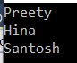
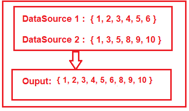

# LINQ 연산자 : 집합 관련(Distinct, Except, Intersect, Union, Concat)

LINQ의 집합 연산자는 동일하거나 다른 데이터 원본 내 요소의 존재 여부에 따라 결과 집합 데이터를 생성하는 데 사용됩니다. 즉, 이러한 작업은 단일 데이터 원본 또는 여러 데이터 원본에서 수행되며 출력에는 일부 데이터가 있고 일부 데이터가 없습니다. 이것이 현재 명확하지 않은 경우 걱정하지 마십시오. 우리는 예제와 함께 모든 것을 논의할 것입니다.

집합 연산의 예:

집합 연산을 사용해야 하는 몇 가지 예를 살펴보겠습니다.

1. 데이터 원본에서 고유한 레코드를 선택해야 하는 경우(중복 레코드 없음) 
2. 특정 부서를 제외한 회사의 모든 직원을 선택해야 하는 경우
3. 여러 클래스들 중 공통적인 값인 교집합을 구해야 하는 경우.
4. 유사한 구조의 여러 데이터 소스가 있고 모든 데이터 소스를 단일 데이터 소스로 결합하려는 경우


다음 LINQ 확장 메서드는 위의 작업을 C#에서 집합 작업을 수행하기 위해 제공됩니다.

- **Distinct : 중복제거**  
    데이터 소스에서 중복 데이터나 레코드를 제거하려면 Distinct() 메서드를 사용해야 합니다. 이 방법은 단일 데이터 소스에서 작동합니다.

- **Except: 차집합**  
    두 번째 데이터 소스에 존재하지 않는 첫 번째 데이터 소스의 모든 요소를 ​​반환하려는 경우 Except LINQ 확장 메서드를 사용해야 합니다. 이 방법은 두 개의 데이터 소스에서 작동합니다.

- **Intersect: 교집합**  
    이 메소드는 두 데이터 소스에서 공통 요소를 반환하는 데 사용됩니다. 즉, 두 데이터 세트에 공통으로 존재하는 요소가 출력으로 반환됩니다. 

- **Union: 합집합**  
    이 메서드는 데이터 소스 중 하나에 있는 모든 요소를 ​​반환하는 데 사용됩니다. 즉, 두 데이터 소스의 데이터를 결합하고 단일 결과 집합을 생성합니다.

## <font color='dodgerblue' size="6">1) Distinct : 중복제거</font>     

- ### A. C#의 LINQ Distinct란?
    C#의 LINQ Distinct 확장 메서드는 단일 데이터 원본에서 고유한 요소만을 반환하는 데 사용됩니다. 아래와 같이 Distinct 메쏘드에 사용할 수 있는 두 가지 오버로드된 버전이 있다.
    
      

    이 두 메서드의 유일한 차이점은 두 번째 오버로드된 버전에서는 IEqualityComparer를 입력파라메터로 사용한다는 것입니다. 즉, Distinct 연산자를 Comparer와 함께 사용할 수도 있습니다. 이것이 현재 명확하지 않은 경우에도 이 기사에서 비교자 사용에 대해 다룰 것이므로 걱정하지 마십시오.

    **예제 1: 값 형식에 대한 LINQ 고유 메서드**  
    여기에 중복 정수 값이 포함된 정수 컬렉션이 있다. 우리는 중복 값을 제거하고 아래와 같이 고유한 값만 반환하고 싶다.

      

    다음 프로그램은 메서드 및 쿼리 구문을 모두 사용하여 고유한 정수 값을 가져오는 방법을 보여줍니다.

    ```cs
    using System;
    using System.Collections.Generic;
    using System.Linq;

    namespace LINQDemo
    {
        class Program
        {
            static void Main(string[] args)
            {
                List<int> intCollection = new List<int>()
                {
                    1,2,3,2,3,4,4,5,6,3,4,5
                };

                //Using Method Syntax
                var MS = intCollection.Distinct();

                //Using Query Syntax
                var QS = (from num in intCollection
                        select num).Distinct();

                foreach (var item in MS)
                {
                    Console.WriteLine(item);
                }

                Console.ReadKey();
            }
        }
    }
    ```

    결과  
      

    ```note
    쿼리 구문에는 이러한 연산자 호출이 구분되지 않으므로 여기에서 쿼리와 메서드 구문을 모두 사용하여 동일한 결과를 얻어야 합니다.
    ```

    **예제2**  
    여기에 이름의 문자열 배열이 있고 컬렉션에서 고유한 이름을 반환해야 합니다.

    ```cs
    using System;
    using System.Linq;

    namespace LINQDemo
    {
        class Program
        {
            static void Main(string[] args)
            {
                string[] namesArray = { "Priyanka", "HINA", "hina", "Anurag", "Anurag", "ABC", "abc" };

                var distinctNames = namesArray.Distinct();

                foreach (var name in distinctNames)
                {
                    Console.WriteLine(name);
                }
                
                Console.ReadKey();
            }
        }
    }
    ```

    결과  
      

    보시다시피 Hina와 Abc라는 이름은 두 번 등장했습니다. 이는 중복 값을 필터링하는 데 사용되는 기본 비교자가 대소문자를 구분하기 때문입니다.

    대소문자를 구분하지 않고 비교하려면 IEqualityComparer 를 인수로 사용하는 다른 오버로드된 버전을 사용해야 합니다. 따라서 여기에서 IEqualityComparer 인터페이스 를 구현해야 하는 클래스를 전달해야 합니다 .

    그럼 아래와 같이 프로그램을 수정해 보겠습니다. 여기에서 볼 수 있듯이 StringComparer 를 Distinct 메서드에 대한 인수로 전달합니다.

    ```cs
    using System;
    using System.Linq;

    namespace LINQDemo
    {
        class Program
        {
            static void Main(string[] args)
            {
                string[] namesArray = { "Priyanka", "HINA", "hina", "Anurag", "Anurag", "ABC", "abc" };

                var distinctNames = namesArray.Distinct(StringComparer.OrdinalIgnoreCase);

                foreach (var name in distinctNames)
                {
                    Console.WriteLine(name);
                }
                
                Console.ReadKey();
            }
        }
    }
    ```

    결과  
      

    StringComparer 클래스 의 정의로 이동하면 이 클래스가 아래와 같이 IEqualityComparer 인터페이스를 구현하는 것을 관찰할 수 있습니다.

      

    **복잡합 유형의 LINQ 고유 작업: 준비하기**  
    LINQ Distinct 메쏘드는 Employee, Product, Student 등과 같은 복합 유형에서 다른 방식으로 작동합니다. 예를 들어 이해해 보겠습니다. 다음 학생 데이터로 작업할 것입니다.

      

    이름이 Student.cs 인 클래스 파일을 만들고 다음 코드를 복사하여 붙여넣습니다.

    ```cs
    using System.Collections.Generic;
    namespace LINQDemo
    {
        public class Student
        {
            public int ID { get; set; }
            public string Name { get; set; }

            public static List<Student> GetStudents()
            {
                List<Student> students = new List<Student>()
                {
                    new Student {ID = 101, Name = "Preety" },
                    new Student {ID = 102, Name = "Sambit" },
                    new Student {ID = 103, Name = "Hina"},
                    new Student {ID = 104, Name = "Anurag"},
                    new Student {ID = 102, Name = "Sambit"},
                    new Student {ID = 103, Name = "Hina"},
                    new Student {ID = 101, Name = "Preety" },
                };

                return students;
            }
        }
    }
    ```

    여기에서 필요한 속성을 가진 학생 클래스를 만들었습니다. 같은 방식으로 모든 학생을 반환하는 GetStudents() 메서드가 있습니다.

    **예제3**  
    여기에서 학생 컬렉션에서 고유한 이름을 모두 가져와야 합니다. 다음 프로그램은 메서드와 쿼리 구문을 모두 사용하여 이를 달성하는 방법을 보여줍니다.

    ```cs
    using System;
    using System.Linq;

    namespace LINQDemo
    {
        class Program
        {
            static void Main(string[] args)
            {
                //Using Method Syntax
                var MS = Student.GetStudents()
                        .Select(std => std.Name)
                        .Distinct().ToList();

                //Using Query Syntax
                var QS = (from std in Student.GetStudents()
                        select std.Name)
                        .Distinct().ToList();

                foreach(var item in MS)
                {
                    Console.WriteLine(item);
                }

                Console.ReadKey();
            }
        }
    }
    ```

    결과  
      

     **예제4**  
    이제 컬렉션에서 고유한 학생을 선택해야 합니다. 컬렉션에서 볼 수 있듯이 세 명의 학생이 동일하고 결과 집합에서 한 번만 나타나야 합니다. 프로그램 클래스를 아래와 같이 수정해 봅시다.

    ```cs
    using System;
    using System.Linq;

    namespace LINQDemo
    {
        class Program
        {
            static void Main(string[] args)
            {
                //Using Method Syntax
                var MS = Student.GetStudents()
                        .Distinct().ToList();

                //Using Query Syntax
                var QS = (from std in Student.GetStudents()
                        select std)
                        .Distinct().ToList();

                foreach (var item in QS)
                {
                    Console.WriteLine($"ID : {item.ID} , Name : {item.Name} ");
                }

                Console.ReadKey();
            }
        }
    }
    ```

    결과  
      

    보시다시피 개별 학생을 선택하지 않고 모든 학생을 선택합니다. 비교에 사용되는 기본 비교자는 두 개체 참조가 동일한지 여부만 확인하고 복합 개체의 개별 속성 값이 확인되지 않기 때문입니다.

    **위의 문제를 해결하는 방법은 무엇입니까?**  
    위의 문제를 네 가지 다른 방법으로 해결할 수 있습니다. 그들은 다음과 같습니다.

        1. IEqualityComparer 인터페이스를 인수로 사용하는 Distinct() 메서드  의 다른 오버로드된 버전을 사용해야 합니다 . 
            따라서 여기에서 IEqualityComparer 인터페이스 를 구현하는 클래스를 만든 다음 해당 비교 인스턴스를 Distinct()  메서드에 
            전달해야 합니다 .
        2. 두 번째 접근 방식에서는 Student  클래스 자체 내에서 Equals() 및 GetHashCode()  메서드를 재정의해야  합니다.
        3. 세 번째 접근 방식에서는 이미  Equals()  및  GetHashCode()  메서드 를 재정의하는 새로운 익명 형식 에 필요한 속성을 
            투영해야 합니다. 
        4. IEquatable<T> 인터페이스 를 구현 합니다.

    - 접근법 1: IEqualityComparer 인터페이스 구현  
        이름이 StudentComparer.cs 인 클래스 파일을 생성한 후 아래와 같이 IEqualityComparer 인터페이스 를 구현합니다 .

        ```cs
        using System.Collections.Generic;

        namespace LINQDemo
        {
            public class StudentComparer : IEqualityComparer<Student>
            {
                public bool Equals(Student x, Student y)
                {
                    //First check if both object reference are equal then return true
                    if(object.ReferenceEquals(x, y))
                    {
                        return true;
                    }

                    //If either one of the object refernce is null, return false
                    if (object.ReferenceEquals(x,null) || object.ReferenceEquals(y, null))
                    {
                        return false;
                    }

                    //Comparing all the properties one by one
                    return x.ID == y.ID && x.Name == y.Name;
                }

                public int GetHashCode(Student obj)
                {
                    //If obj is null then return 0
                    if (obj == null)
                    {
                        return 0;
                    }

                    //Get the ID hash code value
                    int IDHashCode = obj.ID.GetHashCode();

                    //Get the string HashCode Value
                    //Check for null refernece exception
                    int NameHashCode = obj.Name == null ? 0 : obj.Name.GetHashCode();

                    return IDHashCode ^ NameHashCode;
                }
            }
        }
        ```

        여기에서 할 수 있는 것처럼  IEqualityComparer<T>  인터페이스를 구현한 다음  Equals()  및  GetHashCode()  메서드를 구현합니다. 이제 StudentComparer 클래스의 인스턴스를 만든 다음 아래 프로그램과 같이 해당 인스턴스를 Distinct 메서드에 전달해야 합니다.

        ```cs
        using System;
        using System.Linq;

        namespace LINQDemo
        {
            class Program
            {
                static void Main(string[] args)
                {
                    //Creating an instance of StudentComparer
                    StudentComparer studentComparer = new StudentComparer();
                    
                    //Using Method Syntax
                    var MS = Student.GetStudents()
                            .Distinct(studentComparer).ToList();

                    //Using Query Syntax
                    var QS = (from std in Student.GetStudents()
                            select std)
                            .Distinct(studentComparer).ToList();

                    foreach (var item in QS)
                    {
                        Console.WriteLine($"ID : {item.ID} , Name : {item.Name} ");
                    }

                    Console.ReadKey();
                }
            }
        }
        ```

        결과  
          

    - 접근법 2: Equals() 및 GetHashCode() 메서드 재정의  
        이제 Student 클래스 내에서 Equals()  및  GetHashCode()  메서드를 재정의해야 합니다. 따라서 아래와 같이 Student 클래스를 수정합니다.

        ```cs
        using System.Collections.Generic;
        namespace LINQDemo
        {
            public class Student
            {
                public int ID { get; set; }
                public string Name { get; set; }

                public static List<Student> GetStudents()
                {
                    List<Student> students = new List<Student>()
                    {
                        new Student {ID = 101, Name = "Preety" },
                        new Student {ID = 102, Name = "Sambit" },
                        new Student {ID = 103, Name = "Hina"},
                        new Student {ID = 104, Name = "Anurag"},
                        new Student {ID = 102, Name = "Sambit"},
                        new Student {ID = 103, Name = "Hina"},
                        new Student {ID = 101, Name = "Preety" },
                    };

                    return students;
                }

                public override bool Equals(object obj)
                {
                    //As the obj parameter type id object, so we need to
                    //cast it to Student Type
                    return this.ID == ((Student)obj).ID && this.Name == ((Student)obj).Name;
                }

                public override int GetHashCode()
                {
                    //Get the ID hash code value
                    int IDHashCode = this.ID.GetHashCode();

                    //Get the string HashCode Value
                    //Check for null refernece exception
                    int NameHashCode = this.Name == null ? 0 : this.Name.GetHashCode();

                    return IDHashCode ^ NameHashCode;
                }
            }
        }
        ```

        위와 같이 Student 클래스를 변경하여 Main 메서드를 아래와 같이 수정합니다

        ```cs
        using System;
        using System.Linq;

        namespace LINQDemo
        {
            class Program
            {
                static void Main(string[] args)
                {
                    //Using Method Syntax
                    var MS = Student.GetStudents()
                            .Distinct().ToList();

                    //Using Query Syntax
                    var QS = (from std in Student.GetStudents()
                            select std)
                            .Distinct().ToList();

                    foreach (var item in MS)
                    {
                        Console.WriteLine($"ID : {item.ID} , Name : {item.Name} ");
                    }

                    Console.ReadKey();
                }
            }
        }
        ```

        이제 프로그램을 실행하면 예상대로 고유한 레코드가 표시됩니다.

    - 접근법 3: 익명 유형 사용  
        여기서 우리는 이미  Equals()  및  GetHashCode()  메서드 를 재정의하는 새로운 익명 형식 으로 Student 클래스의 속성을 투영해야 합니다.

        ```cs
        using System;
        using System.Linq;

        namespace LINQDemo
        {
            class Program
            {
                static void Main(string[] args)
                {
                    //Using Method Syntax
                    var MS = Student.GetStudents()
                            .Select(std => new { std.ID, std.Name})
                            .Distinct().ToList();

                    //Using Query Syntax
                    var QS = (from std in Student.GetStudents()
                            select std)
                            .Select(std => new { std.ID, std.Name })
                            .Distinct().ToList();

                    foreach (var item in MS)
                    {
                        Console.WriteLine($"ID : {item.ID} , Name : {item.Name} ");
                    }

                    Console.ReadKey();
                }
            }
        }
        ```

        위의 예에서 우리는 ID 및 Name 속성을 IEnumable<'a>에 투영하고 이미 Equals 및 GetHashCode 메서드를 재정의하는 익명 형식을 의미합니다. 이제 응용 프로그램을 실행하면 예상대로 출력이 표시됩니다.

    - 접근법 4: 학생 클래스에서 IEquatble<T> 인터페이스 구현. 
        아래와 같이 Student 클래스를 수정합니다.

        ```cs
        using System.Collections.Generic;
        namespace LINQDemo
        {
            public class Student : IEquatable<Student>
            {
                public int ID { get; set; }
                public string Name { get; set; }

                public static List<Student> GetStudents()
                {
                    List<Student> students = new List<Student>()
                    {
                        new Student {ID = 101, Name = "Preety" },
                        new Student {ID = 102, Name = "Sambit" },
                        new Student {ID = 103, Name = "Hina"},
                        new Student {ID = 104, Name = "Anurag"},
                        new Student {ID = 102, Name = "Sambit"},
                        new Student {ID = 103, Name = "Hina"},
                        new Student {ID = 101, Name = "Preety" },
                    };

                    return students;
                }

                public bool Equals(Student other)
                {
                    if (object.ReferenceEquals(other, null))
                    {
                        return false;
                    }

                    if (object.ReferenceEquals(this, other))
                    {
                        return true;
                    }

                    return this.ID.Equals(other.ID) && this.Name.Equals(other.Name);
                }

                public override int GetHashCode()
                {
                    int IDHashCode = this.ID.GetHashCode();
                    int NameHashCode = this.Name == null ? 0 : this.Name.GetHashCode();

                    return IDHashCode ^ NameHashCode;
                }
            }
        }
        ```

        보시다시피 여기에서 두 가지 작업을 수행했습니다. 먼저 IEquatable 인터페이스의 Equals 메서드를 구현한 다음 GetHashCode 메서드를 재정의합니다.

        이제 아래와 같이 Program 클래스를 변경합니다.

        ```cs
        using System;
        using System.Linq;

        namespace LINQDemo
        {
            class Program
            {
                static void Main(string[] args)
                {
                    //Using Method Syntax
                    var MS = Student.GetStudents()
                            .Distinct().ToList();

                    //Using Query Syntax
                    var QS = (from std in Student.GetStudents()
                            select std)
                            .Distinct().ToList();

                    foreach (var item in MS)
                    {
                        Console.WriteLine($"ID : {item.ID} , Name : {item.Name} ");
                    }

                    Console.ReadKey();
                }
            }
        }
        ```

        애플리케이션을 실행하고 예상대로 출력을 확인하십시오.

- ### B. IEqualityComparer&lt;T&gt;와 IEquatable&lt;T&gt;의 차이점    
    IEqualityComparer<T> 는 T 형식의 두 개체에 대해 비교를 수행하는 개체에 대한 인터페이스인 반면, IEquatable<T> 는 다른 개체와 자신을 비교할 수 있도록 T 형식 개체에 대한 인터페이스이기도 합니다.

## <font color='dodgerblue' size="6">2) Except : 차집합</font>     

1. C#을 LINQ Except 무엇입니까?
2. 메서드 또는 쿼리 구문을 모두 사용하는 C# Except 메쏘드 사용 예
3. 익명 타입 사용 예
4. IEqualityComparer를 구현하는 방법


- ### A. C#을 LINQ Except 무엇입니까?
    C# 의 LINQ Except 메서드 는 첫 번째 데이터 원본에는 있지만 두 번째 데이터 원본에는 없는 요소를 반환하는 데 사용됩니다. 즉 차집하. 아래와 같이 LINQ except 메서드에 사용할 수 있는 두 가지 오버로드된 버전이 있습니다.

      

    위의 두 메서드 간의 유일한 차이점은 두 번째 오버로드된 버전에는 IEqualityComparer 를 인수로 사용한다는 것입니다. 즉, except 메서드는 Comparer와도 함께 사용할 수 있습니다.

    예를 들면  
      

    위 이미지에서 볼 수 있듯이 DataSource 1과 Data Source 2라는 두 개의 데이터 소스가 있습니다. DataSource 1에는 1, 2, 3, 4, 5, 6과 같은 요소가 포함되고 DataSource 2에는 1, 3, 5, 8, 9, 10. 첫 번째 데이터 원본에서 두 번째 데이터 원본에 없는 2, 4, 6과 같은 요소를 검색하려면 고유한 작업을 적용해야 합니다.

- ### B. 메서드 또는 쿼리 구문을 모두 사용하는 C# Except 메쏘드 사용 예
    쿼리 및 메서드 구문을 사용하여 이 작업을 수행하는 방법을 살펴보겠습니다.

    **예제1**  
    ```cs
    using System;
    using System.Linq;
    namespace LINQDemo
    {
        class Program
        {
            static void Main(string[] args)
            {
                List<int> dataSource1 = new List<int>() { 1, 2, 3, 4, 5, 6 };
                List<int> dataSource2 = new List<int>() { 1, 3, 5, 8, 9, 10 };

                //Method Syntax
                var MS = dataSource1.Except(dataSource2).ToList();

                //Query Syntax
                var QS = (from num in dataSource1
                        select num)
                        .Except(dataSource2).ToList();

                foreach (var item in QS)
                {
                    Console.WriteLine(item);
                }

                Console.ReadKey();
            }
        }
    }
    ```
    응용 프로그램을 실행하면 예상대로 출력이 표시됩니다.

    ```note
    쿼리 구문에는 예외와 같은 연산자 호출이 없으므로 여기에서 쿼리와 메서드 구문을 모두 사용하여 동일한 결과를 얻어야 합니다.
    ```

    **예제2**  
    여기에 국가의 문자열 배열이 있고 첫 번째 컬렉션에서 국가를 반환해야 합니다. 해당 국가는 두 번째 컬렉션에 없습니다.

    ```cs
    using System;
    using System.Linq;
    namespace LINQDemo
    {
        class Program
        {
            static void Main(string[] args)
            {
                string[] dataSource1 = { "India", "USA", "UK", "Canada", "Srilanka"};
                string[] dataSource2 = { "India", "uk", "Canada", "France", "Japan" };

                //Method Syntax
                var MS = dataSource1.Except(dataSource2).ToList();

                //Query Syntax
                var QS = (from country in dataSource1
                        select country)
                        .Except(dataSource2).ToList();

                foreach (var item in QS)
                {
                    Console.WriteLine(item);
                }

                Console.ReadKey();
            }
        }
    }
    ```
    
    결과  
      

    두 번째 컬렉션에 UK라는 국가가 있음에도 불구하고 여전히 출력에 표시됩니다. 이는 데이터를 필터링하는 데 사용되는 기본 비교자가 대소문자를 구분하지 않기 때문입니다.

    따라서 대소문자를 구분하지 않으려면 IEqualityComparer 를 인수로 사용하는 오버로드된 다른 버전의 except() 메서드를 사용해야 합니다.

    따라서 StringComparer 를 인수로 전달하고 이 StringComparer 클래스는 이미 IEqualityComparer 인터페이스를 구현하는 것처럼 프로그램을 수정합니다.

    ```cs
    using System;
    using System.Linq;
    namespace LINQDemo
    {
        class Program
        {
            static void Main(string[] args)
            {
                string[] dataSource1 = { "India", "USA", "UK", "Canada", "Srilanka"};
                string[] dataSource2 = { "India", "uk", "Canada", "France", "Japan" };

                //Method Syntax
                var MS = dataSource1.Except(dataSource2, StringComparer.OrdinalIgnoreCase).ToList();

                //Query Syntax
                var QS = (from country in dataSource1
                        select country)
                        .Except(dataSource2, StringComparer.OrdinalIgnoreCase).ToList();

                foreach (var item in MS)
                {
                    Console.WriteLine(item);
                }

                Console.ReadKey();
            }
        }
    }
    ```
    이제 응용 프로그램을 실행하면 예상대로 데이터가 표시됩니다.

    **복합 유형의 LINQ except() 메서드**  
    C# 의 LINQ Except() 메서드는 Employee, Product, Student 등과 같은 복잡한 형식으로 작업할 때 약간 다른 방식으로 작동합니다. 예를 들어 이를 이해해 보겠습니다.

    이름이 Student.cs 인 클래스 파일을 만들고 다음 코드를 복사하여 붙여넣습니다.

    ```cs
    namespace LINQDemo
    {
        public class Student
        {
            public int ID { get; set; }
            public string Name { get; set; }
        }
    }
    ```

    이것은 속성이 두 개뿐인 매우 간단한 학생 클래스입니다. 다음 두 가지 데이터 소스가 있다고 가정해 보겠습니다.

      

    위 이미지에서 볼 수 있듯이 두 개의 데이터 소스가 있습니다. 첫 번째 데이터 소스(AllStudents)는 모든 학생의 정보를 보유하고 두 번째 데이터 소스(Class6Students)는 6학년 학생의 데이터만 보유 합니다 .

    **예제3**  
    우리의 요구 사항은 6 학년 학생을 제외한 모든 학생 이름을 가져오는 것 입니다. 즉, 두 번째 데이터 소스(예: Class6Students)에 없는 AllStudents 데이터 소스에서 학생 이름을 가져와야 합니다.

    ```cs
    using System.Collections.Generic;
    using System;
    using System.Linq;
    namespace LINQDemo
    {
        class Program
        {
            static void Main(string[] args)
            {
                List<Student> AllStudents = new List<Student>()
                {
                    new Student {ID = 101, Name = "Preety" },
                    new Student {ID = 102, Name = "Sambit" },
                    new Student {ID = 103, Name = "Hina"},
                    new Student {ID = 104, Name = "Anurag"},
                    new Student {ID = 105, Name = "Pranaya"},
                    new Student {ID = 106, Name = "Santosh"},
                };

                List<Student> Class6Students = new List<Student>()
                {
                    new Student {ID = 102, Name = "Sambit" },
                    new Student {ID = 104, Name = "Anurag"},
                    new Student {ID = 105, Name = "Pranaya"},
                };

                //Method Syntax
                var MS = AllStudents.Select(x => x.Name).Except(Class6Students.Select(y => y.Name)).ToList();

                //Query Syntax
                var QS = (from std in AllStudents
                        select std.Name).Except(Class6Students.Select(y => y.Name)).ToList();

                foreach (var name in MS)
                {
                    Console.WriteLine(name);
                }
                
                Console.ReadKey();
            }
        }
    }
    ```
    
    결과  
      

    **예제4**  
    이제 두 번째 데이터 소스에 없는 첫 번째 데이터 소스의 모든 학생 정보를 모두 선택해야 합니다. 프로그램 클래스를 아래와 같이 수정해 봅시다.

    ```cs
    using System.Collections.Generic;
    using System;
    using System.Linq;
    namespace LINQDemo
    {
        class Program
        {
            static void Main(string[] args)
            {
                List<Student> AllStudents = new List<Student>()
                {
                    new Student {ID = 101, Name = "Preety" },
                    new Student {ID = 102, Name = "Sambit" },
                    new Student {ID = 103, Name = "Hina"},
                    new Student {ID = 104, Name = "Anurag"},
                    new Student {ID = 105, Name = "Pranaya"},
                    new Student {ID = 106, Name = "Santosh"},
                };

                List<Student> Class6Students = new List<Student>()
                {
                    new Student {ID = 102, Name = "Sambit" },
                    new Student {ID = 104, Name = "Anurag"},
                    new Student {ID = 105, Name = "Pranaya"},
                };
                
                //Method Syntax
                var MS = AllStudents.Except(Class6Students).ToList();

                //Query Syntax
                var QS = (from std in AllStudents
                        select std).Except(Class6Students).ToList();
                
                foreach (var student in MS)
                {
                    Console.WriteLine($" ID : {student.ID} Name : {student.Name}");
                }
                
                Console.ReadKey();
            }
        }
    }
    ```

    결과  
      

    보시다시피 첫 번째 데이터 소스의 모든 학생 데이터가 표시됩니다. 이는 비교에 사용되는 기본 비교자가 복합 개체의 개별 속성 값이 아닌 두 개체 참조가 동일한지 여부만 확인하기 때문입니다.

    이전 기사에서 위의 문제를 해결하는 여러 가지 방법에 대해 이미 논의했습니다. 여기에서 위의 문제를 해결하기 위해 익명 유형을 사용하는 방법을 살펴보겠습니다.

- ### C. 익명 타입 사용 예
    이 접근 방식에서는 모든 개별 속성을 익명 형식으로 선택해야 합니다. 

    ```cs
    using System.Collections.Generic;
    using System;
    using System.Linq;
    namespace LINQDemo
    {
        class Program
        {
            static void Main(string[] args)
            {
                List<Student> AllStudents = new List<Student>()
                {
                    new Student {ID = 101, Name = "Preety" },
                    new Student {ID = 102, Name = "Sambit" },
                    new Student {ID = 103, Name = "Hina"},
                    new Student {ID = 104, Name = "Anurag"},
                    new Student {ID = 105, Name = "Pranaya"},
                    new Student {ID = 106, Name = "Santosh"},
                };

                List<Student> Class6Students = new List<Student>()
                {
                    new Student {ID = 102, Name = "Sambit" },
                    new Student {ID = 104, Name = "Anurag"},
                    new Student {ID = 105, Name = "Pranaya"},
                };
                
                //Method Syntax
                var MS = AllStudents.Select(x => new {x.ID, x.Name })
                        .Except(Class6Students.Select(x => new { x.ID, x.Name })).ToList();

                //Query Syntax
                var QS = (from std in AllStudents
                        select new { std.ID, std.Name})
                        .Except(Class6Students.Select(x => new { x.ID, x.Name })).ToList();
                
                foreach (var student in QS)
                {
                    Console.WriteLine($" ID : {student.ID} Name : {student.Name}");
                }
                
                Console.ReadKey();
            }
        }
    }
    ```

    이제 응용 프로그램을 실행하면 예상대로 출력이 표시되어야 합니다. Comparer를 사용하여 동일한 작업을 수행하는 방법을 살펴보겠습니다.

- ### D. IEqualityComparer를 구현하는 방법
    이 접근 방식에서는 클래스를 만든 다음 IEqualityComparer 인터페이스 를 구현해야 합니다 . 따라서 이름이 StudentComparer.cs 인 클래스 파일을 만들고 다음 코드를 복사하여 붙여넣습니다.

    ```cs
    using System.Collections.Generic;

    namespace LINQDemo
    {
        public class StudentComparer : IEqualityComparer<Student>
        {
            public bool Equals(Student x, Student y)
            {
                //First check if both object reference are equal then return true
                if(object.ReferenceEquals(x, y))
                {
                    return true;
                }

                //If either one of the object refernce is null, return false
                if (object.ReferenceEquals(x,null) || object.ReferenceEquals(y, null))
                {
                    return false;
                }

                //Comparing all the properties one by one
                return x.ID == y.ID && x.Name == y.Name;
            }

            public int GetHashCode(Student obj)
            {
                //If obj is null then return 0
                if (obj == null)
                {
                    return 0;
                }

                //Get the ID hash code value
                int IDHashCode = obj.ID.GetHashCode();

                //Get the Name HashCode Value
                int NameHashCode = obj.Name == null ? 0 : obj.Name.GetHashCode();

                return IDHashCode ^ NameHashCode;
            }
        }
    }
    ```

    그런 다음 StudentComparer 클래스의 인스턴스를 만들고 아래 프로그램과 같이 해당 인스턴스를 except 메서드에 전달합니다.

    ```cs
    using System.Collections.Generic;
    using System;
    using System.Linq;
    namespace LINQDemo
    {
        class Program
        {
            static void Main(string[] args)
            {
                List<Student> AllStudents = new List<Student>()
                {
                    new Student {ID = 101, Name = "Preety" },
                    new Student {ID = 102, Name = "Sambit" },
                    new Student {ID = 103, Name = "Hina"},
                    new Student {ID = 104, Name = "Anurag"},
                    new Student {ID = 105, Name = "Pranaya"},
                    new Student {ID = 106, Name = "Santosh"},
                };

                List<Student> Class6Students = new List<Student>()
                {
                    new Student {ID = 102, Name = "Sambit" },
                    new Student {ID = 104, Name = "Anurag"},
                    new Student {ID = 105, Name = "Pranaya"},
                };

                //Create an instance of StudentComparer
                StudentComparer studentComparer = new StudentComparer();

                //Method Syntax
                var MS = AllStudents
                        .Except(Class6Students, studentComparer).ToList();

                //Query Syntax
                var QS = (from std in AllStudents
                        select std)
                        .Except(Class6Students, studentComparer).ToList();
                
                foreach (var student in MS)
                {
                    Console.WriteLine($" ID : {student.ID} Name : {student.Name}");
                }
                
                Console.ReadKey();
            }
        }
    }
    ```

    이제 응용 프로그램을 실행하면 예상대로 출력이 표시되어야 합니다.


## <font color='dodgerblue' size="6">3) Intersect : 교집합</font>

1. LINQ Intersect 무엇입니까?
2. 메서드 또는 쿼리 구문을 모두 사용하는 C# Intersect 메쏘드 사용 예
3. C#에서 Intersect 연산에 익명 유형 사용
4. 비교인터페이스(IEqualityComparer) 구현

- ### A. LINQ Intersect 무엇입니까?
    C# 의 LINQ Intersect 메서드는 두 컬렉션의 공통 요소를 반환하는 데 사용됩니다. 두 데이터 소스에 모두 있는 요소입니다. 아래와 같이 LINQ Intersect 메서드에 사용할 수 있는 두 가지 오버로드된 버전이 있습니다.

      

    위의 두 LINQ Intersect 메서드 간의 유일한 차이점은 두 번째 오버로드된 버전이 IEqualityComparer 를 인수로 사용한다는 것입니다. 이는 Intersect 메서드가 Comparer에도 사용됨을 의미합니다.

    예를 들어 이것을 이해합시다.

      

    위 이미지에서 볼 수 있듯이 여기에는 두 개의 정수 데이터 소스, 즉 DataSource 1과 Data Source 2가 있습니다. DataSource 1에는 1, 2, 3, 4, 5, 6과 같은 요소가 포함되고 DataSource 2에는 1, 3, 5, 8, 9, 10. 두 데이터 소스에 모두 존재하는 1, 3, 5와 같은 요소를 검색하려면 LINQ Intersect 메서드를 사용해야 합니다.

- ### B. 메서드 또는 쿼리 구문을 모두 사용하는 C# Intersect 메쏘드 사용 예

    **예제1**  
    다음 예제에서는 두 컬렉션에 있는 공통 요소를 가져오기 위해 메서드와 쿼리 구문을 모두 사용하는 LINQ Intersect() 메서드를 사용하는 방법을 보여 줍니다.

    ```cs
    using System.Collections.Generic;
    using System;
    using System.Linq;
    namespace LINQDemo
    {
        class Program
        {
            static void Main(string[] args)
            {
                List<int> dataSource1 = new List<int>() { 1, 2, 3, 4, 5, 6 };
                List<int> dataSource2 = new List<int>() { 1, 3, 5, 8, 9, 10 };

                //Method Syntax
                var MS = dataSource1.Intersect(dataSource2).ToList();

                //Query Syntax
                var QS = (from num in dataSource1
                        select num)
                        .Intersect(dataSource2).ToList();

                foreach (var item in MS)
                {
                    Console.WriteLine(item);
                }

                Console.ReadKey();
            }
        }
    }
    ```

    응용 프로그램을 실행하면 예상대로 출력이 표시됩니다.

    ```note
    쿼리 구문에는 Intersect와 같은 연산자 호출이 없으므로 여기에서 동일한 결과를 얻기 위해 쿼리 및 메서드 구문을 모두 사용하는 혼합 구문을 사용해야 합니다.
    ```

    **예제2**
    여기에 두 개의 국가 배열이 있으며 두 컬렉션에서 공통 국가를 반환해야 합니다.

    ```cs
    using System;
    using System.Linq;
    namespace LINQDemo
    {
        class Program
        {
            static void Main(string[] args)
            {
                string[] dataSource1 = { "India", "USA", "UK", "Canada", "Srilanka" };
                string[] dataSource2 = { "India", "uk", "Canada", "France", "Japan" };

                //Method Syntax
                var MS = dataSource1.Intersect(dataSource2).ToList();

                //Query Syntax
                var QS = (from country in dataSource1
                        select country)
                        .Intersect(dataSource2).ToList();

                foreach (var item in QS)
                {
                    Console.WriteLine(item);
                }

                Console.ReadKey();
            }
        }
    }
    ```

    결과  
      

    보시다시피 인도와 캐나다만 표시됩니다. 우리 컬렉션을 보면 두 컬렉션에 "UK"라는 국가가 있지만 Intersect 메서드가 해당 국가를 가져오지 않은 것을 볼 수 있습니다. Intersect 메서드에서 사용되는 기본 비교자는 대/소문자를 구분하지 않기 때문입니다.

    따라서 대소문자 구분을 무시하려면 IEqualityComparer를 인수로 사용하는 Intersect() 메서드의 다른 오버로드된 버전을 사용해야 합니다. 따라서 StringComparer를 인수로 전달하는 아래와 같이 프로그램을 수정합니다.

    ```cs
    using System;
    using System.Linq;
    namespace LINQDemo
    {
        class Program
        {
            static void Main(string[] args)
            {
                string[] dataSource1 = { "India", "USA", "UK", "Canada", "Srilanka" };
                string[] dataSource2 = { "India", "uk", "Canada", "France", "Japan" };

                //Method Syntax
                var MS = dataSource1.Intersect(dataSource2, StringComparer.OrdinalIgnoreCase).ToList();

                //Query Syntax
                var QS = (from country in dataSource1
                        select country)
                        .Intersect(dataSource2, StringComparer.OrdinalIgnoreCase).ToList();

                foreach (var item in QS)
                {
                    Console.WriteLine(item);
                }

                Console.ReadKey();
            }
        }
    }
    ```
    결과  
      


    **복합 유형의 LINQ Intersect() 메서드**  
    다른 집합 연산자(예: Distinct, Expect)와 같은 LINQ Intersect() 메서드도 Product, Employee, Student 등과 같은 복잡한 유형으로 작업할 때 다른 방식으로 작동합니다. 예를 들어 이를 이해하겠습니다.

    이름이 Student.cs 인 클래스 파일을 만들고 다음 코드를 복사하여 붙여넣습니다.

    ```cs
    namespace LINQDemo
    {
        public class Student
        {
            public int ID { get; set; }
            public string Name { get; set; }
        }
    }
    ```

    이것은 속성이 두 개뿐인 매우 간단한 학생 클래스입니다. 다음 두 가지 데이터 소스가 있다고 가정해 보겠습니다.

      

    위의 이미지에서 볼 수 있듯이 두 개의 학생 데이터 컬렉션이 있습니다. 그리고 두 컬렉션에 모두 등장한 두 명의 학생이 있습니다.

    **예제3**  
    우리의 요구 사항은 두 컬렉션에 있는 모든 학생 이름을 가져오는 것입니다. 그것은 두 컬렉션에서 공통 학생의 이름입니다.

    ```cs
    using System.Collections.Generic;
    using System;
    using System.Linq;
    namespace LINQDemo
    {
        class Program
        {
            static void Main(string[] args)
            {
                List<Student> StudentCollection1 = new List<Student>()
                {
                    new Student {ID = 101, Name = "Preety" },
                    new Student {ID = 102, Name = "Sambit" },
                    new Student {ID = 105, Name = "Hina"},
                    new Student {ID = 106, Name = "Anurag"},             
                };

                List<Student> StudentCollection2 = new List<Student>()
                {
                    new Student {ID = 105, Name = "Hina"},
                    new Student {ID = 106, Name = "Anurag"},
                    new Student {ID = 107, Name = "Pranaya"},
                    new Student {ID = 108, Name = "Santosh"},
                };
                
                //Method Syntax
                var MS = StudentCollection1.Select(x => x.Name)
                        . Intersect(StudentCollection2.Select(y => y.Name)).ToList();

                //Query Syntax
                var QS = (from std in StudentCollection1
                        select std.Name)
                        . Intersect(StudentCollection2.Select(y => y.Name)).ToList();

                foreach (var name in MS)
                {
                    Console.WriteLine(name);
                }

                Console.ReadKey();
            }
        }
    }
    ```
    결과  
      

    **예제4**  
    이제 두 컬렉션에 있는 모든 학생의 모든 정보를 선택해야 합니다. 이를 위해 프로그램 클래스를 아래와 같이 수정해 보겠습니다.

    ```cs
    using System.Collections.Generic;
    using System;
    using System.Linq;
    namespace LINQDemo
    {
        class Program
        {
            static void Main(string[] args)
            {
                List<Student> StudentCollection1 = new List<Student>()
                {
                    new Student {ID = 101, Name = "Preety" },
                    new Student {ID = 102, Name = "Sambit" },
                    new Student {ID = 105, Name = "Hina"},
                    new Student {ID = 106, Name = "Anurag"},             
                };

                List<Student> StudentCollection2 = new List<Student>()
                {
                    new Student {ID = 105, Name = "Hina"},
                    new Student {ID = 106, Name = "Anurag"},
                    new Student {ID = 107, Name = "Pranaya"},
                    new Student {ID = 108, Name = "Santosh"},
                };

                //Method Syntax
                var MS = StudentCollection1.Intersect(StudentCollection2).ToList();

                //Query Syntax
                var QS = (from std in StudentCollection1
                        select std).Intersect(StudentCollection2).ToList();

                foreach (var student in MS)
                {
                    Console.WriteLine($" ID : {student.ID} Name : {student.Name}");
                }
                
                Console.ReadKey();
            }
        }
    }
    ```

    응용 프로그램을 실행하면 데이터가 표시되지 않습니다. 비교에 사용되는 기본 비교자는 두 개체 참조가 동일한지 여부만 확인하고 복합 개체의 개별 속성 값이 확인되지 않기 때문입니다.

    위의 문제를 해결하기 위해 익명 유형을 사용하는 방법을 살펴보겠습니다.

- ### C. C#에서 Intersect 연산에 익명 유형 사용
    이 접근 방식에서는 모든 개별 속성을 익명 형식으로 선택해야 합니다. 다음 프로그램은 정확히 동일한 작업을 수행합니다.

    ```cs
    using System.Collections.Generic;
    using System;
    using System.Linq;
    namespace LINQDemo
    {
        class Program
        {
            static void Main(string[] args)
            {
                List<Student> StudentCollection1 = new List<Student>()
                {
                    new Student {ID = 101, Name = "Preety" },
                    new Student {ID = 102, Name = "Sambit" },
                    new Student {ID = 105, Name = "Hina"},
                    new Student {ID = 106, Name = "Anurag"},             
                };

                List<Student> StudentCollection2 = new List<Student>()
                {
                    new Student {ID = 105, Name = "Hina"},
                    new Student {ID = 106, Name = "Anurag"},
                    new Student {ID = 107, Name = "Pranaya"},
                    new Student {ID = 108, Name = "Santosh"},
                };

                //Method Syntax
                var MS = StudentCollection1.Select(x => new { x.ID, x.Name })
                        .Intersect(StudentCollection2.Select(x => new { x.ID, x.Name })).ToList();

                //Query Syntax
                var QS = (from std in StudentCollection1
                        select new {std.ID, std.Name })
                        .Intersect(StudentCollection2.Select(x => new { x.ID, x.Name })).ToList();

                foreach (var student in MS)
                {
                    Console.WriteLine($" ID : {student.ID} Name : {student.Name}");
                }

                Console.ReadKey();
            }
        }
    }
    ```
    결과  
      

- ### D. 비교인터페이스(IEqualityComparer) 구현
    이 접근 방식에서는 클래스를 만든 다음 IEqualityComparer 인터페이스 를 구현해야 합니다 . 따라서 이름이 StudentComparer.cs 인 클래스 파일을 만들고 다음 코드를 복사하여 붙여넣습니다.

    ```cs
    using System.Collections.Generic;
    namespace LINQDemo
    {
        public class StudentComparer : IEqualityComparer<Student>
        {
            public bool Equals(Student x, Student y)
            {
                return x.ID == y.ID && x.Name == y.Name;
            }

            public int GetHashCode(Student obj)
            {
                return obj.ID.GetHashCode() ^ obj.Name.GetHashCode();
            }
        }
    }
    ```

    이제 StudentComparer 클래스의 인스턴스를 만든 다음 아래 프로그램과 같이 해당 인스턴스를 Intersect 메서드에 전달해야 합니다.

    ```cs
    using System.Collections.Generic;
    using System;
    using System.Linq;
    namespace LINQDemo
    {
        class Program
        {
            static void Main(string[] args)
            {
                List<Student> StudentCollection1 = new List<Student>()
                {
                    new Student {ID = 101, Name = "Preety" },
                    new Student {ID = 102, Name = "Sambit" },
                    new Student {ID = 105, Name = "Hina"},
                    new Student {ID = 106, Name = "Anurag"},             
                };

                List<Student> StudentCollection2 = new List<Student>()
                {
                    new Student {ID = 105, Name = "Hina"},
                    new Student {ID = 106, Name = "Anurag"},
                    new Student {ID = 107, Name = "Pranaya"},
                    new Student {ID = 108, Name = "Santosh"},
                };

                StudentComparer studentComparer = new StudentComparer();

                //Method Syntax
                var MS = StudentCollection1
                        .Intersect(StudentCollection2, studentComparer).ToList();

                //Query Syntax
                var QS = (from std in StudentCollection1
                        select std)
                        .Intersect(StudentCollection2, studentComparer).ToList();

                foreach (var student in QS)
                {
                    Console.WriteLine($" ID : {student.ID} Name : {student.Name}");
                }

                Console.ReadKey();
            }
        }
    }
    ```


## <font color='dodgerblue' size="6">4) Union : 합집합</font>
1. C#에서 LINQ Union이란 무엇입니까?
2. 메서드와 쿼리 구문을 모두 사용하는 C# LINQ Union 메서드의 예
3. 복합 유형과 함께 C# Linq Union 메서드 사용.
4. 익명 유형을 사용하는 예
5. IEqualityComparer를 구현하는 방법은 무엇입니까?


- ### A. C#에서 LINQ Union이란 무엇입니까?
    C# 의 LINQ Union Method 는 중복 요소를 제거하여 여러 데이터 원본을 하나의 데이터 원본으로 결합하는 데 사용됩니다. 아래와 같이 LINQ Union Method에 사용할 수 있는 두 가지 오버로드된 버전이 있습니다.

      
    
    예를 들어 이것을 이해합시다. 다음 이미지를 살펴보십시오.

      

    위 이미지에서 볼 수 있듯이 여기에는 두 개의 정수 데이터 소스, 즉 DataSource 1과 Data Source 2가 있습니다. DataSource 1에는 1, 2, 3, 4, 5, 6과 같은 요소가 포함되고 DataSource 2에는 1, 3, 5, 8, 9, 10. 중복 요소를 제거하여 두 컬렉션에서 모든 요소를 ​​검색하려면 LINQ Union 메서드를 사용해야 합니다.

    **예제1**  
    다음 예제에서는 중복 요소를 제거하여 두 컬렉션에서 모든 요소를 ​​가져오기 위해 메서드와 쿼리 구문을 모두 사용하는 LINQ Union() 메서드를 사용하는 방법을 보여 줍니다.

    ```cs
    using System.Collections.Generic;
    using System;
    using System.Linq;
    namespace LINQDemo
    {
        class Program
        {
            static void Main(string[] args)
            {
                List<int> dataSource1 = new List<int>() { 1, 2, 3, 4, 5, 6 };
                List<int> dataSource2 = new List<int>() { 1, 3, 5, 8, 9, 10 };

                //Method Syntax
                var MS = dataSource1.Union(dataSource2).ToList();

                //Query Syntax
                var QS = (from num in dataSource1
                        select num)
                        .Union(dataSource2).ToList();

                foreach (var item in MS)
                {
                    Console.WriteLine(item);
                }

                Console.ReadKey();
            }
        }
    }
    ```
    응용 프로그램을 실행하면 예상대로 출력이 표시됩니다.

    ```note
    쿼리 구문에는 이러한 연산자 호출 Union이 없으므로 여기서는 쿼리 및 메서드 구문을 모두 사용하는 혼합 구문을 사용해야 합니다.
    ```

    **예제2**  
    여기에 두 개의 국가 컬렉션이 있으며 중복된 국가 이름을 제거하여 두 컬렉션에서 모든 국가를 반환해야 합니다.

    ```cs
    using System;
    using System.Linq;
    namespace LINQDemo
    {
        class Program
        {
            static void Main(string[] args)
            {
                string[] dataSource1 = { "India", "USA", "UK", "Canada", "Srilanka" };
                string[] dataSource2 = { "India", "uk", "Canada", "France", "Japan" };

                //Method Syntax
                var MS = dataSource1.Union(dataSource2).ToList();

                //Query Syntax
                var QS = (from country in dataSource1
                        select country)
                        .Union(dataSource2).ToList();

                foreach (var item in MS)
                {
                    Console.WriteLine(item);
                }

                Console.ReadKey();
            }
        }
    }
    ```

    결과  
      

    보시다시피 " UK "라는 국가가 두 번 표시됩니다. LINQ Union 메서드에서 사용되는 기본 비교자는 대/소문자를 구분하지 않기 때문입니다.

    따라서 대소문자 구분을 무시하려면 IEqualityComparer 를 인수로 사용하는 다른 오버로드된 버전의 Union() 메서드를 사용해야 합니다. 따라서 StringComparer 를 인수로 전달하는 아래와 같이 프로그램을 수정합니다 .

    ```cs
    using System;
    using System.Linq;
    namespace LINQDemo
    {
        class Program
        {
            static void Main(string[] args)
            {
                string[] dataSource1 = { "India", "USA", "UK", "Canada", "Srilanka" };
                string[] dataSource2 = { "India", "uk", "Canada", "France", "Japan" };

                //Method Syntax
                var MS = dataSource1.Union(dataSource2, StringComparer.OrdinalIgnoreCase).ToList();

                //Query Syntax
                var QS = (from country in dataSource1
                        select country)
                        .Union(dataSource2, StringComparer.OrdinalIgnoreCase).ToList();

                foreach (var item in MS)
                {
                    Console.WriteLine(item);
                }

                Console.ReadKey();
            }
        }
    }
    ```
    결과  
      

    **복합 유형의 C# LINQ Union() 메서드**  
    Distinct, Expect, Intersect와 같은 다른 집합 연산자와 같은 LINQ Union() 메서드도 Product, Employee, Student 등과 같은 복잡한 유형으로 작업할 때 다른 방식으로 작동합니다. 예를 들어 이것을 이해합시다.

    이름이 Student.cs 인 클래스 파일을 만들고 다음 코드를 복사하여 붙여넣습니다.

    ```cs
    namespace LINQDemo
    {
        public class Student
        {
            public int ID { get; set; }
            public string Name { get; set; }
        }
    }
    ```

    위의 학생 클래스는 두 개의 속성으로만 생성됩니다. 다음 두 가지 데이터 소스가 있다고 가정해 보겠습니다.

      
    
    위의 이미지에서 볼 수 있듯이 두 개의 학생 데이터 컬렉션이 있습니다. 그리고 두 컬렉션에 모두 등장한 두 명의 학생이 있습니다.

    **예제3**  
    우리의 요구 사항은 중복 이름을 제거하여 두 컬렉션에서 모든 학생 이름을 가져오는 것입니다.

    ```cs
    using System.Collections.Generic;
    using System;
    using System.Linq;
    namespace LINQDemo
    {
        class Program
        {
            static void Main(string[] args)
            {
                List<Student> StudentCollection1 = new List<Student>()
                {
                    new Student {ID = 101, Name = "Preety" },
                    new Student {ID = 102, Name = "Sambit" },
                    new Student {ID = 105, Name = "Hina"},
                    new Student {ID = 106, Name = "Anurag"},
                };

                List<Student> StudentCollection2 = new List<Student>()
                {
                    new Student {ID = 105, Name = "Hina"},
                    new Student {ID = 106, Name = "Anurag"},
                    new Student {ID = 107, Name = "Pranaya"},
                    new Student {ID = 108, Name = "Santosh"},
                };

                //Method Syntax
                var MS = StudentCollection1.Select(x => x.Name)
                        .Union(StudentCollection2.Select(y => y.Name)).ToList();

                //Query Syntax
                var QS = (from std in StudentCollection1
                        select std.Name)
                        .Union(StudentCollection2.Select(y => y.Name)).ToList();

                foreach (var name in MS)
                {
                    Console.WriteLine(name);
                }

                Console.ReadKey();
            }
        }
    }
    ```

    결과  
      

    **예제4**  
    이제 중복된 학생을 제거하여 두 컬렉션에서 모든 학생의 모든 정보를 선택해야 합니다. 이를 위해 프로그램 클래스를 아래와 같이 수정해 보겠습니다.

    ```cs
    using System.Collections.Generic;
    using System;
    using System.Linq;
    namespace LINQDemo
    {
        class Program
        {
            static void Main(string[] args)
            {
                List<Student> StudentCollection1 = new List<Student>()
                {
                    new Student {ID = 101, Name = "Preety" },
                    new Student {ID = 102, Name = "Sambit" },
                    new Student {ID = 105, Name = "Hina"},
                    new Student {ID = 106, Name = "Anurag"},
                };

                List<Student> StudentCollection2 = new List<Student>()
                {
                    new Student {ID = 105, Name = "Hina"},
                    new Student {ID = 106, Name = "Anurag"},
                    new Student {ID = 107, Name = "Pranaya"},
                    new Student {ID = 108, Name = "Santosh"},
                };

                //Method Syntax
                var MS = StudentCollection1.Union(StudentCollection2).ToList();

                //Query Syntax
                var QS = (from std in StudentCollection1
                        select std).Union(StudentCollection2).ToList();

                foreach (var student in MS)
                {
                    Console.WriteLine($" ID : {student.ID} Name : {student.Name}");
                }

                Console.ReadKey();
            }
        }
    }
    ```
    응용 프로그램을 실행하면 중복 학생을 제거하지 않고 모든 학생이 표시되는 것을 볼 수 있습니다. 비교에 사용되는 기본 비교자는 두 개체 참조가 동일한지 여부만 확인하고 복합 개체의 개별 속성 값이 확인되지 않기 때문입니다. 위의 문제를 해결하기 위해 익명 유형을 사용하는 방법을 살펴보겠습니다.


- ### D. 익명 유형을 사용하는 예
    이 접근 방식에서는 모든 개별 속성을 익명 형식으로 선택해야 합니다. 다음 프로그램은 정확히 동일한 작업을 수행합니다.

    ```cs
    using System.Collections.Generic;
    using System;
    using System.Linq;
    namespace LINQDemo
    {
        class Program
        {
            static void Main(string[] args)
            {
                List<Student> StudentCollection1 = new List<Student>()
                {
                    new Student {ID = 101, Name = "Preety" },
                    new Student {ID = 102, Name = "Sambit" },
                    new Student {ID = 105, Name = "Hina"},
                    new Student {ID = 106, Name = "Anurag"},
                };

                List<Student> StudentCollection2 = new List<Student>()
                {
                    new Student {ID = 105, Name = "Hina"},
                    new Student {ID = 106, Name = "Anurag"},
                    new Student {ID = 107, Name = "Pranaya"},
                    new Student {ID = 108, Name = "Santosh"},
                };

                //Method Syntax
                var MS = StudentCollection1.Select(x => new { x.ID, x.Name })
                        .Union(StudentCollection2.Select(x => new { x.ID, x.Name })).ToList();

                //Query Syntax
                var QS = (from std in StudentCollection1
                        select new { std.ID, std.Name })
                        .Union(StudentCollection2.Select(x => new { x.ID, x.Name })).ToList();
                
                foreach (var student in MS)
                {
                    Console.WriteLine($" ID : {student.ID} Name : {student.Name}");
                }

                Console.ReadKey();
            }
        }
    }
    ```

    결과  
      

- ### E. IEqualityComparer를 구현하는 방법은 무엇입니까?
    이 접근 방식에서는 클래스를 만든 다음 IEqualityComparer 인터페이스 를 구현해야 합니다 . 따라서 이름이 StudentComparer.cs 인 클래스 파일을 만들고 다음 코드를 복사하여 붙여넣습니다.

    ```cs
    using System.Collections.Generic;
    namespace LINQDemo
    {
        public class StudentComparer : IEqualityComparer<Student>
        {
            public bool Equals(Student x, Student y)
            {
                return x.ID == y.ID && x.Name == y.Name;
            }

            public int GetHashCode(Student obj)
            {
                return obj.ID.GetHashCode() ^ obj.Name.GetHashCode();
            }
        }
    }
    ```
    이제 StudentComparer 클래스의 인스턴스를 만든 다음 아래 프로그램과 같이 해당 인스턴스를 LINQ Union 메서드에 전달해야 합니다.

    ```cs
    using System.Collections.Generic;
    using System;
    using System.Linq;
    namespace LINQDemo
    {
        class Program
        {
            static void Main(string[] args)
            {
                List<Student> StudentCollection1 = new List<Student>()
                {
                    new Student {ID = 101, Name = "Preety" },
                    new Student {ID = 102, Name = "Sambit" },
                    new Student {ID = 105, Name = "Hina"},
                    new Student {ID = 106, Name = "Anurag"},
                };

                List<Student> StudentCollection2 = new List<Student>()
                {
                    new Student {ID = 105, Name = "Hina"},
                    new Student {ID = 106, Name = "Anurag"},
                    new Student {ID = 107, Name = "Pranaya"},
                    new Student {ID = 108, Name = "Santosh"},
                };

                StudentComparer studentComparer = new StudentComparer();

                //Method Syntax
                var MS = StudentCollection1
                        .Union(StudentCollection2, studentComparer).ToList();

                //Query Syntax
                var QS = (from std in StudentCollection1
                        select std)
                        .Union(StudentCollection2, studentComparer).ToList();

                foreach (var student in MS)
                {
                    Console.WriteLine($" ID : {student.ID} Name : {student.Name}");
                }

                Console.ReadKey();
            }
        }
    }
    ```

## <font color='dodgerblue' size="6">5) Concat</font>
1. Linq의 Concat 메서드는 무엇입니까?
2. 왜 Concat 메서드를 사용해야 합니까?
3. 쿼리 및 메서드 구문을 모두 사용하는 예.
4. Linq에서 Concat과 공용체 연산자의 차이점은 무엇입니까? 

- ### A. Linq의 Concat 메서드는 무엇입니까?
    C# 의 Linq Concat 메서드는 두 시퀀스를 하나의 시퀀스로 연결하는 데 사용됩니다. 아래에 서명이 있는 이 메서드에 사용할 수 있는 버전은 하나만 있습니다.

       

    **예제1**  
    다음 예제에서는 두 개의 정수 시퀀스를 만든 다음 Concat 연산자를 사용하여 두 시퀀스를 하나의 시퀀스로 연결합니다.

    ```cs
    using System.Linq;
    using System;
    using System.Collections.Generic;
    namespace LINQDemo
    {
        class Program
        {
            static void Main(string[] args)
            {
                List<int> sequence1 = new List<int> { 1, 2, 3, 4 };
                List<int> sequence2 = new List<int> { 2, 4, 6, 8 };

                var result = sequence1.Concat(sequence2);

                foreach (var item in result)
                {
                    Console.WriteLine(item);
                }

                Console.ReadLine();
            }
        }
    }
    ```    
    결과  
       

    위의 출력에서 ​​확인하면 중복 요소가 제거되지 않은 것을 볼 수 있습니다. 이제 Union 연산자를 사용하여 위의 두 시퀀스를 연결하고 무슨 일이 일어났는지 관찰해 보겠습니다.

    **Union 연산자를 사용하여 연결:**  
    아래 예제에서는 Linq Union 연산자를 사용하여 두 개의 정수 시퀀스를 하나의 시퀀스로 연결합니다.

    ```cs
    using System.Linq;
    using System;
    using System.Collections.Generic;
    namespace LINQDemo
    {
        class Program
        {
            static void Main(string[] args)
            {
                List<int> sequence1 = new List<int> { 1, 2, 3, 4 };
                List<int> sequence2 = new List<int> { 2, 4, 6, 8 };

                var result = sequence1.Union(sequence2);

                foreach (var item in result)
                {
                    Console.WriteLine(item);
                }

                Console.ReadLine();
            }
        }
    }
    ```
    결과  
      

    위의 출력에서 ​​관찰하면 결과 집합에서 중복 요소가 제거된 것을 볼 수 있습니다.

- ### D. Linq에서 Concat과 Union 연산자의 차이점은 무엇입니까?
    Concat 연산자는 중복 요소를 제거하지 않고 두 시퀀스를 하나의 시퀀스로 연결하는 데 사용됩니다. 즉, 첫 번째 시퀀스의 요소와 두 번째 시퀀스의 요소를 차례로 반환합니다. 

    반면에 Linq Union 연산자는 중복 요소를 제거하여 두 시퀀스를 하나의 시퀀스로 연결하는 데에도 사용됩니다. 

    ```note
    Concat 연산자로 작업하는 동안 시퀀스 중 하나라도 null이면 예외가 발생합니다.
    ```

    **예제2**  
    다음 예에서 두 번째 시퀀스는 null이고 연결 연산자를 사용하여 연결 작업을 수행하는 동안 예외가 발생합니다.

    ```cs
    using System.Linq;
    using System;
    using System.Collections.Generic;
    namespace LINQDemo
    {
        class Program
        {
            static void Main(string[] args)
            {
                List<int> sequence1 = new List<int> { 1, 2, 3, 4 };
                List<int> sequence2 = null;

                var result = sequence1.Concat(sequence2);

                foreach (var item in result)
                {
                    Console.WriteLine(item);
                }

                Console.ReadLine();
            }
        }
    }
    ```

    이제 응용 프로그램을 실행하면 다음 예외가 발생합니다.

      


