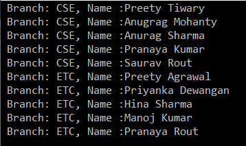

# 정렬 연산자 : OrderBy, OrderByDescending, ThenBy, ThenByDescending, Reverse 

간단히 말해서 Ordering은 특정 순서로 데이터를 정렬하는 프로세스. 데이터 또는 출력을 변경하는 것이 아니라 데이터를 특정 순서, 즉 오름차순 또는 내림차순으로 정렬.

이 경우 개수는 동일하지만 요소의 순서가 변경.

데이터를 오름차순 또는 내림차순의 두 가지 방법으로 정렬하고 순서는 정수 기반 또는 기타 데이터 유형 기반일 수 있다. 예를 들어

1. 알파벳 순서로 된 특정 주의 도시 이름.
2. 학생들은 수업에서 명부 번호로 주문합니다.

급여가 내림차순인 동안 직원 이름 및 성 같은 여러 열을 기준으로 오름차순으로 주문하는 것도 가능합니다.


데이터 정렬을 위해 Linq에서 사용할 수 있는 방법은 무엇입니까?

1. OrderBy
2. OrderByDescending
3. ThenBy
4. ThenByDescending
5. Reverse


## <font color='dodgerblue' size="6">1) OrderBy 메서드</font>     

- ### A. C#의 LINQ Orderby란?
    Linq OrderBy 메서드는 데이터를 오름차순으로 정렬하는 데 사용된다. 명심해야 할 가장 중요한 점은 이 방법이 데이터를 변경하는 것이 아니라 데이터의 순서만 변경한다는 것이다.

    모든 데이터 형식에 대해 OrderBy 메서드를 사용할 수 있다. 즉, 문자, 문자열, 10진수, 정수 뿐만 아니라 클래스와 같은 복합형식에도 사용할 수 있다.
    
    쿼리 구문과 메서드 구문을 모두 사용하여 C#에서 LINQ OrderBy 메서드를 사용하는 방법을 알아보자.

- ### B. 메서도 또는 쿼리 구문을 사용하는 Linq Orderby 확장 메쏘드 예
    **예제 1: 정수 데이터 작업**  
    아래 예제에는 정수 데이터 컬렉션이 있고 OrderBy 메소드를 사용하여 데이터를 오름차순으로 정렬한다.

    ```cs
    using System;
    using System.Collections.Generic;
    using System.Linq;
    namespace LINQDemo
    {
        class Program
        {
            static void Main(string[] args)
            {
                List<int> intList = new List<int>() { 10, 45, 35, 29, 100, 69, 58, 50 };

                Console.WriteLine("Before Sorting : ");
                foreach (var item in intList)
                {
                    Console.Write(item + " ");
                }

                //Sorting the data in Ascending Order
                //Using Method Syntax
                var MS = intList.OrderBy(num => num);

                //Using Query Syntax
                var QS = (from num in intList
                        orderby num
                        select num).ToList();

                Console.WriteLine();
                Console.WriteLine("After Sorting : ");
                foreach (var item in QS)
                {
                    Console.Write(item + " ");
                }

                Console.ReadKey();
            }
        }
    }
    ```

    결과  
      

    **예제 2: 문자열 데이터 작업**  
    아래 예제에는 문자열 이름 모음이 있고 메서드와 쿼리 구문을 모두 사용하여 데이터를 오름차순으로 정렬한다.

    ```cs
    using System;
    using System.Collections.Generic;
    using System.Linq;
    namespace LINQDemo
    {
        class Program
        {
            static void Main(string[] args)
            {
                List<string> stringList = new List<string>() { "Preety", "Tiwary", "Agrawal", "Priyanka", "Dewangan",
                "Hina","Kumar","Manoj", "Rout", "James"};

                //Using Method Syntax
                var MS = stringList.OrderBy(name => name);

                //Using Query Syntax
                var QS = (from name in stringList
                        orderby name ascending
                        select name).ToList();

                foreach (var item in MS)
                {
                    Console.WriteLine(item + " ");
                }

                Console.ReadKey();
            }
        }
    }
    ```

    ```note
    쿼리 구문에서 데이터를 오름차순으로 정렬하는 것이 기본값이기 때문에 아무 것도 지정하지 않으면 기본적으로 오름차순이다. 따라서 다음 두 건은 동일한 내용이다.
    ```

      

    

- ### C. 복합 유형과 함께 LINQ OrderBy 메서드 사용
    우리는 복합 유형인 Student 클래스로 작업할 것이다. 따라서 이름이 Student.cs인 클래스 파일을 만들고 다음 코드를 복사하여 붙여넣자.

    ```cs
    using System.Collections.Generic;
    namespace LINQDemo
    {
        public class Student
        {
            public int ID { get; set; }
            public string FirstName { get; set; }
            public string LastName { get; set; }
            public string Branch { get; set; }

            public static List<Student> GetAllStudents()
            {
                List<Student> listStudents = new List<Student>()
                {
                    new Student{ID= 101,FirstName = "Preety",LastName = "Tiwary",Branch = "CSE"},
                    new Student{ID= 102,FirstName = "Preety",LastName = "Agrawal",Branch = "ETC"},
                    new Student{ID= 103,FirstName = "Priyanka",LastName = "Dewangan",Branch = "ETC"},
                    new Student{ID= 104,FirstName = "Hina",LastName = "Sharma",Branch = "ETC"},
                    new Student{ID= 105,FirstName = "Anugrag",LastName = "Mohanty",Branch = "CSE"},
                    new Student{ID= 106,FirstName = "Anurag",LastName = "Sharma",Branch = "CSE"},
                    new Student{ID= 107,FirstName = "Pranaya",LastName = "Kumar",Branch = "CSE"},
                    new Student{ID= 108,FirstName = "Manoj",LastName = "Kumar",Branch = "ETC"},
                    new Student{ID= 109,FirstName = "Pranaya",LastName = "Rout",Branch = "ETC"},
                    new Student{ID= 110,FirstName = "Saurav",LastName = "Rout",Branch = "CSE"}
                };

                return listStudents;
            }
        }
    }
    ```

    보시다시피 ID, FirstName, LastName 및 Branch 와 같은 네 가지 속성을 사용하여 Student 클래스를 만들었다. 그런 다음 동일한 클래스 내에서 모든 학생의 목록을 반환하는 하나의 메서드(예: GetAllStudents )를 만들었다.

    여기서는 학생의 지점을 기준으로 데이터를 오름차순으로 정렬해보자.
    ```cs
    using System.Linq;
    namespace LINQDemo
    {
        class Program
        {
            static void Main(string[] args)
            {
                //Method Syntax
                var MS = Student.GetAllStudents().OrderBy(x => x.Branch).ToList();

                //Query Syntax
                var QS = (from std in Student.GetAllStudents()
                        orderby std.Branch
                        select std);

                foreach (var student in MS)
                {
                    Console.WriteLine(" Branch: " + student.Branch + ", Name :" + student.FirstName + " " + student.LastName );
                }
                
                Console.ReadKey();
            }
        }
    }
    ```

    결과  
      

- ### D. 필터링과 함께 사용하여 정렬
    이제 CSE 지점 학생만 가져와서 FirstName을 기준으로 데이터를 오름차순으로 정렬해야 한다.

    참고: 기억해야 할 가장 중요한 점은 OrderBy 메서드보다 Where 메서드를 먼저 사용해야 한다는 것입니다. 다음 예제에서는 쿼리 및 메서드 구문을 모두 사용하여 위의 내용을 보여준다.

    ```cs
    using System;
    using System.Collections.Generic;
    using System.Linq;
    namespace LINQDemo
    {
        class Program
        {
            static void Main(string[] args)
            {
                //Method Syntax
                var MS = Student.GetAllStudents()
                                .Where(std => std.Branch.ToUpper() == "CSE")
                                .OrderBy(x => x.FirstName).ToList();

                //Query Syntax
                var QS = (from std in Student.GetAllStudents()
                        where std.Branch.ToUpper() == "CSE"
                        orderby std.FirstName
                        select std);

                foreach (var student in QS)
                {
                    Console.WriteLine(" Branch: " + student.Branch + ", Name :" + student.FirstName + " " + student.LastName );
                }
                
                Console.ReadKey();
            }
        }
    }
    ```

    결과  
      

<br/>
<br/>

## <font color='dodgerblue' size="6">2) OrderByDescending 메서드</font>     

- ### A. LINQ OrderbyDescending 이란?
    LINQ OrderByDescending 메서드는 데이터를 내림차순으로 정렬하는 데 사용된다.

    OrderBy 메서드 와 마찬가지로 문자열, 문자, 부동 소수점, 정수, 클래스 등과 같은 모든 데이터 형식에 대해 OrderByDescending 메서드를 사용할 수 있다. 쿼리 및 메서드 구문을 모두 사용하여 C#에서 OrderByDescending 메서드를 사용하는 방법을 알아보자.

<br/>

- ### B. 메서도 또는 쿼리 구문을 사용하는 Linq OrderByDescending 확장 메쏘드 예
    **정수 데이터 작업**  
    다음 예에는 정수 컬렉션이 있습니다. 그리고 데이터를 내림차순으로 정렬해야 합니다. 쿼리 및 메서드 구문을 모두 사용하여 이 작업을 수행하는 방법을 살펴보다.

    ```cs
    using System;
    using System.Collections.Generic;
    using System.Linq;
    namespace LINQDemo
    {
        class Program
        {
            static void Main(string[] args)
            {
                List<int> intList = new List<int>() { 10, 45, 35, 29, 100, 69, 58, 50 };

                Console.WriteLine("Before Sorting the Data: ");
                foreach (var item in intList)
                {
                    Console.Write(item + " ");
                }

                //Sorting the data in Descending Order
                //Using Method Syntax
                var MS = intList.OrderByDescending(num => num);

                //Using Query Syntax
                var QS = (from num in intList
                        orderby num descending
                        select num).ToList();

                Console.WriteLine();
                Console.WriteLine("After Sorting the Data in Descending Order: ");
                foreach (var item in QS)
                {
                    Console.Write(item + " ");
                }

                Console.ReadKey();
            }
        }
    }
    ```

    결과  
      

    **문자열 데이터 작업**  
    다음 예에서는 문자열 데이터 모음, 즉 이름 모음이 있습니다. 메서드와 쿼리 구문을 모두 사용하여 데이터를 내림차순으로 정렬하려고 합니다. 우리가 이것을 할 수 있는 방법을 보자.

    ```cs
    using System;
    using System.Collections.Generic;
    using System.Linq;
    namespace LINQDemo
    {
        class Program
        {
            static void Main(string[] args)
            {
                List<string> stringList = new List<string>() { "Preety", "Tiwary", "Agrawal", "Priyanka", "Dewangan",
                "Hina","Kumar","Manoj", "Rout", "James"};

                //Using Method Syntax
                var MS = stringList.OrderByDescending(name => name);

                //Using Query Syntax
                var QS = (from name in stringList
                        orderby name descending
                        select name).ToList();

                foreach (var item in MS)
                {
                    Console.WriteLine(item + " ");
                }

                Console.ReadKey();
            }
        }
    }
    ```

<br/>

- ### C. 복합 유형과 함께 LINQ OrderByDescending 메서드 사용    
    복합형으로 작업하는 방법을 이해하기 위해 다음과 같은 Student 클래스로 작업할 것입니다. 따라서 이름이 Student.cs인 클래스 파일을 만들고 다음 코드를 복사하여 붙여넣습니다.

    ```cs
    using System.Collections.Generic;
    namespace LINQDemo
    {
        public class Student
        {
            public int ID { get; set; }
            public string FirstName { get; set; }
            public string LastName { get; set; }
            public string Branch { get; set; }

            public static List<Student> GetAllStudents()
            {
                List<Student> listStudents = new List<Student>()
                {
                    new Student{ID= 101,FirstName = "Preety",LastName = "Tiwary",Branch = "CSE"},
                    new Student{ID= 102,FirstName = "Preety",LastName = "Agrawal",Branch = "ETC"},
                    new Student{ID= 103,FirstName = "Priyanka",LastName = "Dewangan",Branch = "ETC"},
                    new Student{ID= 104,FirstName = "Hina",LastName = "Sharma",Branch = "ETC"},
                    new Student{ID= 105,FirstName = "Anugrag",LastName = "Mohanty",Branch = "CSE"},
                    new Student{ID= 106,FirstName = "Anurag",LastName = "Sharma",Branch = "CSE"},
                    new Student{ID= 107,FirstName = "Pranaya",LastName = "Kumar",Branch = "CSE"},
                    new Student{ID= 108,FirstName = "Manoj",LastName = "Kumar",Branch = "ETC"},
                    new Student{ID= 109,FirstName = "Pranaya",LastName = "Rout",Branch = "ETC"},
                    new Student{ID= 110,FirstName = "Saurav",LastName = "Rout",Branch = "CSE"}
                };

                return listStudents;
            }
        }
    }
    ```

    보시다시피 4개의 간단한 속성(ID, FirstName, LastName 및 Branch)을 사용하여 위의 Student 클래스를 만들었습니다. 그런 다음 모든 학생의 목록을 반환하는 하나의 메서드(예: GetAllStudents)를 만들었습니다.

    여기서는 Branch를 기준으로 데이터를 내림차순으로 정렬하려고 합니다.

    ```cs
    using System.Linq;
    namespace LINQDemo
    {
        class Program
        {
            static void Main(string[] args)
            {
                //Method Syntax
                var MS = Student.GetAllStudents().OrderByDescending(x => x.Branch).ToList();

                //Query Syntax
                var QS = (from std in Student.GetAllStudents()
                        orderby std.Branch descending
                        select std);

                foreach (var student in MS)
                {
                    Console.WriteLine(" Branch: " + student.Branch + ", Name :" + student.FirstName + " " + student.LastName);
                }
                
                Console.ReadKey();
            }
        }
    }
    ```
    결과  
      

<br/>

- ### D. 필터링과 함께 OrderByDescending 사용
    이제 ETC 지점 학생만 가져와서 이름을 기준으로 학생을 내림차순으로 정렬해야 합니다.

    참고: 명심해야 할 가장 중요한 점은 OrderByDescending 메서드보다 Where 확장 메서드를 사용해야 한다는 것입니다.

    ```cs
    using System.Linq;
    namespace LINQDemo
    {
        class Program
        {
            static void Main(string[] args)
            {
                //Method Syntax
                var MS = Student.GetAllStudents()
                                .Where(std => std.Branch.ToUpper() == "ETC")
                                .OrderByDescending(x => x.FirstName).ToList();

                //Query Syntax
                var QS = (from std in Student.GetAllStudents()
                        where std.Branch.ToUpper() == "ETC"
                        orderby std.FirstName descending
                        select std);

                foreach (var student in QS)
                {
                    Console.WriteLine(" Branch: " + student.Branch + ", Name :" + student.FirstName + " " + student.LastName);
                }

                Console.ReadKey();
            }
        }
    }
    ```

    결과  
       

<br/>
<br/>

## <font color='dodgerblue' size="6">3) ThenBy와 ThenByDescending 메서드</font>    

- ### A. LINQ ThenBy와 ThenByDescending 이란?
    OrderBy 또는 OrderByDescending 메서드는 단일 값 또는 단일 식을 기반으로 데이터를 정렬하려는 경우 제대로 작동합니다. 그러나 여러 값이나 여러 식을 기반으로 데이터를 정렬하려면 LINQ ThenBy 및 ThenByDescending 메서드를 OrderBy 또는 OrderByDescending 메서드와 함께 사용해야 환다.

    ThenBy 메서드는 데이터를 두 번째 수준부터 오름차순으로 정렬하는 데 사용된다. 반면에 TheByDescending 메서드는 데이터를 두 번째 수준부터 내림차순으로 정렬하는 데 사용된다.

    이 두 가지 방법은 OrderBy 또는 OrderByDescending 방법 과 함께 사용되며 동일한 LINQ 쿼리에서 ThenBy 또는 TheByDescending 메서드를 두 번 이상 사용할 수 있다.

    OrderBy 또는 OrderByDescending 메서드 는 일반적으로 기본 정렬에 사용됩니다. thenBy 또는 ThenByDescending 은 2차 정렬 등에 사용됩니다. 예를 들어, 먼저 이름으로 학생을 정렬한 다음 성으로 학생을 정렬합니다.

- ### B. 메서도 또는 쿼리 구문을 사용하는 ThenBy, ThenByDescending 확장 메쏘드 예
    C#에서 ThenBy 및 ThenByDescending 메서드의 사용을 이해하기 위해 다음 Student 클래스를 사용할 것입니다.

    ```cs
    using System.Collections.Generic;
    namespace LINQDemo
    {
        public class Student
        {
            public int ID { get; set; }
            public string FirstName { get; set; }
            public string LastName { get; set; }
            public string Branch { get; set; }

            public static List<Student> GetAllStudents()
            {
                List<Student> listStudents = new List<Student>()
                {
                    new Student{ID= 101,FirstName = "Preety",LastName = "Tiwary",Branch = "CSE"},
                    new Student{ID= 102,FirstName = "Preety",LastName = "Agrawal",Branch = "ETC"},
                    new Student{ID= 103,FirstName = "Priyanka",LastName = "Dewangan",Branch = "ETC"},
                    new Student{ID= 104,FirstName = "Hina",LastName = "Sharma",Branch = "ETC"},
                    new Student{ID= 105,FirstName = "Anugrag",LastName = "Mohanty",Branch = "CSE"},
                    new Student{ID= 106,FirstName = "Anurag",LastName = "Sharma",Branch = "CSE"},
                    new Student{ID= 107,FirstName = "Pranaya",LastName = "Kumar",Branch = "CSE"},
                    new Student{ID= 108,FirstName = "Manoj",LastName = "Kumar",Branch = "ETC"},
                    new Student{ID= 109,FirstName = "Pranaya",LastName = "Rout",Branch = "ETC"},
                    new Student{ID= 110,FirstName = "Saurav",LastName = "Rout",Branch = "CSE"}
                };

                return listStudents;
            }
        }
    }
    ```

    **예제:메서드구문사용**  
    먼저 이름을 기준으로 학생을 오름차순으로 정렬한 다음 성을 기준으로 학생을 오름차순으로 정렬해야 합니다.

    ```cs
    using System;
    using System.Linq;
    namespace LINQDemo
    {
        class Program
        {
            static void Main(string[] args)
            {
                //Method Syntax
                var MS = Student.GetAllStudents()
                                .OrderBy(x => x.FirstName)
                                .ThenBy(y => y.LastName)
                                .ToList();
                
                foreach (var student in MS)
                {
                    Console.WriteLine( "First Name :" + student.FirstName + ", Last Name : " + student.LastName);
                }

                Console.ReadKey();
            }
        }
    }
    ```
    
    결과  
          

    **예제:쿼리 구문 사용**  
    쿼리 구문에는 ThenBy 및 ThenByDescending이라는 메서드가 없습니다. 따라서 여기에서 아래 예제와 같이 쉼표로 구분된 order by 절에 여러 값 또는 표현식을 지정해야 합니다.

    ```cs
    using System;
    using System.Linq;
    namespace LINQDemo
    {
        class Program
        {
            static void Main(string[] args)
            {
                //Query Syntax
                var QS = (from std in Student.GetAllStudents()
                        orderby std.FirstName, std.LastName
                        select std);

                foreach (var student in QS)
                {
                    Console.WriteLine( "First Name :" + student.FirstName + ", Last Name : " + student.LastName);
                }

                Console.ReadKey();
            }
        }
    }
    ```

    메서드 구문과 동일한 출력을 제공합니다.

- ### C. 여러 속성을 사용하여 정렬을 여러번 수행
    먼저 Branch를 기준으로 데이터를 오름차순으로 정렬(asc).  
    그런 다음 이름을 기준으로 데이터를 내림차순으로 정렬(desc).  
    마지막으로 성 값을 기준으로 오름차순으로 데이터를 정렬(asc).

    ```cs
    using System;
    using System.Linq;
    namespace LINQDemo
    {
        class Program
        {
            static void Main(string[] args)
            {
                //Using Method Syntax
                var MS = Student.GetAllStudents()
                        .OrderBy(x => x.Branch)
                        .ThenByDescending(y => y.FirstName)
                        .ThenBy(z => z.LastName)
                        .ToList();

                //Query Syntax
                var QS = (from std in Student.GetAllStudents()
                        orderby std.Branch ascending, 
                                std.FirstName descending, 
                                std.LastName
                        select std).ToList();

                foreach (var student in QS)
                {
                    Console.WriteLine( "Barnch " + student.Branch+ ", First Name :" 
                    + student.FirstName + ", Last Name : " + student.LastName);
                }

                Console.ReadKey();
            }
        }
    }
    ```

    결과  
      


- ### D. 필터링과 함께 ThenBy, ThenByDescending 사용
    여기서 먼저 CSE 지점 학생만 가져와야 하고 다음과 같이 데이터를 정렬해야 합니다. 먼저 이름을 기준으로 오름차순으로 데이터를 정렬합니다. 그런 다음 성을 기준으로 데이터를 내림차순으로 정렬합니다.

    ```cs
    using System;
    using System.Linq;
    namespace LINQDemo
    {
        class Program
        {
            static void Main(string[] args)
            {
                //Using Method Syntax
                var MS = Student.GetAllStudents()
                        .Where(std => std.Branch == "CSE")
                        .OrderBy(x => x.FirstName)
                        .ThenByDescending(y => y.LastName)
                        .ToList();

                //Query Syntax
                var QS = (from std in Student.GetAllStudents()
                        where std.Branch == "CSE"
                        orderby std.FirstName, 
                                std.LastName descending
                        select std).ToList();

                foreach (var student in QS)
                {
                    Console.WriteLine( "Barnch " + student.Branch+ ", First Name :"
                        + student.FirstName + ", Last Name : " + student.LastName);
                }

                Console.ReadKey();
            }
        }
    }
    ```

    결과  
          

<br/>
<br/>

## <font color='dodgerblue' size="6">4) Reverse 메서드</font>    

- ### A. Reverse 메쏘드 란?
    데이터 소스에 저장된 데이터를 반전시키는 데 사용. 즉, Orderby나 OrderByDescending을 사용하지 않고 간단히 되돌린다. 결과적으로 우리는 역순으로 출력을 얻을 것이다.

    Reverse 메서드는 System.Linq 및 System.Collections.Generic 네임스페이스와 같은 두 개의 서로 다른 네임스페이스에서 구현된다.

       

    IEnumerabl&lt;TSource> 인터페이스 에서 확장 메서드로 구현된 System.Linq 네임스페이스 에 속하는 Reverse 메서드를 볼 수 있으며 더 중요한 것은 이 메서드도 IEnumerable&lt;TSource> 형식을 반환한다는 것입니다.

    반면 System.Collections.Generic 네임스페이스에 속하는 Reverse 메서드는 반환 유형이 void이므로 값을 반환하지 않습니다.

    이를 염두에 두고 Reverse 방법을 더 잘 이해하기 위한 몇 가지 예를 살펴보겠습니다.

- ### B. 메서드 또는 쿼리 구문을 사용하는 Reverse 확장 메쏘드 예
    **예제1: System.Linq 네임스페이스 Reverse 메서드**  
    이를 이해하기 위해 아래 예제와 같이 정수 배열로 작업할 것입니다.
    ```cs
    using System.Collections.Generic;
    using System;
    using System.Linq;
    namespace LINQDemo
    {
        class Program
        {
            static void Main(string[] args)
            {
                int[] intArray = new int[] { 10, 30, 50, 40,60,20,70,100 };
                Console.WriteLine("Before Reverse the Data");
                foreach (var number in intArray)
                {
                    Console.Write(number + " ");
                }
                Console.WriteLine();

                IEnumerable<int> ArrayReversedData = intArray.Reverse();
                Console.WriteLine("After Reverse the Data");
                foreach (var number in ArrayReversedData)
                {
                    Console.Write(number + " ");
                }
                
                Console.ReadKey();
            }
        }
    }
    ```

    결과  
       

    참고: 위의 예에서 Reverse 메서드의 정의로 이동하면 이 Reverse 메서드가 System.Linq 네임스페이스에 속한다는 것을 알 수 있으므로 IEnumerable&lt;int> 유형의 변수에 데이터를 저장할 수 있다. 소스에 정수 데이터가 포함되어 있기 때문입니다.

    **쿼리 구문 사용:**  
    가장 중요한 점은 쿼리 구문을 작성하기 위해 Linq에서 사용할 수 있는 Reverse라는 연산자가 없다는 것입니다. 따라서 여기서는 혼합 구문을 사용해야 합니다. 따라서 혼합 구문을 사용하여 동일한 예제를 다시 작성하는 방법을 살펴보겠습니다.

    ```cs
    using System.Collections.Generic;
    using System;
    using System.Linq;
    namespace LINQDemo
    {
        class Program
        {
            static void Main(string[] args)
            {
                int[] intArray = new int[] { 10, 30, 50, 40,60,20,70,100 };
                Console.WriteLine("Before Reverse the Data");
                foreach (var number in intArray)
                {
                    Console.Write(number + " ");
                }
                Console.WriteLine();

                IEnumerable<int> ArrayReversedData = (from num in intArray
                                                    select num).Reverse();

                Console.WriteLine("After Reverse the Data");
                foreach (var number in ArrayReversedData)
                {
                    Console.Write(number + " ");
                }
                
                Console.ReadKey();
            }
        }
    }
    ```

    **예제 2: System.Collections.Generic 네임스페이스 Reverse 메서드**  
    위의 Reverse 메소드를 이해하기 위해서는 아래 예시와 같이 List&lt;string> 컬렉션을 생성해야 합니다.

    ```cs
    using System.Collections.Generic;
    using System;
    using System.Linq;
    namespace LINQDemo
    {
        class Program
        {
            static void Main(string[] args)
            {
                List<string> stringList = new List<string>() { "Preety", "Tiwary", "Agrawal", "Priyanka", "Dewangan"};
                
                Console.WriteLine("Before Reverse the Data");
                foreach (var name in stringList)
                {
                    Console.Write(name + " ");
                }
                Console.WriteLine();

                //이 메서드는 반환 형식이 void인 System.Collections.Generic 네임스페이스에 속하므로
                // 데이터를 저장할 수 없습니다. 
                stringList.Reverse();

                Console.WriteLine("After Reverse the Data");
                foreach (var name in stringList)
                {
                    Console.Write(name + " ");
                }

                Console.ReadKey();
            }
        }
    }
    ```

    위의 Reverse 메서드 정의로 이동하면 이 메서드가 System.Collections.Generic 네임스페이스에 속하고 이 Reverse 메서드의 반환 유형이 Void임을 알 수 있습니다.

    결과  
       

- ### D. List&lt;T> 유형의 컬렉션에 System.Linq 네임스페이스의 Reverse 메서드를 적용하는 방법
    List&lt;T> 형식의 컬렉션에서 System.Linq 네임스페이스에 속하는 Reverse 메서드를 적용하려면 먼저 AsEnumerable() 을 사용하여 List&lt;T> 컬렉션을 IEnumerable 또는 IQueryable 컬렉션 으로 변환해야 한다. 

    AsEnumerable() 메서드를 사용 하면 컬렉션이 IEnumerable 로 변환되고 AsQueryable() 메서드를 사용하면 컬렉션이 IQueryable 로 변환된다 .

    다음 프로그램은 List&lt;T> 형식의 컬렉션에 System.Linq네임스페이스의 Reverse 메서드를 적용하는 방법을 보여준다.

    ```cs
    using System.Collections.Generic;
    using System;
    using System.Linq;
    namespace LINQDemo
    {
        class Program
        {
            static void Main(string[] args)
            {
                List<string> stringList = new List<string>() { "Preety", "Tiwary", "Agrawal", "Priyanka", "Dewangan" };

                Console.WriteLine("Before Reverse the Data");
                foreach (var name in stringList)
                {
                    Console.Write(name + " ");
                }
                Console.WriteLine();

                IEnumerable<string> ReverseData1 = stringList.AsEnumerable().Reverse();
                IQueryable<string> ReverseData2 = stringList.AsQueryable().Reverse();

                Console.WriteLine("After Reverse the Data");
                foreach (var name in ReverseData1)
                {
                    Console.Write(name + " ");
                }

                Console.ReadKey();
            }
        }
    }
    ```

    결과  
           

    참고: C#의 System.Linq.Reverse 메서드는 LINQ 메서드를 사용하는 방법에 따라 데이터를 IEnumerable&lt;TSource> 또는 IQuereable&lt;TSource >로 반환합니다 .


