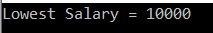
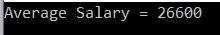
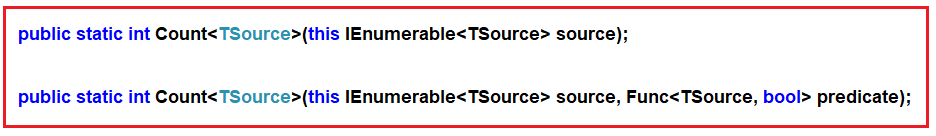
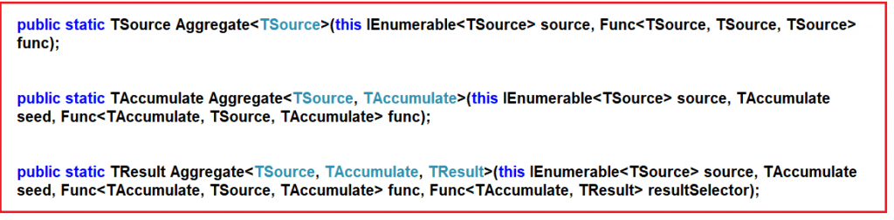

# 집계 함수 : Sum, Max, Min, Average, Count, Aggregate

**C#의 Linq 집계 함수란?**  
Linq 집계 함수는 여러 행의 값을 입력으로 그룹화한 다음 출력을 단일 값으로 반환하는 데 사용된다. 간단히 말해서 C#의 집계 함수는 항상 단일 값을 반환한다고 말할 수 있다. 

**C#에서 집계 함수는 언제 사용합니까?**
컬렉션의 숫자 속성에 대해 Sum, Count, Max, Min, Average 및 Aggregate와 같은 일부 수학 연산을 수행하려면 Linq 집계 함수를 사용한다.

**Linq에서 제공하는 집계 함수는 무엇이 있나?**
다음은 컬렉션에 대한 수학 연산을 수행하기 위해 Linq에서 제공하는 집계 함수들이다.

1. Sum(): 이 함수는 컬렉션의 total(sum) 값을 계산하는 데 사용.
2. Max(): 이 함수는 컬렉션에서 가장 큰 값을 찾는 데 사용.
3. Min(): 이 함수는 컬렉션에서 가장 작은 값을 찾는 데 사용.
4. Average(): 이 함수는 컬렉션의 숫자 형식의 평균 값을 계산하는 데 사용.
5. Count(): 이 함수는 컬렉션에 있는 요소의 갯수를 세는데 사용.
6. Aggregate(): 이 함수는 컬렉션 값에 대해 사용자 지정 집계 작업을 수행하는 데 사용.

<br/>

## <font color='dodgerblue' size="6">1) Sum 함수</font>     

- ### A. Sum 함수란?
    Linq Sum() 메서드는 집계 함수 범주에 속합니다. C#의 Linq Sum 메서드는 컬렉션에 있는 숫자 값의 합계 또는 합계를 계산하는 데 사용됩니다. 몇 가지 예를 들어 Sum() 메서드를 이해합시다.

<br/>

- ### B. 메서도 또는 쿼리 구문을 사용하는 Sum 함수 예제
    **예제 1**  
    다음 예제에서는 컬렉션에 있는 모든 정수의 합계를 계산합니다.

    ```cs
   using System;
    using System.Linq;
    namespace LINQDemo
    {
        class Program
        {
            static void Main(string[] args)
            {
                int[] intNumbers = new int[] { 10, 30, 50, 40, 60, 20, 70, 90, 80, 100 };

                //Using Method Syntax
                int MSTotal = intNumbers.Sum();

                //Using Query Syntax
                int QSTotal = (from num in intNumbers
                            select num).Sum();

                Console.WriteLine("Sum = " + QSTotal);

                Console.ReadKey();
            }
        }
    }
    ```

    결과  
    <span style='background-color:#fff5b1'>Sum = 550</span>

    참고: Linq 쿼리 구문에는 sum이라는 연산자가 없습니다. 따라서 여기서는 혼합 구문을 사용해야 합니다.

    **예제 2: 필터가 있는 Linq Sum 메서드**  
    이제 50보다 큰 모든 숫자의 합을 계산해야 합니다.

    ```cs
    using System;
    using System.Linq;
    namespace LINQDemo
    {
        class Program
        {
            static void Main(string[] args)
            {
                int[] intNumbers = new int[] { 10, 30, 50, 40, 60, 20, 70, 90, 80, 100 };

                //Using Method Syntax
                int MSTotal = intNumbers.Where(num => num > 50).Sum();

                //Using Query Syntax
                int QSTotal = (from num in intNumbers
                            where num > 50
                            select num).Sum();

                Console.WriteLine("Sum = " + QSTotal);

                Console.ReadKey();
            }
        }
    }
    ```

    <span style='background-color:#fff5b1'>Sum = 400</span>

    **예제 3: 람다 조건식 파라메터가 있는 Linq Sum 메서드**  
    where 메서드를 사용하여 데이터를 필터링하는 대신 조건식을 사용하여 데이터를 필터링하는 논리를 작성하는 Sum 메서드의 다른 오버로드된 버전을 사용할 수도 있다.

    ```cs
    using System;
    using System.Linq;
    namespace LINQDemo
    {
        class Program
        {
            static void Main(string[] args)
            {
                int[] intNumbers = new int[] { 10, 30, 50, 40, 60, 20, 70, 90, 80, 100 };

                //Using Method Syntax with a Predicate
                int MSTotal = intNumbers.Sum(num => {
                    if (num > 50)
                        return num;
                    else
                        return 0;
                });
                
                Console.WriteLine("Sum = " + MSTotal);

                Console.ReadKey();
            }
        }
    }
    ```
    
    <span style='background-color:#fff5b1'>Sum = 400</span>

<br/>

- ### C. 복합 유형에서 LINQ Sum 함수 사용
    다음 Employee 클래스로 작업할 것입니다.

    ```cs
    using System.Collections.Generic;
    namespace LINQDemo
    {
        public class Employee
        {
            public int ID { get; set; }
            public string Name { get; set; }
            public int Salary { get; set; }
            public string Department { get; set; }

            public static List<Employee> GetAllEmployees()
            {
                List<Employee> listStudents = new List<Employee>()
                {
                    new Employee{ID= 101,Name = "Preety", Salary = 10000, Department = "IT"},
                    new Employee{ID= 102,Name = "Priyanka", Salary = 15000, Department = "Sales"},
                    new Employee{ID= 103,Name = "James", Salary = 50000, Department = "Sales"},
                    new Employee{ID= 104,Name = "Hina", Salary = 20000, Department = "IT"},
                    new Employee{ID= 105,Name = "Anurag", Salary = 30000, Department = "IT"},
                    new Employee{ID= 106,Name = "Sara", Salary = 25000, Department = "IT"},
                    new Employee{ID= 107,Name = "Pranaya", Salary = 35000, Department = "IT"},
                    new Employee{ID= 108,Name = "Manoj", Salary = 11000, Department = "Sales"},
                    new Employee{ID= 109,Name = "Sam", Salary = 45000, Department = "Sales"},
                    new Employee{ID= 110,Name = "Saurav", Salary = 25000, Department = "Sales"}
                };

                return listStudents;
            }
        }
    }
    ```

    이것은 ID, Name, Salary 및 Department 와 같은 4가지 속성이 있는 매우 간단한 Employee 클래스입니다 . 우리는 또한 모든 직원의 목록을 반환할 GetAllEmployees() 와 같은 하나의 메서드를 만듭니다.

    **예제4:**
    다음 예에서는 모든 직원의 급여 합계를 계산합니다.

    ```cs
    using System;
    using System.Linq;
    namespace LINQDemo
    {
        class Program
        {
            static void Main(string[] args)
            {
                //Using Method Syntax
                var TotalSalaryMS = Employee.GetAllEmployees()
                                .Sum(emp => emp.Salary);

                //Using Query Syntax
                var TotalSalaryQS = (from emp in Employee.GetAllEmployees()
                                    select emp).Sum(e => e.Salary);
                
                Console.WriteLine("Sum Of Salary = " + TotalSalaryMS);

                Console.ReadKey();
            }
        }
    }
    ```

    결과  
    <span style='background-color:#fff5b1'>Sum Of Salary = 266000</span>

    **예제5:**  
    다음 예에서는 IT 부서에 속한 모든 직원의 급여 합계를 계산합니다.

    ```cs
    using System;
    using System.Linq;
    namespace LINQDemo
    {
        class Program
        {
            static void Main(string[] args)
            {
                //Using Method Syntax
                var TotalSalaryMS = Employee.GetAllEmployees()
                                .Where(emp => emp.Department == "IT")
                                .Sum(emp => emp.Salary);

                //Using Query Syntax
                var TotalSalaryQS = (from emp in Employee.GetAllEmployees()
                                    where emp.Department == "IT"
                                    select emp).Sum(e => e.Salary);
                
                Console.WriteLine("IT Department Total Salary = " + TotalSalaryQS);

                Console.ReadKey();
            }
        }
    }
    ```
    결과  
    <span style='background-color:#fff5b1'>IT Department Total Salary = 120000</span>

     **예제6:**  
    사용자 정의 조건식을 사용하여 이전 예제를 다시 작성하였다.

    ```cs
    using System;
    using System.Linq;
    namespace LINQDemo
    {
        class Program
        {
            static void Main(string[] args)
            {
                //Using Method Syntax and Predicate
                var TotalSalaryMS = Employee.GetAllEmployees()
                                .Sum(emp => {
                                    if (emp.Department == "IT")
                                        return emp.Salary;
                                    else
                                        return 0;
                                });
                
                Console.WriteLine("IT Department Total Salary = " + TotalSalaryMS);

                Console.ReadKey();
            }
        }
    }
    ```
    결과  
    <span style='background-color:#fff5b1'>IT Department Total Salary = 120000</span>

<br/>

## <font color='dodgerblue' size="6">2) Max 함수</font>     

- ### A. Max 함수란?
    Max 함수는 컬렉션에서 가장 큰 숫자 값을 반환하는 데 사용되며 몇 가지 예를 들어 Max() 함수를 이해해 보자.

- ### B. 메서도 또는 쿼리 구문을 사용하는 Max 함수 예제
    **예제 1**  
    다음 예에서는 컬렉션에서 가장 큰 수를 반환한다.

    ```cs
    using System;
    using System.Linq;

    namespace LINQDemo
    {
        class Program
        {
            static void Main(string[] args)
            {
                int[] intNumbers = new int[] { 10, 80, 50, 90, 60, 30, 70, 40, 20, 100 };

                //Using Method Syntax
                int MSLergestNumber = intNumbers.Max();

                //Using Query Syntax
                int QSLergestNumber = (from num in intNumbers
                            select num).Max();

                Console.WriteLine("Largest Number = " + MSLergestNumber);

                Console.ReadKey();
            }
        }
    }
    ```

    출력값은 100이다.  
    참고: Linq 쿼리 구문에는 Max라는 연산자가 없기 때문에 혼합 구문을 사용해야 한다.

    <br/>
    **예제 2: 필터와 함께 Linq Max 메서드 사용**  
    이제 컬렉션에서 50보다 작은 숫자 중 들에서 가장 큰 숫자를 반환해야 한다.

    ```cs
    using System;
    using System.Linq;

    namespace LINQDemo
    {
        class Program
        {
            static void Main(string[] args)
            {
                int[] intNumbers = new int[] { 10, 80, 50, 90, 60, 30, 70, 40, 20, 100 };

                //Using Method Syntax
                int MSLergestNumber = intNumbers.Where(num => num < 50).Max();

                //Using Query Syntax
                int QSLergestNumber = (from num in intNumbers
                                    where num < 50
                                    select num).Max();

                Console.WriteLine("Largest Number = " + MSLergestNumber);

                Console.ReadKey();
            }
        }
    }
    ```

    출력값은 40이다
    
    <br/>
    **예제 3: 람다 조건식을 파라메터로 지정하는 Linq Max**  
    where 메서드를 사용하여 데이터를 필터링하는 대신에 조건식 파라메터를 사용하는 Max 메서드의 다른 오버로드된 버전이 있다. 아래 예제에서와 같이 해당 조건식을 작성하여 데이터를 필터링하는 논리를 사용할 수 있다.

    ```cs
    using System;
    using System.Linq;

    namespace LINQDemo
    {
        class Program
        {
            static void Main(string[] args)
            {
                int[] intNumbers = new int[] { 10, 80, 50, 90, 60, 30, 70, 40, 20, 100 };

                //Using Method Syntax
                int MSLergestNumber = intNumbers.Max(num => {
                    if (num < 50)
                        return num;
                    else
                        return 0;
                });
            
                Console.WriteLine("Largest Number = " + MSLergestNumber);

                Console.ReadKey();
            }
        }
    }
    ```

    이전 예제와 동일한 결과값을 제공한다.

<br/>

- ### C. 복합 유형과 함께 LINQ Max 함수 사용
    다음 Employee 클래스는 ID, Name, Salary 및 Department 와 같은 4가지 속성이 있는 간단한 클래스이다. 또한 모든 직원의 목록을 반환할 GetAllEmployees() 와 같은 하나의 함수도 있다.

    ```cs
    using System.Collections.Generic;

    namespace LINQDemo
    {
        public class Employee
        {
            public int ID { get; set; }
            public string Name { get; set; }
            public int Salary { get; set; }
            public string Department { get; set; }

            public static List<Employee> GetAllEmployees()
            {
                List<Employee> listStudents = new List<Employee>()
                {
                    new Employee{ID= 101,Name = "Preety", Salary = 10000, Department = "IT"},
                    new Employee{ID= 102,Name = "Priyanka", Salary = 15000, Department = "Sales"},
                    new Employee{ID= 103,Name = "James", Salary = 50000, Department = "Sales"},
                    new Employee{ID= 104,Name = "Hina", Salary = 20000, Department = "IT"},
                    new Employee{ID= 105,Name = "Anurag", Salary = 30000, Department = "IT"},
                    new Employee{ID= 106,Name = "Sara", Salary = 25000, Department = "IT"},
                    new Employee{ID= 107,Name = "Pranaya", Salary = 35000, Department = "IT"},
                    new Employee{ID= 108,Name = "Manoj", Salary = 11000, Department = "Sales"},
                    new Employee{ID= 109,Name = "Sam", Salary = 45000, Department = "Sales"},
                    new Employee{ID= 110,Name = "Saurav", Salary = 25000, Department = "Sales"}
                };

                return listStudents;
            }
        }
    }
    ```   

    <br/>
    **예제4:**
    모든 직원의 급여 중에서 가장 높은 금액을 추출.

    ```cs
    using System;
    using System.Linq;

    namespace LINQDemo
    {
        class Program
        {
            static void Main(string[] args)
            {
                //Using Method Syntax
                var MSHighestSalary = Employee.GetAllEmployees()
                                .Max(emp => emp.Salary);

                //Using Query Syntax
                var QSHighestSalary = (from emp in Employee.GetAllEmployees()
                                    select emp).Max(e => e.Salary);

                Console.WriteLine("Highest Salary = " + QSHighestSalary);

                Console.ReadKey();
            }
        }
    }
    ```
    
    결과  
    <span style='background-color:#fff5b1'>Highest Salary = 50000</span>

    <br/>
    **예제5:**  
    IT 부서 직원 중에서 최고 급여 금액을 추출.

    ```cs
    using System;
    using System.Linq;

    namespace LINQDemo
    {
        class Program
        {
            static void Main(string[] args)
            {
                //Using Method Syntax
                var MSHighestSalary = Employee.GetAllEmployees()
                                .Where(emp => emp.Department == "IT")
                                .Max(emp => emp.Salary);

                //Using Query Syntax
                var QSHighestSalary = (from emp in Employee.GetAllEmployees()
                                    where emp.Department == "IT"
                                    select emp).Max(e => e.Salary);

                Console.WriteLine("It Department Highest Salary = " + QSHighestSalary);

                Console.ReadKey();
            }
        }
    }
    ```
    결과  
    <span style='background-color:#fff5b1'>It Department Highest Salary = 35000</span>

    <br/>
     **예제6:**  
    사용자 정의 람다 조건식을 사용하여 이전 예제를 다시 작성하였다.

    ```cs
    using System;
    using System.Linq;

    namespace LINQDemo
    {
        class Program
        {
            static void Main(string[] args)
            {
                //Using Method Syntax
                var MSHighestSalary = Employee.GetAllEmployees()
                                .Max(emp => {
                                    if (emp.Department == "IT")
                                        return emp.Salary;
                                    else
                                        return 0;
                                });
                
                Console.WriteLine("It Department Highest Salary = " + MSHighestSalary);

                Console.ReadKey();
            }
        }
    }
    ```
    이전 예제와 동일한 출력을 제공합니다.


## <font color='dodgerblue' size="6">3) Min 함수</font>     

- ### A. Min 함수란?
    Min 함수는 컬렉션에서 가장 작은 숫자 값을 반환하는 데 사용되며 몇 가지 예를 들어 Min() 함수를 이해해 보자.

- ### B. 메서드 또는 쿼리 구문을 사용하는 Min 함수 예제
    **예제 1**  
    다음 예에서는 컬렉션에서 가장 작은 수를 반환한다.

    ```cs
    using System;
    using System.Linq;
    namespace LINQDemo
    {
        class Program
        {
            static void Main(string[] args)
            {
                int[] intNumbers = new int[] { 60, 80, 50, 90, 10, 30, 70, 40, 20, 100 };

                //Using Method Syntax
                int MSLowestNumber = intNumbers.Min();

                //Using Query Syntax
                int QSLowestNumber = (from num in intNumbers
                            select num).Min();

                Console.WriteLine("Lowest Number = " + MSLowestNumber);

                Console.ReadKey();
            }
        }
    }
    ```

    출력값은 10이다.  
    참고: Linq 쿼리 구문에는 Min라는 연산자가 없기 때문에 혼합 구문을 사용해야 한다.

    <br/>
    **예제 2: 필터와 함께 Min 함수 사용**  
     컬렉션에서 50보다 큰 숫자들 중에서 가장 작은 숫자를 반환해야 한다.

    ```cs
    using System;
    using System.Linq;

    namespace LINQDemo
    {
        class Program
        {
            static void Main(string[] args)
            {
                int[] intNumbers = new int[] { 60, 80, 50, 90, 10, 30, 70, 40, 20, 100 };

                //Using Method Syntax
                int MSLowestNumber = intNumbers.Where(num => num > 50).Min();

                //Using Query Syntax
                int QSLowestNumber = (from num in intNumbers
                                    where num > 50
                                    select num).Min();

                Console.WriteLine("Lowest Number = " + MSLowestNumber);
                Console.ReadKey();
            }
        }
    }
    ```

    출력값은 60이다
    
    <br/>
    **예제 3: 람다 조건식을 파라메터로 지정하는 Linq Min**  
    where 메서드를 사용하여 데이터를 필터링하는 대신에 람다 조건식 파라메터를 사용하는 Min 메서드의 다른 오버로드된 버전이 있다.

    ```cs
    using System;
    using System.Linq;

    namespace LINQDemo
    {
        class Program
        {
            static void Main(string[] args)
            {
                int[] intNumbers = new int[] { 60, 80, 50, 90, 10, 30, 70, 40, 20, 100 };

                //Using Method Syntax
                int MSLowestNumber = intNumbers.Where(num => num > 50).Min(num => {
                    if (num > 50)
                        return num;
                    else
                        return 0;
                });
                
                Console.WriteLine("Lowest Number = " + MSLowestNumber);
                Console.ReadKey();
            }
        }
    }
    ```

    이전 예제와 동일한 결과값을 제공한다.

<br/>

- ### C. 복합 유형과 함께 LINQ Min 함수 사용
    다음 Employee 클래스는 ID, Name, Salary 및 Department 와 같은 4가지 속성이 있는 간단한 클래스이다. 또한 모든 직원의 목록을 반환할 GetAllEmployees() 와 같은 하나의 함수도 있다.

    ```cs
    using System.Collections.Generic;

    namespace LINQDemo
    {
        public class Employee
        {
            public int ID { get; set; }
            public string Name { get; set; }
            public int Salary { get; set; }
            public string Department { get; set; }

            public static List<Employee> GetAllEmployees()
            {
                List<Employee> listStudents = new List<Employee>()
                {
                    new Employee{ID= 101,Name = "Preety", Salary = 10000, Department = "IT"},
                    new Employee{ID= 102,Name = "Priyanka", Salary = 15000, Department = "Sales"},
                    new Employee{ID= 103,Name = "James", Salary = 50000, Department = "Sales"},
                    new Employee{ID= 104,Name = "Hina", Salary = 20000, Department = "IT"},
                    new Employee{ID= 105,Name = "Anurag", Salary = 30000, Department = "IT"},
                    new Employee{ID= 106,Name = "Sara", Salary = 25000, Department = "IT"},
                    new Employee{ID= 107,Name = "Pranaya", Salary = 35000, Department = "IT"},
                    new Employee{ID= 108,Name = "Manoj", Salary = 11000, Department = "Sales"},
                    new Employee{ID= 109,Name = "Sam", Salary = 45000, Department = "Sales"},
                    new Employee{ID= 110,Name = "Saurav", Salary = 25000, Department = "Sales"}
                };

                return listStudents;
            }
        }
    }
    ```   

    <br/>
    **예제4:**
    모든 직원의 급여 중에서 가장 낮은 금액을 추출.

    ```cs
    using System;
    using System.Linq;

    namespace LINQDemo
    {
        class Program
        {
            static void Main(string[] args)
            {
                //Using Method Syntax
                var MSHighestSalary = Employee.GetAllEmployees()
                                .Min(emp => emp.Salary);

                //Using Query Syntax
                var QSHighestSalary = (from emp in Employee.GetAllEmployees()
                                    select emp).Min(e => e.Salary);

                Console.WriteLine("Highest Salary = " + QSHighestSalary);

                Console.ReadKey();
            }
        }
    }
    ```
    
    결과  
      


    <br/>
    **예제5:**  
    IT 부서 직원 중에서 최저 급여 금액을 추출.

    ```cs
    using System;
    using System.Linq;

    namespace LINQDemo
    {
        class Program
        {
            static void Main(string[] args)
            {
                //Using Method Syntax
                var MSHighestSalary = Employee.GetAllEmployees()
                                .Where(emp => emp.Department == "IT")
                                .Min(emp => emp.Salary);

                //Using Query Syntax
                var QSHighestSalary = (from emp in Employee.GetAllEmployees()
                                    where emp.Department == "IT"
                                    select emp).Min(e => e.Salary);

                Console.WriteLine("It Department Highest Salary = " + QSHighestSalary);

                Console.ReadKey();
            }
        }
    }
    ```
    결과  
     


## <font color='dodgerblue' size="6">4) Average 함수</font>     

- ### A. Average 함수란?
    Average 함수는 컬렉션에서 숫자 값의 평균을 계산하는 데 사용된다. 이 Average 메서드는 nullable 또는 nullable이 아닌 10진수, float 또는 double 값을 반환할 수 있다. 몇 가지 예를 들어보자.

- ### B. 메서드 또는 쿼리 구문을 사용하는 Average 함수 예제
    **예제 1**  
    컬렉션에 있는 모든 정수의 평균 값을 계산.

    ```cs
    using System;
    using System.Linq;

    namespace LINQDemo
    {
        class Program
        {
            static void Main(string[] args)
            {
                int[] intNumbers = new int[] { 60, 80, 50, 90, 10, 30, 70, 40, 20, 100 };

                //Using Method Syntax
                var MSAverageValue = intNumbers.Average();

                //Using Query Syntax
                var QSAverageValue = (from num in intNumbers
                                    select num).Average();

                Console.WriteLine("Average Value = " + MSAverageValue);
                Console.ReadKey();
            }
        }
    }
    ```

    결과  
      

    참고: Linq 쿼리 구문에는 Average라는 연산자가 없기 때문에 혼합 구문을 사용해야 한다.

    <br/>
    **예제 2: 필터와 함께 Average 함수 사용**  
     컬렉션에서 50보다 큰 숫자들의 평균값을 추출.

    ```cs
    using System;
    using System.Linq;

    namespace LINQDemo
    {
        class Program
        {
            static void Main(string[] args)
            {
                int[] intNumbers = new int[] { 60, 80, 50, 90, 10, 30, 70, 40, 20, 100 };

                //Using Method Syntax
                var MSAverageValue = intNumbers.Where(num => num > 50).Average();

                //Using Query Syntax
                var QSAverageValue = (from num in intNumbers
                                    where num > 50
                                    select num).Average();

                Console.WriteLine("Average Value = " + MSAverageValue);
                Console.ReadKey();
            }
        }
    }
    ```

    출력값은 80이다
    
    

<br/>

- ### C. 복합 유형과 함께 Average 함수 사용
    다음 Employee 클래스는 ID, Name, Salary 및 Department 와 같은 4가지 속성이 있는 간단한 클래스이다. 또한 모든 직원의 목록을 반환할 GetAllEmployees() 와 같은 하나의 함수도 있다.

    ```cs
    using System.Collections.Generic;

    namespace LINQDemo
    {
        public class Employee
        {
            public int ID { get; set; }
            public string Name { get; set; }
            public int Salary { get; set; }
            public string Department { get; set; }

            public static List<Employee> GetAllEmployees()
            {
                List<Employee> listStudents = new List<Employee>()
                {
                    new Employee{ID= 101,Name = "Preety", Salary = 10000, Department = "IT"},
                    new Employee{ID= 102,Name = "Priyanka", Salary = 15000, Department = "Sales"},
                    new Employee{ID= 103,Name = "James", Salary = 50000, Department = "Sales"},
                    new Employee{ID= 104,Name = "Hina", Salary = 20000, Department = "IT"},
                    new Employee{ID= 105,Name = "Anurag", Salary = 30000, Department = "IT"},
                    new Employee{ID= 106,Name = "Sara", Salary = 25000, Department = "IT"},
                    new Employee{ID= 107,Name = "Pranaya", Salary = 35000, Department = "IT"},
                    new Employee{ID= 108,Name = "Manoj", Salary = 11000, Department = "Sales"},
                    new Employee{ID= 109,Name = "Sam", Salary = 45000, Department = "Sales"},
                    new Employee{ID= 110,Name = "Saurav", Salary = 25000, Department = "Sales"}
                };

                return listStudents;
            }
        }
    }
    ```   

    <br/>
    **예제 3**  
    모든 직원의 평균 급여를 반환

    ```cs
    using System;
    using System.Linq;

    namespace LINQDemo
    {
        class Program
        {
            static void Main(string[] args)
            {
                //Using Method Syntax
                var MSAverageSalary = Employee.GetAllEmployees()
                                    .Average(emp => emp.Salary);

                //Using Query Syntax
                var QSAverageSalary = (from emp in Employee.GetAllEmployees()
                                    select emp).Average(e => e.Salary);

                Console.WriteLine("Average Salary = " + MSAverageSalary);
                Console.ReadKey();
            }
        }
    }
    ```
    결과  
      
    

    <br/>
    **예제4:**
    IT 부서의 평균 급여를 계산.

    ```cs
    using System;
    using System.Linq;

    namespace LINQDemo
    {
        class Program
        {
            static void Main(string[] args)
            {
                //Using Method Syntax
                var MSAverageSalary = Employee.GetAllEmployees()
                                    .Where(emp => emp.Department == "IT")
                                    .Average(emp => emp.Salary);

                //Using Query Syntax
                var QSAverageSalary = (from emp in Employee.GetAllEmployees()
                                    where emp.Department == "IT"
                                    select emp).Average(e => e.Salary);

                Console.WriteLine("IT Department Average Salary = " + MSAverageSalary);
                Console.ReadKey();
            }
        }
    }
    ```
    
    결과  
      


## <font color='dodgerblue' size="6">5) Count 함수</font>     

- ### A. Count 함수란?
    Count 함수는 컬렉션에 있는 요소 수 또는 주어진 조건을 충족한 요소 수를 반환하는 데 사용되는 함수.

    Count() 확장 메서드에는 두 가지 오버로드된 버전이 있다.

      

    위의 정의에서 볼 수 있듯이 첫 번째 오버로드된 버전은 매개변수를 사용하지 않으며 단순히 컬렉션에 있는 요소 수를 반환합니다. 반면에, 두 번째 오버로드된 버전은 하나의 조건식을 매개변수로 사용하고 있으며 람다 표현식을 사용하거나 조건식 함수를 사용하여 지정할 수 있는 주어진 조건을 충족하는 요소 수를 반환한다.

    Count() 함수의 반환 유형은 항상 int이다.

- ### B. 메서드 또는 쿼리 구문을 사용하는 Count 함수 예제
    **예제 1**  
    컬렉션에 있는 요소의 수를 반환.

    ```cs
    using System;
    using System.Linq;

    namespace LINQDemo
    {
        class Program
        {
            static void Main(string[] args)
            {
                int[] intNumbers = new int[] { 60, 80, 50, 90, 10, 30, 70, 40, 20, 100 };

                //Using Method Syntax
                int MSCount = intNumbers.Count();

                //Using Query Syntax
                var QSCount = (from num in intNumbers
                                        select num).Count();

                Console.WriteLine("No of Elements = " + MSCount);
                Console.ReadKey();
            }
        }
    }
    ```

    결과  
      

    참고: Linq 쿼리 구문에는 Count라는 연산자가 없기 때문에 혼합 구문을 사용해야 한다.

    <br/>
    **예제 2: 필터와 함께 Count 함수 사용**  
    컬렉션에 있는 40보다 큰 요소의 개수를 계산.

    ```cs
    using System;
    using System.Linq;

    namespace LINQDemo
    {
        class Program
        {
            static void Main(string[] args)
            {
                int[] intNumbers = new int[] { 60, 80, 50, 90, 10, 30, 70, 40, 20, 100 };

                //Using Method Syntax
                int MSCount = intNumbers.Where(num => num > 40).Count();

                //Using Query Syntax
                var QSCount = (from num in intNumbers
                            where num > 40
                            select num).Count();

                Console.WriteLine("No of Elements = " + MSCount);
                Console.ReadKey();
            }
        }
    }
    ```

    결과  
      
    
    

<br/>

- ### C. 복합 유형과 함께 Count 함수 사용
    다음 Employee 클래스는 ID, Name, Salary 및 Department 와 같은 4가지 속성이 있는 간단한 클래스이다. 또한 모든 직원의 목록을 반환할 GetAllEmployees() 와 같은 하나의 함수도 있다.

    ```cs
    using System.Collections.Generic;

    namespace LINQDemo
    {
        public class Employee
        {
            public int ID { get; set; }
            public string Name { get; set; }
            public int Salary { get; set; }
            public string Department { get; set; }

            public static List<Employee> GetAllEmployees()
            {
                List<Employee> listStudents = new List<Employee>()
                {
                    new Employee{ID= 101,Name = "Preety", Salary = 10000, Department = "IT"},
                    new Employee{ID= 102,Name = "Priyanka", Salary = 15000, Department = "Sales"},
                    new Employee{ID= 103,Name = "James", Salary = 50000, Department = "Sales"},
                    new Employee{ID= 104,Name = "Hina", Salary = 20000, Department = "IT"},
                    new Employee{ID= 105,Name = "Anurag", Salary = 30000, Department = "IT"},
                    new Employee{ID= 106,Name = "Sara", Salary = 25000, Department = "IT"},
                    new Employee{ID= 107,Name = "Pranaya", Salary = 35000, Department = "IT"},
                    new Employee{ID= 108,Name = "Manoj", Salary = 11000, Department = "Sales"},
                    new Employee{ID= 109,Name = "Sam", Salary = 45000, Department = "Sales"},
                    new Employee{ID= 110,Name = "Saurav", Salary = 25000, Department = "Sales"}
                };

                return listStudents;
            }
        }
    }
    ```   

    <br/>
    **예제 3**  
    직원의 수를 반환

    ```cs
    using System;
    using System.Linq;

    namespace LINQDemo
    {
        class Program
        {
            static void Main(string[] args)
            {
                //Using Method Syntax
                var MSCount = Employee.GetAllEmployees().Count();

                //Using Query Syntax
                var QSCount = (from emp in Employee.GetAllEmployees()
                                    select emp).Count();

                Console.WriteLine("Total No of Employees = " + QSCount);
                Console.ReadKey();
            }
        }
    }
    ```
    결과  
      
    

    <br/>
    **예제4:**
    IT 부서의 직원 수를 반환

    ```cs
    using System;
    using System.Linq;

    namespace LINQDemo
    {
        class Program
        {
            static void Main(string[] args)
            {
                //Using Method Syntax
                var MSCount = Employee.GetAllEmployees()
                            .Where(emp => emp.Department == "IT")
                            .Count();

                //Using Query Syntax
                var QSCount = (from emp in Employee.GetAllEmployees()
                            where emp.Department == "IT"
                            select emp).Count();

                Console.WriteLine("Total No of Employees of IT Department = " + QSCount);
                Console.ReadKey();
            }
        }
    }
    ```
    
    결과  
    <span style='background-color:#fff5b1'>Total No of Employees of IT Department = 5</span>

<br/>    

## <font color='dodgerblue' size="6">6) Aggregate 함수</font>     

- ### A. Aggregate 함수란?
    Aggregate 확장 메서드는 누적 연산을 수행합니다. 이 메서드에는 세 가지 오버로드된 버전이 있으며 아래 이미지와 같이 System.Linq 네임스페이스에서 사용할 수 있다.    

      


- ### B. 메서드 또는 쿼리 구문을 사용하는 Aggregate 함수 예제
    다음과 같은 문자열 배열이 있다고 가정해 보자.

    string[] 기술 = { "C#.NET", "MVC", "WCF", "SQL", "LINQ", "ASP.NET"};

    우리의 요구 사항은 기술 배열에 있는 위의 모든 문자열을 아래와 같이 쉼표로 구분된 단일 문자열로 결합하는 것입니다.

    C#.NET, MVC, WCF, SQL, LINQ, ASP.NET

    <br/>
    **Linq Aggregate 방법을 사용하지 않고 프로그래밍:**  
    ```cs
    using System;
    using System.Linq;

    namespace LINQDemo
    {
        class Program
        {
            static void Main(string[] args)
            {
                string[] skills = { "C#.NET", "MVC", "WCF", "SQL", "LINQ", "ASP.NET" };

                string result = string.Empty;

                foreach(string skill in skills)
                {
                    result = result + skill + ", ";
                }

                //Find the index position of last comma
                int lastIndex = result.LastIndexOf(",");

                //Remove the last comma
                result = result.Remove(lastIndex);

                Console.WriteLine(result);
                Console.ReadKey();
            }
        }
    }
    ```

    결과  
 
    <span style='background-color:#fff5b1'>C#.NET, MVC, WCF, SQL, LINQ, ASP.NET</span>

    이제 Linq Aggregate 메서드를 사용하여 동일한 출력을 얻는 방법을 살펴보겠습니다.

    <br/>
    **Linq Aggregate 방법을 사용하는 방법**  
    ```cs
    using System;
    using System.Linq;

    namespace LINQDemo
    {
        class Program
        {
            static void Main(string[] args)
            {
                string[] skills = { "C#.NET", "MVC", "WCF", "SQL", "LINQ", "ASP.NET" };

                string result = skills.Aggregate((s1, s2) => s1 + ", " + s2);
                
                Console.WriteLine(result);
                Console.ReadKey();
            }
        }
    }
    ```

    결과  
    <span style='background-color:#fff5b1'>C#.NET, MVC, WCF, SQL, LINQ, ASP.NET</span>
    
    람다 식 (s1, s2) => s1 + ", " + s2 는 s1 = s1 + ", " + s2 와 같은 의미이다. 여기서 s1은 컬렉션에 있는 각 항목에 대해 누적값을 의미하여 결과적으로 Aggregate 함수는 쉼표로 구분된 문자열을 반환한다.  
    
    쉼표로 구분된 문자열이 어떻게 생성되는지 단계별로 살펴보자.

        1단계 : 먼저 "C#.NET"은 "MVC"와 연결되어 "C#.NET, MVC".
        2단계 : 1단계의 결과 "WCF"와 연결되어 "C#.NET, MVC, WCF".
        3단계 : 2단계의 결과 "C#.NET, MVC, WCF"는 "SQL" 과 연결되어 "C#.NET, MVC, WCF, SQL".
        4단계 : 3단계의 결과 "C#.NET, MVC, WCF, SQL"은 "LINQ" 와 연결되어 "C#.NET, MVC, WCF, SQL, LINQ".
        5단계 : 4단계의 결과 "C#.NET, MVC, WCF, SQL, LINQ"는 "ASP.NET"과 연결되어 
            최종 결과 "C#.NET, MVC, WCF, SQL, LINQ, ASP.NET"을 생성

    <br/>
    **예제 3: 정수의 곱**  
    다음 정수 배열이 있다고 가정합니다.

    int[] intNumbers = { 3, 5, 7, 9 };

    우리의 요구 사항은 모든 숫자의 곱을 계산하는 것입니다.

    집계 방법을 사용하지 않고 프로그래밍:
    ```cs
    namespace LINQDemo
    {
        class Program
        {
            static void Main(string[] args)
            {
                int[] intNumbers = { 3, 5, 7, 9 };

                int result = 1;
                foreach(int num in intNumbers)
                {
                    result = result * num;
                }
                
                Console.WriteLine(result);
                Console.ReadKey();
            }
        }
    }
    ```

    집계 방법을 사용하는 프로그램:
    ```cs
    using System;
    using System.Linq;

    namespace LINQDemo
    {
        class Program
        {
            static void Main(string[] args)
            {
                int[] intNumbers = { 3, 5, 7, 9 };

                int result = intNumbers.Aggregate((n1, n2) => n1 * n2);

                Console.WriteLine(result);
                Console.ReadKey();
            }
        }
    }
    ``` 

        1단계 : 먼저 3 x 5를 곱하여 결과 15생성.
        2단계 : 1단계의 결과 15에 7을 곱하여 105 생성
        3단계 : 2단계의 결과 105에 9를 곱하여 최종 결과 945 생성

    

<br/>

- ### C. 시드 매개변수가 있는 집계 메서드:
    Aggregate 메서드의 두 번째 오버로드된 버전은 첫 번째 매개 변수를 누적할 시드 값으로 사용합니다. 두 번째 매개변수는 Func 유형 대리자입니다. 예를 들어 seed 매개변수의 사용을 이해하겠습니다. 이전 예제에서 시드 값을 2로 전달하는 방법을 살펴보겠습니다.

    int result = intNumbers.Aggregate(2, (n1, n2) => n1 * n2);

    ```cs
    using System;
    using System.Linq;

    namespace LINQDemo
    {
        class Program
        {
            static void Main(string[] args)
            {
                int[] intNumbers = { 3, 5, 7, 9 };

                int result = intNumbers.Aggregate(2, (n1, n2) => n1 * n2);

                Console.WriteLine(result);
                Console.ReadKey();
            }
        }
    }
    ```   
        1단계: 먼저 (2*3)을 곱하여 결과를 6으로 생성합.
        2단계: 1단계의 결과 6에 5를 곱하여 30생성.
        3단계: 2단계의 결과 30에 7을 곱하여 210 생성.
        4단계: 3단계의 결과 210에 9를 곱하여 1890과 같은 최종 결과.
    
- ### D. 복합 유형의 집계 방법:    

    ```cs
    using System.Collections.Generic;

    namespace LINQDemo
    {
        public class Employee
        {
            public int ID { get; set; }
            public string Name { get; set; }
            public int Salary { get; set; }
            public string Department { get; set; }

            public static List<Employee> GetAllEmployees()
            {
                List<Employee> listStudents = new List<Employee>()
                {
                    new Employee{ID= 101,Name = "Preety", Salary = 10000, Department = "IT"},
                    new Employee{ID= 102,Name = "Priyanka", Salary = 15000, Department = "Sales"},
                    new Employee{ID= 103,Name = "James", Salary = 50000, Department = "Sales"},
                    new Employee{ID= 104,Name = "Hina", Salary = 20000, Department = "IT"},
                    new Employee{ID= 105,Name = "Anurag", Salary = 30000, Department = "IT"},
                
                };

                return listStudents;
            }
        }
    }
    ```

    참고: 복합 유형으로 작업하는 동안 Aggregate 메서드의 두 번째 세 번째 오버로드 버전을 사용해야 합니다.


    <br/>
    **예제3:**
     Aggregate 메서드를 사용하여 모든 직원의 급여를 추가.

    ```cs
    using System;
    using System.Linq;

    namespace LINQDemo
    {
        class Program
        {
            static void Main(string[] args)
            {
                int Salary = Employee.GetAllEmployees()
                                .Aggregate<Employee, int>(0,
                                (TotalSalary, emp) => TotalSalary += emp.Salary);
                
                Console.WriteLine(Salary);
                Console.ReadKey();
            }
        }
    }
    ```
    
    여기에서 시드 값을 0으로 전달했음을 유의하십시오. 애플리케이션을 실행하면 예상대로 출력이 제공됩니다.


    <br/>
    **예제4**
    다음 예에서는 문자열을 Aggregate 확장 메서드에 시드 값으로 전달합니다. 여기서 시드 값은 문자열인 "Employee Names : "입니다.

    ```cs
    using System;
    using System.Linq;

    namespace LINQDemo
    {
        class Program
        {
            static void Main(string[] args)
            {
                string CommaSeparatedEmployeeNames = Employee.GetAllEmployees().Aggregate<Employee, string>(
                                            "Employee Names : ",  // seed value
                                            (employeeNames, employee) => employeeNames = employeeNames + employee.Name + ", ");

                int LastIndex = CommaSeparatedEmployeeNames.LastIndexOf(",");
                CommaSeparatedEmployeeNames = CommaSeparatedEmployeeNames.Remove(LastIndex);

                Console.WriteLine(CommaSeparatedEmployeeNames);
                Console.ReadKey();
            }
        }
    }
    ```

    결과:  
    <span style='background-color:#fff5b1'>Employee Names : Preety, Priyanka, James, Hina, Anurag</span>

    위의 예에서 Aggregate 메소드의 첫 번째 매개변수는 모든 직원 이름과 함께 누적될 " Employee Names: " 문자열입니다. 람다 식의 쉼표는 두 번째 매개변수로 전달됩니다.

    마지막에는 결과에서 마지막 쉼표를 제거하기 LastIndex를 구하고 Remove를 한번 더 사용했다.

    <br/>
    **결과 선택기를 사용한 집계 메서드**  
    세 번째 오버로드 버전에는 결과를 공식화할 수 있도록 결과 선택기에 대한 Func 대리자 식의 세 번째 매개 변수가 필요합니다. 이전 예에서 쉼표로 구분된 문자열을 얻은 다음 몇 가지 추가 논리를 사용하여 마지막 쉼표를 제거합니다. 세 번째 매개변수를 사용하여 동일한 작업을 수행하는 방법을 살펴보겠습니다.

    ```cs
    using System;
    using System.Linq;

    namespace LINQDemo
    {
        class Program
        {
            static void Main(string[] args)
            {
                string CommaSeparatedEmployeeNames = Employee.GetAllEmployees().Aggregate<Employee, string, string>(
                                            "Employee Names : ",  // seed value
                                            (employeeNames, emp) => employeeNames = employeeNames + emp.Name + ",",
                                            employeeNames => employeeNames.Substring(0, employeeNames.Length - 1));
                
                Console.WriteLine(CommaSeparatedEmployeeNames);
                Console.ReadKey();
            }
        }
    }
    ```
    
    결과:  
    <span style='background-color:#fff5b1'>Employee Names : Preety, Priyanka, James, Hina, Anurag</span>  

    이번에는 이전 예제처럼 문자열 결과에서 LastIndex를 구하고 Remove로 마지막 쉼표를 제거하는 단계를 추가하지 않았다. 대신 세번째 파라메터를 결과 선택기로 지정하여 람다 식(예: employeeNames => employeeNames.Substring(0, employeeNames.Length – 1)) 을 넣었다. 그리하여 뒤쪽의 콤마를 제거하였다.


