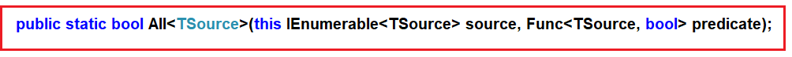
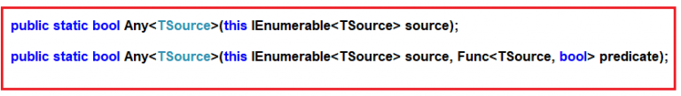
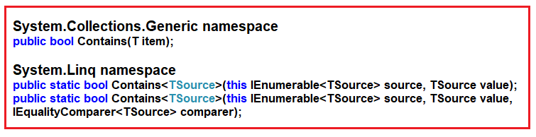

# 존재확인 함수 : Any, All, Contains

**C#의 존재확인 함수란?**  
데이터 원본의 일부 또는 모든 요소가 조건을 충족하는지 여부를 확인하기 위해 존재확인 함수를 사용해야 한다.

이 함수들의 결과는 항상 부울 값을 반환한다. 즉, 데이터 소스의 요소 전체 또는 일부가 주어진 조건을 충족하면 true를 반환하고 그렇지 않으면 false를 반환.

**존재확인 함수는 언제 사용합니까?**
1. 특정 요일에 모든 직원의 출석 여부를 확인하고 싶을 때
2. 특정 학급에서 90% 이상 득점한 학생이 있는지 확인해야 할때.
3. James라는 이름의 직원이 있는지 확인해야 할 때

**존재확인 연산자의 종류**  

    1. All      : 데이터 소스의 모든 요소가 주어진 조건을 만족하는지 여부
    2. Any      : 데이터 소스의 요소 중 적어도 하나가 조건을 만족하는지 여부
    3. Contains : 데이터 소스에 지정된 요소가 포함되어 있는지 여부

참고: 위의 세 가지 메서드는 모두 데이터 소스의 요소 전체 또는 일부가 조건을 충족하는지 여부에 따라 true 또는 false를 반환합니다.

<br/>

## <font color='dodgerblue' size="6">1) All 함수</font>     

- ### A. All 함수
    데이터 소스의 모든 요소가 주어진 조건을 만족하면 true를 반환하고 그렇지 않으면 false를 반환한다. All 메서드에 사용할 수 있는 오버로드된 버전이 없고 정의는 다음과 같다.
    
      
    ALL 확장 메서드는 하나의 조건식만 매개변수로 사용.

<br/>

- ### B.메서드 또는 쿼리 구문을 사용하는 All 함수 예제
    **예제 1**  
    다음 예제에서는 정수 배열의 모든 요소가 10보다 크므로 true를 반환.

    ```cs
    using System;
    using System.Linq;

    namespace LINQDemo
    {
        class Program
        {
            static void Main(string[] args)
            {
                int[] IntArray = { 11, 22, 33, 44, 55 };

                //Using Method Syntax
                var MSResult = IntArray.All(x => x > 10);

                //Using Query Syntax
                var QSResult = (from item in IntArray
                                select item).All(x => x > 10);

                Console.WriteLine("Is All Numbers are greater than 10 : " + MSResult);
                Console.ReadKey();
            }
        }
    }
    ```

    결과  
    <span style='background-color:#fff5b1'>Is All Numbers are greater than 10 = True</span>

    <br>
    **예제 2:**  
    모든 이름이 5자 이상인지 체크하는데 3글자(Pam)도 존재하기 때문에 False를 반환.

    ```cs
    using System;
    using System.Linq;

    namespace LINQDemo
    {
        class Program
        {
            static void Main(string[] args)
            {
                string[] stringArray = { "James", "Sachin", "Sourav", "Pam", "Sara" };
                var Result = stringArray.All(name => name.Length > 5);
                Console.WriteLine("Is All Names are greater than 5 Characters : " + Result);
                Console.ReadKey();
            }
        }
    }
    ```

    결과  
    <span style='background-color:#fff5b1'>Is All Names are greater than 5 Characters : False</span>

- ### C. 복합 유형에서 LINQ Sum 함수 사용
    학생 및 과목 수업과 함께 작업 할 것이기에 이름이 Student.cs 인 클래스 파일을 만들고 다음 코드를 복사 붙여넣기하자.

    ```cs
    using System.Collections.Generic;

    namespace LINQDemo
    {
        public class Student
        {
            public int ID { get; set; }
            public string Name { get; set; }
            public int TotalMarks { get; set; }
            public List<Subject> Subjects { get; set; }

            public static List<Student> GetAllStudnets()
            {
                List<Student> listStudents = new List<Student>()
                {
                    new Student{ID= 101,Name = "Preety", TotalMarks = 265,
                        Subjects = new List<Subject>()
                        {
                            new Subject(){SubjectName = "Math", Marks = 80},
                            new Subject(){SubjectName = "Science", Marks = 90},
                            new Subject(){SubjectName = "English", Marks = 95}
                        }},
                    new Student{ID= 102,Name = "Priyanka", TotalMarks = 278,
                        Subjects = new List<Subject>()
                        {
                            new Subject(){SubjectName = "Math", Marks = 90},
                            new Subject(){SubjectName = "Science", Marks = 95},
                            new Subject(){SubjectName = "English", Marks = 93}
                        }},
                    new Student{ID= 103,Name = "James", TotalMarks = 240,
                        Subjects = new List<Subject>()
                        {
                            new Subject(){SubjectName = "Math", Marks = 70},
                            new Subject(){SubjectName = "Science", Marks = 80},
                            new Subject(){SubjectName = "English", Marks = 90}
                        }},
                    new Student{ID= 104,Name = "Hina", TotalMarks = 275,
                        Subjects = new List<Subject>()
                        {
                            new Subject(){SubjectName = "Math", Marks = 90},
                            new Subject(){SubjectName = "Science", Marks = 90},
                            new Subject(){SubjectName = "English", Marks = 95}
                        }},
                    new Student{ID= 105,Name = "Anurag", TotalMarks = 255,
                        Subjects = new List<Subject>()
                        {
                            new Subject(){SubjectName = "Math", Marks = 80},
                            new Subject(){SubjectName = "Science", Marks = 90},
                            new Subject(){SubjectName = "English", Marks = 85}
                        }
                    },
                };

                return listStudents;
            }
        }

        public class Subject
        {
            public string SubjectName { get; set; }
            public int Marks { get; set; }
        }
    }
    ```
    
    <br>
    **예제3**  
    모든 학생의 총 점수가 250보다 큰지 확인한다. 보시다시피 학생 James의 총 점수는 240이며 250보다 작기에 결과는 false로 표시.

    ```cs
    using System;
    using System.Linq;

    namespace LINQDemo
    {
        class Program
        {
            static void Main(string[] args)
            {
                //Using Method Syntax
                bool MSResult = Student.GetAllStudnets().All(std => std.TotalMarks > 250);

                //Using Query Syntax
                bool QSResult = (from std in Student.GetAllStudnets()
                                select std).All(std => std.TotalMarks > 250);

                Console.WriteLine(MSResult);
                Console.ReadKey();
            }
        }
    }
    ```

    결과  
    <span style='background-color:#fff5b1'>False</span>

    <br>
    **예제4:**  
    각 과목의 점수가 모두 80점을 넘는 모든 학생의 세부 정보를 가져와야 한다.

    ```cs
    using System;
    using System.Linq;

    namespace LINQDemo
    {
        class Program
        {
            static void Main(string[] args)
            {
                //Using Method Syntax
                var MSResult = Student.GetAllStudnets()
                                .Where(std => std.Subjects.All(x => x.Marks > 80)).ToList();
                
                //Using Query Syntax
                var QSResult = (from std in Student.GetAllStudnets()
                                where std.Subjects.All(x => x.Marks > 80)
                                select std).ToList();

                foreach (var item in QSResult)
                {
                    Console.WriteLine(item.Name + " " + item.TotalMarks);
                }
                Console.ReadKey();
            }
        }
    }
    ```

    결과  
    <span style='background-color:#fff5b1'>Priyanka 278<br>Hina 275</span>  


<br/>

## <font color='dodgerblue' size="6">2) Any 함수</font>     

- ### A. Any 함수란?
    데이터 컬렉션 중 하나 이상이 주어진 조건을 충족하는지 여부를 확인하는 데 사용. 하나라도 주어진 조건을 만족하면 true, 그렇지 않으면 false 반환.

    컬렉션에 일부 데이터가 포함되어 있는지 여부를 확인하는 데에도 사용. 메서드의 두 가지 오버로드된 버전을 사용할 수 있다.

      

    ANY 확장 메서드의 첫 번째 오버로드된 버전은 매개 변수를 사용하지 않지만 다른 오버로드 버전은 조건식을 첫번째 매개 변수로 사용.

- ### B. 메서드 또는 쿼리 구문을 사용하는 Any 함수 예제
    **예제1: Any 연산자의 첫 번째 오버로드된 버전 사용**  
    다음은 컬렉션에 하나 이상의 요소가 존재하기에 true 반환.

    ```cs
    using System;
    using System.Linq;

    namespace LINQDemo
    {
        class Program
        {
            static void Main(string[] args)
            {
                int[] IntArray = { 11, 22, 33, 44, 55 };

                //Using Method Syntax
                var ResultMS = IntArray.Any();

                //Using Query Syntax
                var ResultQS = (from num in IntArray
                                select num).Any();

                Console.WriteLine("Is there any element in the collection : " + ResultMS);
                Console.ReadKey();
            }
        }
    }
    ```

    결과  
    <span style='background-color:#fff5b1'>Is there any element in the collection : True</span>  


    <br/>
    **예제 2: Any 연산자의 두 번째 오버로드된 버전 사용**  
    다음은 10보다 큰 데이터가 존재하기 때문에 true를 반환.

    ```cs
    using System;
    using System.Linq;

    namespace LINQDemo
    {
        class Program
        {
            static void Main(string[] args)
            {
                int[] IntArray = { 11, 22, 33, 44, 55 };
                var Result = IntArray.All(x => x > 10);

                Console.WriteLine("Is All Numbers are greater than 10 : " + Result);
                Console.ReadKey();
            }
        }
    }
    ```

    결과  
    <span style='background-color:#fff5b1'>Is All Numbers are greater than 10 : True</span>
    
    <br/>
    **예제 3**  
    다음에서는 일부 이름의 길이가 5보다 크므로 true를 반환.

    ```cs
    using System;
    using System.Linq;

    namespace LINQDemo
    {
        class Program
        {
            static void Main(string[] args)
            {
                string[] stringArray = { "James", "Sachin", "Sourav", "Pam", "Sara" };

                //Method Syntax
                var ResultMS = stringArray.Any(name => name.Length > 5);

                //Query Syntax
                var ResultQS = (from name in stringArray
                                select name).Any(name => name.Length > 5);

                Console.WriteLine("Is Any name with length  greater than 5 Characters : " + ResultMS);
                Console.ReadKey();
            }
        }
    }
    ```
    결과  
    <span style='background-color:#fff5b1'>Is Any name with length  greater than 5 Characters : True</span>

    <br/>

- ### C. 복합 유형과 함께 LINQ Any 함수 사용
    여기서는 학생 및 과목 수업과 함께 작업 할것이기에 Student.cs인 클래스 파일을 만들고 다음 코드를 복사 붙여넣기하자.

    ```cs
    using System.Collections.Generic;

    namespace LINQDemo
    {
        public class Student
        {
            public int ID { get; set; }
            public string Name { get; set; }
            public int TotalMarks { get; set; }
            public List<Subject> Subjects { get; set; }

            public static List<Student> GetAllStudnets()
            {
                List<Student> listStudents = new List<Student>()
                {
                    new Student{ID= 101,Name = "Preety", TotalMarks = 265,
                        Subjects = new List<Subject>()
                        {
                            new Subject(){SubjectName = "Math", Marks = 80},
                            new Subject(){SubjectName = "Science", Marks = 90},
                            new Subject(){SubjectName = "English", Marks = 95}
                        }},
                    new Student{ID= 102,Name = "Priyanka", TotalMarks = 278,
                        Subjects = new List<Subject>()
                        {
                            new Subject(){SubjectName = "Math", Marks = 90},
                            new Subject(){SubjectName = "Science", Marks = 95},
                            new Subject(){SubjectName = "English", Marks = 93}
                        }},
                    new Student{ID= 103,Name = "James", TotalMarks = 240,
                        Subjects = new List<Subject>()
                        {
                            new Subject(){SubjectName = "Math", Marks = 70},
                            new Subject(){SubjectName = "Science", Marks = 80},
                            new Subject(){SubjectName = "English", Marks = 90}
                        }},
                    new Student{ID= 104,Name = "Hina", TotalMarks = 275,
                        Subjects = new List<Subject>()
                        {
                            new Subject(){SubjectName = "Math", Marks = 90},
                            new Subject(){SubjectName = "Science", Marks = 90},
                            new Subject(){SubjectName = "English", Marks = 95}
                        }},
                    new Student{ID= 105,Name = "Anurag", TotalMarks = 255,
                        Subjects = new List<Subject>()
                        {
                            new Subject(){SubjectName = "Math", Marks = 80},
                            new Subject(){SubjectName = "Science", Marks = 90},
                            new Subject(){SubjectName = "English", Marks = 85}
                        }
                    },
                };

                return listStudents;
            }
        }

        public class Subject
        {
            public string SubjectName { get; set; }
            public int Marks { get; set; }
        }
    }
    ```   

    <br/>
    **예제4:**  
    총 점수가 250보다 큰 학생이 있는지 확인. 보시다시피 James를 제외한 모든 학생의 총 점수가 250보다 크기에 결과는 true.

    ```cs
    using System;
    using System.Linq;

    namespace LINQDemo
    {
        class Program
        {
            static void Main(string[] args)
            {
                //Using Method Syntax
                bool MSResult = Student.GetAllStudnets().Any(std => std.TotalMarks > 250);

                //Using Query Syntax
                bool QSResult = (from std in Student.GetAllStudnets()
                                select std).Any(std => std.TotalMarks > 250);

                Console.WriteLine(MSResult);
                Console.ReadKey();
            }
        }
    }
    ```
    
    결과  
    <span style='background-color:#fff5b1'>True</span>

    <br/>
    **예제5:**  
    이제 과목상관없이 90점 이상의 점수를 받은 학생의 세부 정보를 가져와 보자.

    ```cs
    using System;
    using System.Linq;

    namespace LINQDemo
    {
        class Program
        {
            static void Main(string[] args)
            {
                //Using Method Syntax
                var MSResult = Student.GetAllStudnets()
                                .Where(std => std.Subjects.Any(x => x.Marks > 90)).ToList();

                //Using Query Syntax
                var QSResult = (from std in Student.GetAllStudnets()
                                where std.Subjects.Any(x => x.Marks > 90)
                                select std).ToList();

                foreach (var item in QSResult)
                {
                    Console.WriteLine(item.Name + " " + item.TotalMarks);
                }
                Console.ReadKey();
            }
        }
    }
    ```
    결과  
    <span style='background-color:#fff5b1'>Preety 265<br>Priyanka 278<br>Hina 275</span>

    <br/>

## <font color='dodgerblue' size="6">3) Contains 함수</font>        
- ### A. Contains 함수란?
    데이터 소스에 지정된 요소가 하나라도 포함되어 있는지 여부를 확인하는 데 사용. 포함되어 있으면 true, 그렇지 않으면 false를 반환. C#의 Contains 메서드는 아래 이미지와 같이 두 개의 다른 네임스페이스에서 구현된다.

          

    System.Collections.Generic 네임스페이스의 Contains 메서드는 하나의 요소를 입력 매개 변수로 사용하고 해당 요소가 데이터 소스에 있으면 true를 반환하고 그렇지 않으면 false를 반환한다.

    System.Linq 네임스페이스의 Contains메서드는 IEqualityComparer 메서드를 사용할지에 따라 사용할 수 있는 두 가지 오버로드된 버전이 존재한다.

    참고: 이 방법은 복합 유형 개체로 작업할 때 다른 방식으로 작동합니다. 복합 유형 개체의 경우 값이 아닌 참조만 확인하기에 값으로 작업하려면 IEqualityComparer를 사용해야 한다.

    <br>
- ### B. 메서드 또는 쿼리 구문을 사용하는 Contains 메쏘드 예제    
    **예제1**  
    다음 예제에서는 데이터 소스(예: IntArray)에 요소 33이 포함되어 있으므로 true를 반환한다.

    ```cs
    using System;
    using System.Linq;

    namespace LINQDemo
    {
        class Program
        {
            static void Main(string[] args)
            {
                int[] IntArray = { 11, 22, 33, 44, 55 };

                //Using Method Syntax
                var IsExistsMS = IntArray.Contains(33);

                //Using Query Syntax
                var IsExistsQS = (from num in IntArray
                                select num).Contains(33);

                Console.WriteLine(IsExistsMS);
                Console.ReadKey();
            }
        }
    }
    ```

    결과  
    <span style='background-color:#fff5b1'>True</span>  

<br>

- ### C. 복합 유형과 함께 LINQ Contains 함수 사용
    직원 클래스인 Employee.cs인 파일을 만들어 보자.

    ```cs
    namespace LINQDemo
    {
        public class Employee
        {
            public int ID { get; set; }
            public string Name { get; set; }
            public int TotalMarks { get; set; }
        }
    }
    ```

    <br>
    **예제3**  
    다음 예제에서는 Contains 메서드에 전달한 개체가 데이터 소스에 존재하므로 True를 반환합니다.

    ```cs
    using System;
    using System.Collections.Generic;
    using System.Linq;

    namespace LINQDemo
    {
        class Program
        {
            static void Main(string[] args)
            {
                List<Employee> emps = new List<Employee>();
                var emp1 = new Employee() { ID = 101, Name = "Park", TotalMarks = 275 };
                var emp2 = new Employee() { ID = 102, Name = "Hong", TotalMarks = 375 };
                emps.Add(emp1);
                emps.Add(emp2);

                //Using Method Syntax
                var IsExistsMS = emps.Contains(emp1);
                
                //Using Query Syntax
                var IsExistsQS = (from num in emps
                                select num).Contains(emp1);

                Console.WriteLine(IsExistsMS);
                Console.ReadKey();
            }
        }
    }
    ```

    결과  
    <span style='background-color:#fff5b1'>True</span>  

    참고: 복합 유형으로 작업하는 동안 Contains 메서드는 개체 값이 아니라 개체 참조를 확인한다. 위의 예에서 전달한 개체의 개체 참조는 데이터 소스에서 사용할 수 있으므로 true를 반환한다.

    <br>
    **예제4**  
    다음 예제에서는 비교할 값이 데이터 원본에서 존재하는데도 false를 반환한다. Contains 메서드가 값 형태가 아니고 참조 형태로 비교를 수행하기 때문인데 이 경우 개체 참조가 다르기 때문이다.

    ```cs
    using System;
    using System.Collections.Generic;
    using System.Linq;

    namespace LINQDemo
    {
        class Program
        {
            static void Main(string[] args)
            {
                List<Employee> emps = new List<Employee>()
                            {
                                new Employee(){ID = 101, Name = "Park", TotalMarks = 275 },
                                new Employee(){ID = 102, Name = "Hong", TotalMarks = 375 }
                            };

                var emp1 = new Employee() { ID = 101, Name = "Park", TotalMarks = 275 };

                //Using Method Syntax
                var IsExistsMS = emps.Contains(emp1);                

                //Using Query Syntax
                var IsExistsQS = (from num in emps
                                select num).Contains(emp1);

                Console.WriteLine(IsExistsMS);
                Console.ReadKey();
            }
        }
    }
    ```

    결과  
    <span style='background-color:#fff5b1'>False</span>  

    

    <br>
    **예제5**  
    참조가 아닌 값 형태로 확인하려면 IEqualityComparere 인터페이스를 구현하는 클래스를 생성하여 Contains 메서드의 오버로드된 버전을 사용하여 매개변수로 넘겨야 한다.


    - EmployeeComparer 클래스 생성  

        이름이 EmployeeComparer.cs 인 클래스 파일을 만들고 다음 코드를 복사하여 붙여넣기.

        ```cs
        using System.Collections.Generic;

        namespace LINQDemo
        {
            public class EmployeeComparer : IEqualityComparer<Student>
            {
                public bool Equals(Employee x, Employee y)
                {
                    //If both object refernces are equal then return true
                    if (object.ReferenceEquals(x, y))
                    {
                        return true;
                    }

                    //If one of the object refernce is null then return false
                    if (x is null || y is null)
                    {
                        return false;
                    }

                    return x.ID == y.ID && x.Name == y.Name && x.TotalMarks == y.TotalMarks;
                }

                public int GetHashCode(Employee obj)
                {
                    //If obj is null then return 0
                    if (obj is null)
                    {
                        return 0;
                    }

                    int IDHashCode = obj.ID.GetHashCode();
                    int NameHashCode = obj.Name == null ? 0 : obj.Name.GetHashCode();
                    int TotalMarksHashCode = obj.TotalMarks.GetHashCode();

                    return IDHashCode ^ NameHashCode ^ TotalMarksHashCode;
                }
            }
        }
        ```

    <br>
    - Contains 메서드에 EmployeeComparer 인스턴스를 매개변수로 전달한다.

        ```cs
        using System;
        using System.Collections.Generic;
        using System.Linq;

        namespace LINQDemo
        {
            class Program
            {
                static void Main(string[] args)
                {
                    List<Employee> emps = new List<Employee>()
                            {
                                new Employee(){ID = 101, Name = "Park", TotalMarks = 275 },
                                new Employee(){ID = 102, Name = "Hong", TotalMarks = 375 }
                            };

                    //Createing Student Comparer Instance
                    EmployeeComparer employeeComparer = new EmployeeComparer();

                    //Using Method Syntax
                    var IsExistsMS = emps.Contains(new Employee() { ID = 101, Name = "Park", TotalMarks = 275 },
                        employeeComparer);

                    var emp1 = new Employee() { ID = 101, Name = "Park", TotalMarks = 275 };

                    //Using Query Syntax
                    var IsExistsQS = (from num in emps
                                    select num).Contains(emp1, employeeComparer);

                    Console.WriteLine(IsExistsMS);
                    Console.ReadKey();
                }
            }
        }
        ```

        결과  
        <span style='background-color:#fff5b1'>True</span>  


