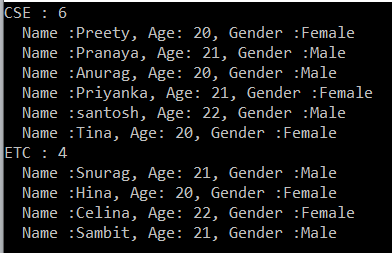
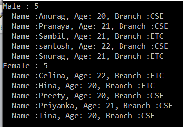
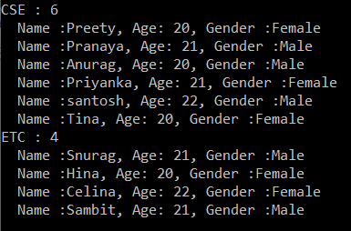
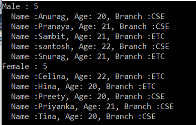
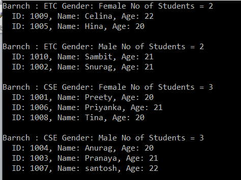

# 그룹화 연산자 : Groupby, ToLookup

- 일단 Student.cs라는 샘플 데이터 클래스를 만든다.

    ```cs
    using System.Collections.Generic;

    namespace GroupByDemo
    {
        public class Student
        {
            public int ID { get; set; }
            public string Name { get; set; }
            public string Gender { get; set; }
            public string Branch { get; set; }
            public int Age { get; set; }

            public static List<Student> GetStudents()
            {
                return new List<Student>()
                {
                    new Student { ID = 1001, Name = "Preety", Gender = "Female", Branch = "CSE", Age = 20 },
                    new Student { ID = 1002, Name = "Snurag", Gender = "Male", Branch = "ETC", Age = 21  },
                    new Student { ID = 1003, Name = "Pranaya", Gender = "Male", Branch = "CSE", Age = 21  },
                    new Student { ID = 1004, Name = "Anurag", Gender = "Male", Branch = "CSE", Age = 20  },
                    new Student { ID = 1005, Name = "Hina", Gender = "Female", Branch = "ETC", Age = 20 },
                    new Student { ID = 1006, Name = "Priyanka", Gender = "Female", Branch = "CSE", Age = 21 },
                    new Student { ID = 1007, Name = "santosh", Gender = "Male", Branch = "CSE", Age = 22  },
                    new Student { ID = 1008, Name = "Tina", Gender = "Female", Branch = "CSE", Age = 20  },
                    new Student { ID = 1009, Name = "Celina", Gender = "Female", Branch = "ETC", Age = 22 },
                    new Student { ID = 1010, Name = "Sambit", Gender = "Male", Branch = "ETC", Age = 21 }
                };
            }
        }
    }
    ```


<br/>

## <font color='dodgerblue' size="6">1) Groupby</font>     

- ### A. Groupby 함수
    GroupBy 는 그루핑 연산자 범주에 속하며 SQL 쿼리에서 Group By가 수행하는 것과 정확히 동일한 작업을 수행한다. 지정된 키(컬럼)를 기반으로 컬렉션의 데이터들을 그룹핑(즉 , IGrouping<TKey, TSource> )한다.

    GroupBy 메서드 의 정의로 이동하면 IEnumerable<IGrouping<TKey, TSource>> 를 반환하는 것을 볼 수 있다. 여기서 TKey 는 그룹화가 형성된 Key의 데이터타입이고 TSource는 컬렉션의 데이터 타입이다. 

<br/>

- ### B.메서드 또는 쿼리 구문을 사용하는 Groupby 예제
    

    <br>
    **예제1: 단순그룹핑**  
    다음은 학생을 분기에 따라 그룹으로 구성한다.(즉, 분기가 그룹핑 키). 동일한 분기를 가진 학생은 컬렉션 내부의 동일한 그룹에 저장된다. 여기서 키는 분기가 되고 컬렉션은 해당 특정 분기에 속한 학생이 된다.

    ```cs
    using System;
    using System.Collections.Generic;
    using System.Linq;

    namespace GroupByDemo
    {
        class Program
        {
            static void Main(string[] args)
            {
                //Using Method Syntax
                var GroupByMS = Student.GetStudents().GroupBy(s => s.Branch);

                //Using Query Syntax
                IEnumerable<IGrouping<string, Student>> GroupByQS = (from std in Student.GetStudents()
                                group std by std.Branch);

                //It will iterate through each groups
                foreach(var group in GroupByMS)
                {
                    Console.WriteLine(group.Key +" : " + group.Count());

                    //Iterate through each student of a group
                    foreach(var student in group)
                    {
                        Console.WriteLine("  Name :" + student.Name + ", Age: " + student.Age + ", Gender :" + student.Gender);
                    }
                }

                Console.ReadKey();
            }
        }  
    }
    ```

    결과  
      

    각 그룹에는 키가 있으며 키 속성을 사용하여 키-값에 액세스할 수 있다. 그룹핑 이후 결과에 count 속성을 사용하면 해당 그룹에 몇 개의 요소가 있는지 확인할 수 있다.

    ```note
    그룹핑을 하면 내부적으로 두개의 뎁쓰로 결과가 만들어진다. 위 그림이 정확한 형태의 결과 형태. 첫번째 뎁스는 Key만 존재하는 집계형태의 단계, 두번째는 원본데이터의 형태.  

    sql은 그룹핑이 되면 원본의 형태가 흐트러지고 집계형태의 단계만 존재하기 때문에 다르다는 것이 특징이다. 
    ```

    <br>
    **예제 2:**  
    성별로 그룹핑을 해보자. 그러나 여기서는 먼저 성별을 기준으로 내림차순으로 데이터를 정렬한 후 학생 이름을 오름차순으로 정렬합니다.

    ```cs
    using System;
    using System.Linq;

    namespace GroupByDemo
    {
        class Program
        {
            static void Main(string[] args)
            {
                //Using Method Syntax
                var GroupByMS = Student.GetStudents().GroupBy(s => s.Gender)
                                //First sorting the data based on key in Descending Order
                                .OrderByDescending(c => c.Key) 
                                .Select(std => new
                                {
                                    Key = std.Key,
                                    //Sorting the data based on name in descending order
                                    Students = std.OrderBy(x => x.Name)
                                });

                //Using Query Syntax
                var GroupByQS = from std in Student.GetStudents()
                                    group std by std.Gender into stdGroup
                                    orderby stdGroup.Key descending
                                    select new
                                    {
                                        Key = stdGroup.Key,
                                        Students = stdGroup.OrderBy(x => x.Name)
                                    };

                //It will iterate through each groups
                foreach (var group in GroupByQS)
                {
                    Console.WriteLine(group.Key +" : " + group.Students.Count());

                    //Iterate through each student of a group
                    foreach(var student in group.Students)
                    {
                        Console.WriteLine("  Name :" + student.Name + ", Age: " + student.Age + ", Branch :" + student.Branch);
                    }
                }

                Console.Read();
            }
        }  
    }
    ```

    결과  
      


    참고: select절에서 new를 통해 새로 만들었기 때문에 익명 유형으로 생성된다.


## <font color='dodgerblue' size="6">2) 다중 키 Groupby</font>     
대부분 애플리케이션에서는 여러 키를 기반으로 데이터를 그룹화 한다. 그 전에 Group By 연산자에서 여러 키를 사용할 때 반환되는 데이터는 익명 유형이라는 사실을 기억해야 한다.

위에서 정의한 Student.cs를 계속 사용

- **예제1**  
    다음은 먼저 학생을  두개의 속성 Branch와 Gender 별로 그룹화한다. 단 Branch별로는 내림차순으로, Gender별로는 오름차순으로 정렬한다. 마지막으로 각 그룹의 학생들은 이름을 기준으로 오름차순으로 정렬 됩니다. 

    ```cs
    using System;
    using System.Linq;

    namespace GroupByDemo
    {
        class Program
        {
            static void Main(string[] args)
            {
                //Using Method Syntax
                var GroupByMultipleKeysMS = Student.GetStudents()
                                            .GroupBy(x => new { x.Branch, x.Gender })
                                            .OrderByDescending(g => g.Key.Branch).ThenBy(g => g.Key.Gender)
                                            .Select(g => new
                                            {
                                                Branch = g.Key.Branch,
                                                Gender = g.Key.Gender,
                                                Students = g.OrderBy(x => x.Name)
                                            });
                //Using Query Syntax
                var GroupByMultipleKeysQS = from student in Student.GetStudents()
                                            group student by new
                                            {
                                                student.Branch,
                                                student.Gender
                                            } into stdGroup
                                            orderby stdGroup.Key.Branch descending,
                                                    stdGroup.Key.Gender ascending
                                            select new
                                            {
                                                Branch = stdGroup.Key.Branch,
                                                Gender = stdGroup.Key.Gender,
                                                Students = stdGroup.OrderBy(x => x.Name)
                                            };

                //It will iterate through each group
                foreach (var grp in GroupByMultipleKeysQS)
                {
                    Console.WriteLine($"Branch : {grp.Branch} Gender: {grp.Gender} No of Students = {grp.Students.Count()}");
                    //It will iterate through each item of a group
                    foreach (var student in grp.Students)
                    {
                        Console.WriteLine($"  ID: {student.ID}, Name: {student.Name}, Age: {student.Age} ");
                    }
                    Console.WriteLine();
                }
                Console.Read();
            }
        }
    }
    ```

    결과  
      

## <font color='dodgerblue' size="6">3) ToLookUp</font>     
ToLookup 메서드는 GroupBy 연산자 와 정확히 동일한 작업을 수행하는데 유일한 차이점은 GroupBy는 지연된 실행을 사용하는 반면 ToLookup은 즉시 실행된다는 것이다. 

맨 위의 Student.cs 샘플 데이터를 그대로 사용

- **예제1**  
    다음은 ToLookup 메서드를 사용하여 Branch를 키로 그룹핑하여 학생을 구성한다. 여기서 키는 분기(Branch)가 되고 컬렉션은 해당 특정 분기에 속한 학생이 된다.

    ```cs
    using System;
    using System.Linq;

    namespace GroupByDemo
    {
        class Program
        {
            static void Main(string[] args)
            {
                //Using Method Syntax
                var GroupByMS = Student.GetStudents().ToLookup(s => s.Branch);

                //Using Query Syntax
                var GroupByQS = (from std in Student.GetStudents()
                                select std).ToLookup(x => x.Branch);

                //It will iterate through each group
                foreach (var group in GroupByMS)
                {
                    Console.WriteLine(group.Key + " : " + group.Count());

                    //Iterate through each student of a group
                    foreach (var student in group)
                    {
                        Console.WriteLine("  Name :" + student.Name + ", Age: " + student.Age + ", Gender :" + student.Gender);
                    }
                }
                
                Console.ReadKey();
            }
        }
    }
    ```

    결과  
      

- **예제2**  
    다음 예에서는 Linq ToLookup 연산자를 사용하여 성별로 직원을 가져옵니다. 그러나 여기서는 먼저 성별을 기준으로 내림차순으로 데이터를 정렬한 다음 이름을 기준으로 오름차순으로 데이터를 정렬합니다.

    ```cs
    using System;
    using System.Linq;

    namespace GroupByDemo
    {
        class Program
        {
            static void Main(string[] args)
            {
                var GroupByMS = Student.GetStudents().ToLookup(s => s.Gender)
                                .OrderByDescending(c => c.Key)
                                .Select(std => new
                                {
                                    Key = std.Key,
                                    Students = std.OrderBy(x => x.Name)
                                });
    
                foreach (var group in GroupByMS)
                {
                    Console.WriteLine(group.Key + " : " + group.Students.Count());
                    foreach (var student in group.Students)
                    {
                        Console.WriteLine("  Name :" + student.Name + ", Age: " + student.Age + ", Branch :" + student.Barnch);
                    }
                }

                Console.Read();
            }
        }
    }
    ```

    결과  
      

- **예제3: C#에서 여러 키와 함께 ToLookup 사용**  
    다음 예에서는 ToLookup을 사용하여 먼저 학생을 Branch별로 그룹화한 다음 Gender별로 그룹화합니다. 학생 그룹은 먼저 Branch별로 내림차순으로 정렬한 다음 Gender별로 오름차순으로 정렬합니다. 마지막으로 각 그룹의 데이터를 이름에 따라 오름차순으로 정렬합니다.

    ```cs
    using System;
    using System.Linq;

    namespace GroupByDemo
    {
        class Program
        {
            static void Main(string[] args)
            {
                var ToLookupwithMultipleKeys = Student.GetStudents()
                                            .ToLookup(x => new { x.Barnch, x.Gender })
                                            .OrderByDescending(g => g.Key.Barnch).ThenBy(g => g.Key.Gender)
                                            .Select(g => new
                                            {
                                                Branch = g.Key.Barnch,
                                                Gender = g.Key.Gender,
                                                Students = g.OrderBy(x => x.Name)
                                            });
                
                foreach (var grp in ToLookupwithMultipleKeys)
                {
                    Console.WriteLine($"Barnch : {grp.Branch} Gender: {grp.Gender} No of Students = {grp.Students.Count()}");
                    
                    foreach (var student in grp.Students)
                    {
                        Console.WriteLine($"  ID: {student.ID}, Name: {student.Name}, Age: {student.Age} ");
                    }
                    Console.WriteLine();
                }

                Console.Read();
            }
        }
    }
    ```

    결과  
      