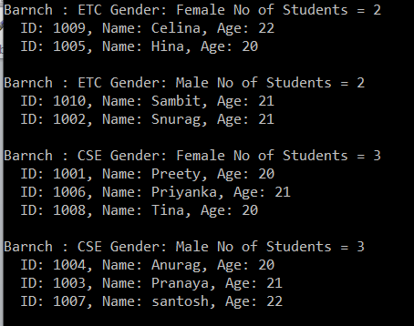

# 그룹화 연산자 : Groupby

<br/>

## <font color='dodgerblue' size="6">1) Groupby</font>     

- ### A. Groupby 함수
    C# 의 Linq GroupBy 는 Grouping 연산자 범주에 속하며 SQL 쿼리에서 Group By 절이 수행하는 것과 정확히 동일한 작업을 수행합니다. 이 메서드는 요소의 평면 시퀀스를 취한 다음 지정된 키를 기반으로 요소를 그룹(즉 , IGrouping<TKey, TSource> )으로 구성합니다.

    GroupBy 메서드 의 정의로 이동하면 IEnumerable<IGrouping<TKey, TSource>> 를 반환하는 것을 볼 수 있습니다 . 여기서 TKey 는 그룹화가 형성된 Key 값이고 TSource 는 일치하는 요소 모음입니다. 그룹화 키 값. 이것이 현재 명확하지 않은 경우 걱정하지 마십시오. 몇 가지 예를 들어 이것을 이해하려고 노력하겠습니다.

<br/>

- ### B.메서드 또는 쿼리 구문을 사용하는 Groupby 예제
    - Student.cs라는 샘플 데이터 클래스를 만든다.

        ```cs
        using System.Collections.Generic;

        namespace GroupByDemo
        {
            public class Student
            {
                public int ID { get; set; }
                public string Name { get; set; }
                public string Gender { get; set; }
                public string Branch { get; set; }
                public int Age { get; set; }

                public static List<Student> GetStudents()
                {
                    return new List<Student>()
                    {
                        new Student { ID = 1001, Name = "Preety", Gender = "Female", Branch = "CSE", Age = 20 },
                        new Student { ID = 1002, Name = "Snurag", Gender = "Male", Branch = "ETC", Age = 21  },
                        new Student { ID = 1003, Name = "Pranaya", Gender = "Male", Branch = "CSE", Age = 21  },
                        new Student { ID = 1004, Name = "Anurag", Gender = "Male", Branch = "CSE", Age = 20  },
                        new Student { ID = 1005, Name = "Hina", Gender = "Female", Branch = "ETC", Age = 20 },
                        new Student { ID = 1006, Name = "Priyanka", Gender = "Female", Branch = "CSE", Age = 21 },
                        new Student { ID = 1007, Name = "santosh", Gender = "Male", Branch = "CSE", Age = 22  },
                        new Student { ID = 1008, Name = "Tina", Gender = "Female", Branch = "CSE", Age = 20  },
                        new Student { ID = 1009, Name = "Celina", Gender = "Female", Branch = "ETC", Age = 22 },
                        new Student { ID = 1010, Name = "Sambit", Gender = "Male", Branch = "ETC", Age = 21 }
                    };
                }
            }
        }
        ```

    <br>
    **예제1**  
    다음 예는 학생을 분기에 따라 그룹으로 구성합니다(즉, 분기가 키로 작동함). 즉, 동일한 분기를 가진 학생은 키와 내부 컬렉션이 있는 각 그룹이 있는 동일한 그룹에 저장됩니다. 여기서 키는 분기가 되고 컬렉션은 해당 특정 분기에 속한 학생이 됩니다.

    참고: 자체 설명된 주석 줄을 통해 이동하십시오.

    ```cs
    using System;
    using System.Collections.Generic;
    using System.Linq;

    namespace GroupByDemo
    {
        class Program
        {
            static void Main(string[] args)
            {
                //Using Method Syntax
                var GroupByMS = Student.GetStudents().GroupBy(s => s.Branch);

                //Using Query Syntax
                IEnumerable<IGrouping<string, Student>> GroupByQS = (from std in Student.GetStudents()
                                group std by std.Branch);

                //It will iterate through each groups
                foreach(var group in GroupByMS)
                {
                    Console.WriteLine(group.Key +" : " + group.Count());

                    //Iterate through each student of a group
                    foreach(var student in group)
                    {
                        Console.WriteLine("  Name :" + student.Name + ", Age: " + student.Age + ", Gender :" + student.Gender);
                    }
                }

                Console.ReadKey();
            }
        }  
    }
    ```

    결과  
      

    참고: 각 그룹에는 키가 있으며 키 속성을 사용하여 키-값에 액세스할 수 있습니다. 같은 줄을 따라 count 속성을 사용하여 해당 그룹에 몇 개의 요소가 있는지 확인할 수 있습니다.


    <br>
    **예제 2:**  
    성별로 그룹핑을 해보자. 그러나 여기서는 먼저 성별을 기준으로 내림차순으로 데이터를 정렬한 후 학생 이름을 오름차순으로 정렬합니다.

    ```cs
    using System;
    using System.Linq;

    namespace GroupByDemo
    {
        class Program
        {
            static void Main(string[] args)
            {
                //Using Method Syntax
                var GroupByMS = Student.GetStudents().GroupBy(s => s.Gender)
                                //First sorting the data based on key in Descending Order
                                .OrderByDescending(c => c.Key) 
                                .Select(std => new
                                {
                                    Key = std.Key,
                                    //Sorting the data based on name in descending order
                                    Students = std.OrderBy(x => x.Name)
                                });

                //Using Query Syntax
                var GroupByQS = from std in Student.GetStudents()
                                    group std by std.Gender into stdGroup
                                    orderby stdGroup.Key descending
                                    select new
                                    {
                                        Key = stdGroup.Key,
                                        Students = stdGroup.OrderBy(x => x.Name)
                                    };

                //It will iterate through each groups
                foreach (var group in GroupByQS)
                {
                    Console.WriteLine(group.Key +" : " + group.Students.Count());

                    //Iterate through each student of a group
                    foreach(var student in group.Students)
                    {
                        Console.WriteLine("  Name :" + student.Name + ", Age: " + student.Age + ", Branch :" + student.Branch);
                    }
                }

                Console.Read();
            }
        }  
    }
    ```

    결과  
      

    참고: select절에서 new를 통해 새로 만들었기 때문에 익명 유형으로 생성된다.


## <font color='dodgerblue' size="6">2) 다중 키로 Groupby</font>     
대부분 애플리케이션에서는 여러 키를 기반으로 데이터를 그룹화 한다. 그 전에 Group By 연산자에서 여러 키를 사용할 때 반환되는 데이터는 익명 유형이라는 사실을 기억해야 한다.

위에서 정의한 Student.cs를 계속 사용

        

- **예제1**  
    다음 예제에서는 먼저 학생을  Branch 별로 그룹화한 이후에 또  Gender 별로 그룹화한다. 이 후 Branch별로 내림차순으로 정렬한 다음 Gender별로 오름차순으로 정렬한다. 마지막으로 각 그룹의 학생들은 이름을 기준으로 오름차순으로 정렬 됩니다. 

    ```cs
    using System;
    using System.Linq;

    namespace GroupByDemo
    {
        class Program
        {
            static void Main(string[] args)
            {
                //Using Method Syntax
                var GroupByMultipleKeysMS = Student.GetStudents()
                                            .GroupBy(x => new { x.Branch, x.Gender })
                                            .OrderByDescending(g => g.Key.Branch).ThenBy(g => g.Key.Gender)
                                            .Select(g => new
                                            {
                                                Branch = g.Key.Branch,
                                                Gender = g.Key.Gender,
                                                Students = g.OrderBy(x => x.Name)
                                            });
                //Using Query Syntax
                var GroupByMultipleKeysQS = from student in Student.GetStudents()
                                            group student by new
                                            {
                                                student.Branch,
                                                student.Gender
                                            } into stdGroup
                                            orderby stdGroup.Key.Branch descending,
                                                    stdGroup.Key.Gender ascending
                                            select new
                                            {
                                                Branch = stdGroup.Key.Branch,
                                                Gender = stdGroup.Key.Gender,
                                                Students = stdGroup.OrderBy(x => x.Name)
                                            };

                //It will iterate through each group
                foreach (var grp in GroupByMultipleKeysQS)
                {
                    Console.WriteLine($"Branch : {grp.Branch} Gender: {grp.Gender} No of Students = {grp.Students.Count()}");
                    //It will iterate through each item of a group
                    foreach (var student in grp.Students)
                    {
                        Console.WriteLine($"  ID: {student.ID}, Name: {student.Name}, Age: {student.Age} ");
                    }
                    Console.WriteLine();
                }
                Console.Read();
            }
        }
    }
    ```

    결과  
      


