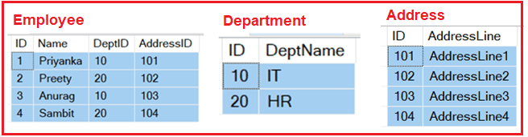
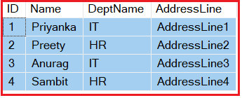
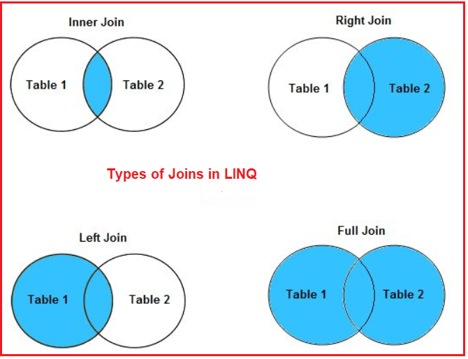
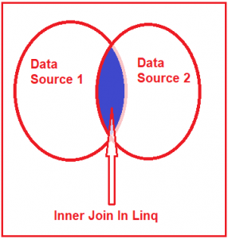
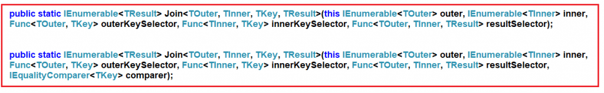
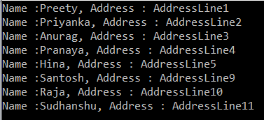

# 조인 연산자 : Join
SQL Server, Oracle, MySQL 등과 같은 데이터베이스 시스템에 대한 경험이 있는 경우 SQL Join에 익숙할 것입니다. LINQ 조인도 다르지 않다. 두 개 이상의 데이터 원본(테이블 또는 개체)을 이용하여 일부 공통 속성을 바탕으로 단일 결과 집합으로 병합하는 데 사용된다.

예를 들어 다음 세 가지 데이터 소스(Employee, Department 및 Address)가 있다고 가정해 보겠습니다.

  

이제 아래와 같이 위의 세 가지 데이터 소스에서 데이터를 가져와야 합니다.

  

**조인의 종류**  

1. Join: 이 연산자는 공통 속성을 기반으로 두 데이터 소스 또는 컬렉션을 결합하고 데이터를 단일 결과 집합으로 반환하는 데 사용됩니다.
2. GroupJoin: 이 연산자는 공통 키 또는 속성을 기반으로 두 데이터 소스 또는 컬렉션을 결합하는 데도 사용되지만 결과를 시퀀스 그룹으로 반환합니다.

그 중 Join은 다음과 같은 여러가지 하위단계가 있다.

  


<br/>

## <font color='dodgerblue' size="6">1) 내부 Join</font>     

- ### A. 내부 Join
    두 데이터 소스에서 일치하는 요소만 반환하고 일치하지 않는 요소는 결과 집합에서 제거하는 데 사용된다고 말할 수 있습니다. 따라서 두 개의 데이터 원본이 있고 LINQ 내부 조인을 수행하면 두 데이터 원본에 모두 존재하는 일치하는 요소만 결과 집합에 포함됩니다. 다음 다이어그램을 살펴보겠습니다.

      

    내부 조인을 수행하는 동안 두 데이터 원본에 공통 요소 또는 속성이 있어야 합니다.

    Join 메서드는 두 개의 데이터 원본에서 작동하거나 내부 컬렉션과 외부 컬렉션과 같은 두 가지 컬렉션을 말할 수 있습니다. 이 연산자는 두 컬렉션의 데이터를 포함하는 새 컬렉션을 반환하며 SQL 조인 연산자와 동일합니다. Linq Join 메서드의 서명을 살펴보겠습니다.

      

    보시다시피 Linq에는 내부 조인 작업을 수행하는 데 사용할 수 있는 두 가지 오버로드된 버전이 있습니다. 두 번째 오버로드된 버전은 비교자를 추가 매개변수로 사용합니다.

    따라서 Linq Join으로 작업하는 동안 다음 5가지 사항을 이해해야 합니다.

    1. 외부 데이터 소스
    2. 내부 데이터 소스
    3. 외부 키 선택기(외부 데이터 소스의 공통 키)
    4. 내부 키 선택기(내부 데이터 소스의 공통 키)
    5. 결과 선택기(데이터를 결과 집합에 투영)

    이 데모에서는 Employee 및 Address 라는 두 가지 모델 클래스를 사용할 것 입니다. 따라서 클래스 파일을 만든 후 다음 코드를 복사하여 붙여넣습니다.

    ```cs
    using System.Collections.Generic;

    namespace LINQJoin
    {
        public class Employee
        {
            public int ID { get; set; }
            public string Name { get; set; }
            public int AddressId { get; set; }

            public static List<Employee> GetAllEmployees()
            {
                return new List<Employee>()
                {
                    new Employee { ID = 1, Name = "Preety", AddressId = 1 },
                    new Employee { ID = 2, Name = "Priyanka", AddressId = 2 },
                    new Employee { ID = 3, Name = "Anurag", AddressId = 3 },
                    new Employee { ID = 4, Name = "Pranaya", AddressId = 4 },
                    new Employee { ID = 5, Name = "Hina", AddressId = 5 },
                    new Employee { ID = 6, Name = "Sambit", AddressId = 6 },
                    new Employee { ID = 7, Name = "Happy", AddressId = 7},
                    new Employee { ID = 8, Name = "Tarun", AddressId = 8 },
                    new Employee { ID = 9, Name = "Santosh", AddressId = 9 },
                    new Employee { ID = 10, Name = "Raja", AddressId = 10},
                    new Employee { ID = 11, Name = "Sudhanshu", AddressId = 11}
                };
            }
        }

        public class Address
        {
            public int ID { get; set; }
            public string AddressLine { get; set; }

            public static List<Address> GetAllAddresses()
            {
                return new List<Address>()
                {
                    new Address { ID = 1, AddressLine = "AddressLine1"},
                    new Address { ID = 2, AddressLine = "AddressLine2"},
                    new Address { ID = 3, AddressLine = "AddressLine3"},
                    new Address { ID = 4, AddressLine = "AddressLine4"},
                    new Address { ID = 5, AddressLine = "AddressLine5"},
                    new Address { ID = 9, AddressLine = "AddressLine9"},
                    new Address { ID = 10, AddressLine = "AddressLine10"},
                    new Address { ID = 11, AddressLine = "AddressLine11"},
                };
            }
        }
    }
    ```

    실시간 애플리케이션에서는 데이터베이스에서 데이터를 가져와야 합니다. 여기서는 데이터베이스에서 데이터를 가져오는 방법에 초점을 맞추지 않고 내부 조인을 수행하는 방법에 초점을 맞출 것입니다. 그래서 여기에서 하드 코딩된 데이터로 필요한 데이터 소스(즉, 직원 및 주소 목록)를 만들었습니다.

    여기 두 데이터 소스에서 공통 속성은 Address id입니다. 즉, Employee 데이터 소스의 AddressId 속성이고 Address 데이터 소스의 ID 속성은 공통 속성입니다. 보시다시피 직원 데이터 소스에는 11개의 레코드가 있고 주소 데이터 소스에는 8개의 레코드가 있습니다. 또한 일부 데이터가 두 데이터 소스에 모두 존재하는 것을 알 수 있습니다.

<br/>

- ### B.메서드 또는 쿼리 구문을 사용하는 내부 Join 예제
    이번예에서 직원 이름, 주소만 가져오면 되기에 2개만 나오는 익명 형식을 만들어보자. 여기서는 두 데이터 소스에 공통적으로 있는 요소만 가져와야 한다.

    ```cs
    using System.Linq;
    using System;

    namespace LINQJoin
    {
        class Program
        {
            static void Main(string[] args)
            {
                //Linq 메쏘드
                var JoinMS = Employee.GetAllEmployees()     // 외부 데이터소스
                    .Join(
                        Address.GetAllAddresses(),          // 내부 데이터소스
                        emp => emp.AddressId,               // 외부 데이터소스의 조인 키
                        addr => addr.ID,                    // 내부 데이터소스의 조인키
                        (emp, addr) => new                  // 결과셋에서 원하는컬럼만 프로젝션
                        {
                            EmployeeName = emp.Name,
                            AddressLine = addr.AddressLine
                        }).ToList();

                //Linq 쿼리
                var joinQS = (from emp in Employee.GetAllEmployees()
                            join addr in Address.GetAllAddresses()
                                on emp.AddressId equals addr.ID
                            select new
                            {
                                EmployeeName = emp.Name,
                                AddressLine = addr.AddressLine
                            }).ToList();

                foreach (var employee in JoinMS)
                {
                    Console.WriteLine($"Name :{employee.EmployeeName}, Address : {employee.AddressLine}");
                }

                Console.ReadKey();
            }
        }
    }
    ```

    결과  
      

    위의 출력에서 ​​볼 수 있듯이 두 데이터 소스에서 일치하는 레코드만 가져옵니다. Linq 쿼리 구문을 사용하여 동일한 예제를 다시 작성해 보겠습니다.
  

    <br>
    