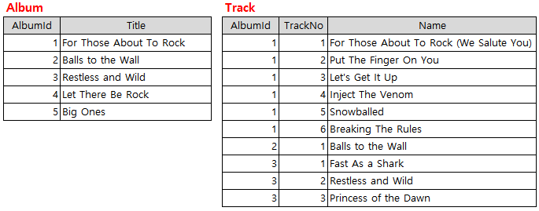
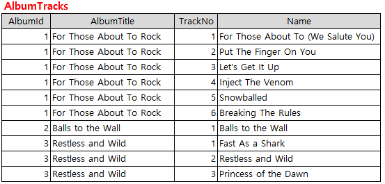
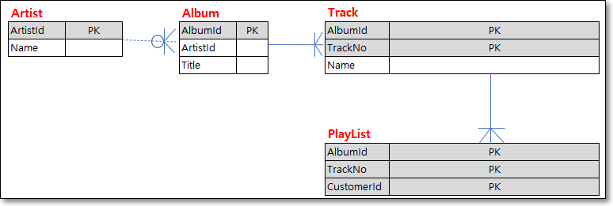
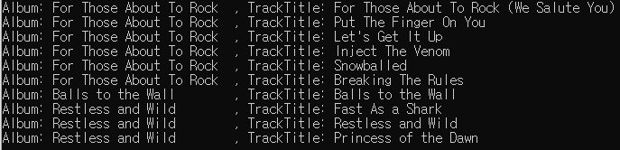
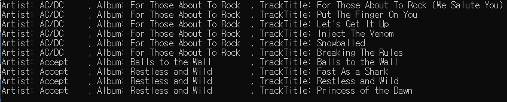
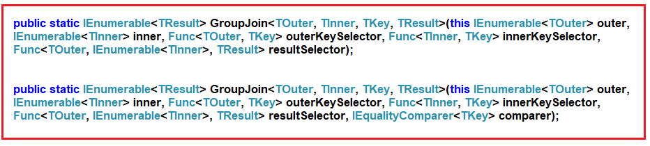
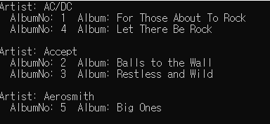

# 조인 연산자 : Join, GroupJoin
SQL Server, Oracle, MySQL 등과 같은 데이터베이스 시스템에 대한 경험이 있는 경우 SQL Join에 익숙할 것이다. LINQ 조인도 다르지 않다. 두 개 이상의 데이터 원본(테이블 또는 개체)에 공통 속성을 이용하여 단일 결과 집합으로 만든다. 


예를 들어 다음 두 가지 데이터 소스 Album과 앨범 세부곡들의 정보인 Track이 있을때
  


공통 속성인 AlbumId로 조인된 결과는 아래와 같다.  
  

**조인의 종류**  

1. Join: 공통 속성을 기반으로 두 데이터 소스 또는 컬렉션을 결합하고 단일 결과 집합으로 만드는 데 사용된다.
2. GroupJoin: 공통 속성을 기반으로 두 데이터 소스 또는 컬렉션을 결합하는 데도 사용되지만 결과를 시퀀스 그룹으로 반환.

그 중 Join은 다음과 같은 여러가지 종류가 있다.

  

**샘플데이터**  

이번에는 4개의 샘플 컬렉션 데이터 Artist, Album, Track,  PlayList 를 사용할 것이다.

```cs
using System.Collections.Generic;

namespace LINQJoin
{
    public class Album
    {
        public int AlbumId { get; set; }
        public string Title { get; set; }

        public static List<Album> GetAllAlbums()
        {
            return new List<Album>()
            {
                new Album { AlbumId = 1, Title = "For Those About To Rock", ArtistId = 1},
                new Album { AlbumId = 2, Title = "Balls to the Wall", ArtistId = 2},
                new Album { AlbumId = 3, Title = "Restless and Wild", ArtistId = 2},
                new Album { AlbumId = 4, Title = "Let There Be Rock", ArtistId = 1},
                new Album { AlbumId = 5, Title = "Big Ones", ArtistId = 3 },
                new Album { AlbumId = 6, Title = "Jagged Little Pill", ArtistId = 4 },
            };
        }
    }

    public class Track
    {
        public int AlbumId { get; set; }
        public int TrackNo { get; set; }
        public string Name { get; set; }            

        public static List<Track> GetAllTracks()
        {
            return new List<Track>()
            {
                new Track { AlbumId = 1, TrackNo = 1, Name = "For Those About To Rock (We Salute You)"},
                new Track { AlbumId = 1, TrackNo = 2, Name = "Put The Finger On You"},
                new Track { AlbumId = 1, TrackNo = 3, Name = "Let's Get It Up",},
                new Track { AlbumId = 1, TrackNo = 4, Name = "Inject The Venom"},
                new Track { AlbumId = 1, TrackNo = 5, Name = "Snowballed"},
                new Track { AlbumId = 1, TrackNo = 6, Name = "Breaking The Rules"},
                new Track { AlbumId = 2, TrackNo = 1, Name = "Balls to the Wall"},
                new Track { AlbumId = 3, TrackNo = 1, Name = "Fast As a Shark"},
                new Track { AlbumId = 3, TrackNo = 2, Name = "Restless and Wild"},
                new Track { AlbumId = 3, TrackNo = 3, Name = "Princess of the Dawn"},
            };
        }
    }

    public class PlayList
    {            
        public int AlbumId { get; set; }
        public int TrackNo { get; set; }            
        public int CustomerId { get; set; }

        public static List<PlayList> GetAllPlayLists()
        {
            return new List<PlayList>()
            {
                new PlayList { AlbumId = 1, TrackNo = 1, CustomerId = 1},
                new PlayList { AlbumId = 1, TrackNo = 2, CustomerId = 1},
                new PlayList { AlbumId = 1, TrackNo = 3, CustomerId = 1},
                new PlayList { AlbumId = 3, TrackNo = 1, CustomerId = 1},
            };
        }
    }

    public class Artist
    {
        public int ArtistId { get; set; }
        public string Name { get; set; }

        public static List<Artist> GetAllArtists()
        {
            return new List<Artist>
            {
                new Artist {ArtistId = 1, Name = "AC/DC"},
                new Artist {ArtistId = 2, Name = "Accept"},
                new Artist {ArtistId = 3, Name = "Aerosmith"},
            };
        }
    }
}
```

ERD로 표현하면 다음과 같다.


<br/>

## <font color='dodgerblue' size="6">1) 내부 Join</font>     

- ### A. 내부 Join
    두 데이터 소스에서 일치하는 요소만 결과에 포함하고 일치하지 않으면 제거한다. 아래 다이어그램을 보면 교집합의 데이터만 포함됨을 알수 있다.

      

    내부 조인을 수행하는 동안 두 데이터 원본에 공통 요소 또는 속성이 있어야 합니다.

    이 연산자는 두 컬렉션의 데이터를 합쳐 새 컬렉션을 반환하며 SQL 조인과 동일하다.  
    
    잠깐 Linq Join 메서드의 정의를 살펴보자.

      

    웁쓰. 이해하기 너무 복잡하다. 한가지만 기억하면 되는데 두 가지 오버로드된 버전이 존재하고 차이점은 두 번째 오버로드된 버전에서는 비교자를 추가 매개변수로 받아들인다는 것이다.

    Linq Join은 다음 5가지 사항을 이해해야 한다.

    1. 외부 데이터 소스
    2. 내부 데이터 소스
    3. 외부 키 선택기(외부 데이터 소스 중 조인에 사용될 공통 키)
    4. 내부 키 선택기(내부 데이터 소스 중 조인에 사용될 공통 키)
    5. 결과 선택기(최종 결과에서 원하는 컬럼만 뽑아내기. 즉 Select절)


<br/>

- ### B.메서드 또는 쿼리 구문을 사용하는 내부 Join 예제
    **예제1: 간단예제(2개테이블 조인)**  
    다음은 앨범과 트랙정보를 Join하여 앨범타이틀, 트랙제목 2가지만을 보이게 할 것이다. 양쪽에 공통으로 존재하는 속성인 AlbumId를 이용해 조인을 수행한 후 new 익명형식으로 결과를 만든다.  
    
    ```cs
    using System.Linq;
    using System;

    namespace LINQJoin
    {
        class Program
        {
            static void Main(string[] args)
            {
                //Linq Method
                var JoinMS = Album.GetAllAlbums()               // 외부테이블. 드라이빙 테이블이라고도함
                    .Join(
                            Track.GetAllTracks(),               // 내부테이블
                            album => album.AlbumId,             // 외부테이블의 조인키
                            tr => tr.AlbumId,                   // 내부테이블의 조인키
                            (album, tr) => new                  // 조인 후 원하는 컬럼만 추출
                            {
                                AlbumTitle = album.Title,
                                TrackName = tr.Name,
                            }
                        );

                //Linq Query
                var JoinQS = (from album in Album.GetAllAlbums()
                          join tr in Track.GetAllTracks()
                            on album.AlbumId equals tr.AlbumId      // 조인 컬럼. 주의:on바로 뒤에는 첫번째 테이블
                          select new
                          {
                              AlbumTitle = album.Title,
                              TrackName = tr.Name,
                          }).ToList();

                foreach (var track in JoinMS)
                {
                    Console.WriteLine($"Album: {track.AlbumTitle, -25}, TrackTitle: {track.TrackName}");
                }

                Console.ReadKey();
            }
        }
    }
    ```

    결과  
      
    
    두 데이터 소스에서 일치하는 레코드만 가져온다. sql에 익숙하다면 싶게 이해할수 있을 것이다.
  
    <br>
    **예제2: 데이터소스 3개 이상**  
    데이터가 3개 이상일 경우 Join을 1번 더 사용해야 한다.
    
    다음은 아티스트명, 앨범명, 트랙제목 3개 속성만 추출해보자.

    Artist와 Album의 공통속성은 ArtistId,   
    Album과 Track의 공통속성은 AlbumId이다.    
    
    쉬운 버전
    ```cs
    using System.Linq;
    using System;

    namespace LINQJoin
    {
        class Program
        {
            static void Main(string[] args)
            {
                //Linq Method
                var JoinMS = Album.GetAllAlbums()           
                    .Join(
                            Artist.GetAllArtists(),         
                            album => album.ArtistId,        
                            art => art.ArtistId,            
                            (album, art) => new             
                            {
                                AlbumId = album.AlbumId,
                                ArtistName = art.Name,
                                AlbumTitle = album.Title
                            }
                        )
                    .Join(
                        Track.GetAllTracks(),
                        albumArt => albumArt.AlbumId,
                        tr => tr.AlbumId,
                        (albumArt, tr) => new
                        {
                            Artistname = albumArt.ArtistName,
                            AlbumTitle = albumArt.AlbumTitle,
                            TrackName = tr.Name
                        }
                    ).ToList();

                //Linq Query
                var JoinQS = (
                                from album in Album.GetAllAlbums()          // 첫번째 테이블
                                join art in Artist.GetAllArtists()          // 두번째 테이블
                                    on album.ArtistId equals art.ArtistId   // 조인컬럼.주의:on바로 뒤에는 첫번째 테이블의 키 
                                join tr in Track.GetAllTracks()
                                    on album.AlbumId equals tr.AlbumId
                                select new
                                {
                                    Artistname = art.Name,
                                    AlbumTitle = album.Title,
                                    TrackName = tr.Name
                                }
                            ).ToList();  

                foreach (var item in JoinMS)
                {
                    Console.WriteLine($"Artist: {item.Artistname, -10}, Album: {item.AlbumTitle,-25}, " +
                        $"TrackTitle: {item.TrackName}");
                }

                Console.ReadKey();
            }
        }
    }
    ```

    결과  
      
    
    각 단계별로 필요한 컬럼만 추출하여 다음단계와 비교한다. 이해하기 쉽다.


    어려운 버전: 몰라도 됨
    ```cs
    using System.Linq;
    using System;

    namespace LINQJoin
    {
        class Program
        {
            static void Main(string[] args)
            {
                //Linq Method
                var JoinMS = Album.GetAllAlbums()
                    .Join(
                            Artist.GetAllArtists(),
                            album => album.ArtistId,
                            ar => ar.ArtistId,
                            (album, ar) => new
                            {
                                ar, album
                            }
                        )
                    .Join(
                        Track.GetAllTracks(),
                        albumArtist => albumArtist.album.AlbumId,
                        tr => tr.AlbumId,
                        (albumArtist, tr) => new
                        {
                            tr, albumArtist
                        }
                    ).ToList();

                foreach (var item in JoinMS)
                {
                    Console.WriteLine($"Artist: {item.albumArtist.ar.Name, -10}, Album: {item.albumArtist.album.Title,-25}, " +
                        $"TrackTitle: {item.tr.Name}");
                }

                Console.ReadKey();
            }
        }
    }
    ```
    각 단계별로 필요한 컬럼만 추출하지 않고 모든 컬럼을 추출. 이해가 어렵다.
    

    <br>
    **예제3: 조인 컬럼 여러개**  
    테이블의 PK가 2개이상일 경우처럼 조인에 사용될 속성이 2개이상인 경우도 자주 발생한다. 그럴때는 조인컬럼을 위한 new 익명형식을 만들어서 비교해야 한다.  
    다음은 플레이리스트를 추출할때 각 트랙의 제목까지 추출한 예제이다.

    PlayList와 Track의 공통속성은 AlbumId, TrackNo이다.    
    
    ```cs
    using System.Linq;
    using System;

    namespace LINQJoin
    {
        class Program
        {
            static void Main(string[] args)
            {
                //Linq Method
                var JoinMS = PlayList.GetAllPlayLists().Join(
                Track.GetAllTracks(),
                pl => new { pl.AlbumId, pl.TrackNo },
                tr => new {tr.AlbumId, tr.TrackNo},
                (pl, tr) => new
                {
                    CustomerId = pl.CustomerId,
                    AlubmId = tr.AlbumId,
                    TrackNo = tr.TrackNo,
                    TrackName = tr.Name,
                });

                //Linq Query
                var JoinQS = (from pl in PlayList.GetAllPlayLists()
                            join tr in Track.GetAllTracks()
                                on new { pl.AlbumId, pl.TrackNo } equals new { tr.AlbumId, tr.TrackNo }
                            select new
                            {
                                CustomerId = pl.CustomerId,
                                AlubmId = tr.AlbumId,
                                TrackNo = tr.TrackNo,
                                TrackName = tr.Name,
                            }).ToList();

                foreach (var pl in JoinMS)
                {
                    Console.WriteLine($"CustomerId: {pl.CustomerId}, AlbumId:{pl.AlubmId}, " +
                        $"TrackNo: {pl.TrackNo}, TrackTitle: {pl.TrackName}");
                }

                Console.ReadKey();
            }
        }
    }
    ```

    결과  
      
    
    ```note
    메쏘드 구문보다 쿼리 구문이 이해하기가 훨씬 좋다. 데이터소스가 3개이상이 되면 더 심해진다. 가능한 쿼리 구문을 사용하는것이 이로울것 같다.
    ```

    <br>

## <font color='dodgerblue' size="6">2) GroupJoin</font>     

- ### A. GroupJoin 이란?
    sql에서 Join 후 그룹핑하는 것을 Linq에서는 GroupJoin 하나로 수행할 수 있다.

    앞의 그루핑쪽에서 본것처럼 그룹 조인은 결과를 두개의 계층으로 생성한다. 첫번째 계층은 집합화된 결과, 두번째는 원본데이터이다. Join메소드처럼 GroupJoin도 두 가지 오버로드된 버전이 존재한다.

      

    역시나 차이점은 두 번째 오버로드된 버전이 추가 IEqualityComparer를 사용한다는 것이다.

    1. 외부 데이터 소스
    2. 내부 데이터 소스
    3. 외부 키 선택기
    4. 내부 키 선택기
    5. 결과 선택기

- ### B.메서드 또는 쿼리 구문을 사용하는 내부 Join 예제
    **예제1: 간단예제**  
    Artist와 Album 샘플 데이터를 보면 Artist는 3명이지만 6번 Album이 존재하지 않는 4번 아티스트기록이 있다. inner join을 먼저 하기 때문에 6번 앨범은 결과에서 제외될것이다. 그 이후 그룹핑을 수행하게 된다.

    ```cs
    using System.Linq;
    using System;

    namespace LINQJoin
    {
        class Program
        {
            static void Main(string[] args)
            {
                //Linq GroupJoin Method
                var GroupJoinMS = Artist.GetAllArtists()
                    .GroupJoin(
                        Album.GetAllAlbums(),
                        art => art.ArtistId,
                        album => album.ArtistId,
                        (art, album) => new {art, album});

                foreach (var group in GroupJoinMS)
                {
                    Console.WriteLine($"Artist: {group.art.Name}");

                    foreach (var item in group.album)
                    {
                        Console.WriteLine($"  AlbumNo: {item.AlbumId}  Album: {item.Title}");
                    }

                    Console.WriteLine();
                }

                Console.ReadKey();
            }
        }
    }
    ```

    결과  
      
    
    6번 앨범의 Artist ID가 4인데 4인 아티스트는 존재하지 않기 때문에 결과에서 제외되었다.

    **예제2: 쿼리구문예제**  
    쿼리 구문에는 GroupJoin 연산자가 존재하지 않기 때문에 "into" 와 함께 내부 조인을 사용해야 한다.

    ```cs
    using System.Linq;
    using System;

    namespace LINQJoin
    {
        class Program
        {
            static void Main(string[] args)
            {
                //Linq Query
                var GroupJoinQS = from art in Artist.GetAllArtists()
                                join album in Album.GetAllAlbums()
                                    on art.ArtistId equals album.ArtistId
                                into ArtistGroups                       // Grouping 결과를 임시저장소에 저장
                                select new { art, ArtistGroups };     // Grouping 결과인 ArtistGroups 사용에 주의

                foreach (var group in GroupJoinQS)
                {
                    Console.WriteLine($"Artist: {group.art.Name}");

                    foreach (var item in group.ArtistGroups)
                    {
                        Console.WriteLine($"  AlbumNo: {item.AlbumId}  Album: {item.Title}");
                    }

                    Console.WriteLine();
                }

                Console.ReadKey();
            }
        }
    }
    ```


    **예제3: 사용자 정의구문예제**  
    아래 예와 같이 사용자 정의 이름을 지정할 수도 있습니다.

    ```cs
    using System.Linq;
    using System;

    namespace LINQJoin
    {
        class Program
        {
            static void Main(string[] args)
            {
                //Using Method Syntax
                var GroupJoinMS = Artist.GetAllArtists()
                .GroupJoin(
                    Album.GetAllAlbums(),
                    art => art.ArtistId,
                    album => album.ArtistId,
                    (art, album) => new
                    {
                        Artists = art,
                        Albums = album
                    }
                );

                //Linq Query
                var GroupJoinQS = from art in Artist.GetAllArtists()
                                join album in Album.GetAllAlbums()
                                    on art.ArtistId equals album.ArtistId
                                into ArtistGroups
                                select new 
                                {
                                    Artists = art,
                                    Albums = ArtistGroups
                                };

                foreach (var group in GroupJoinQS)
                {
                    Console.WriteLine($"Artist: {group.Artists.Name}");

                    foreach (var item in group.Albums)
                    {
                        Console.WriteLine($"  AlbumNo: {item.AlbumId}  Album: {item.Title}");
                    }

                    Console.WriteLine();
                }

                Console.ReadKey();
            }
        }
    }
    ```
## <font color='dodgerblue' size="6">3) 왼쪽 Join</font>     

- ### A. 왼쪽 Join
    sql의 left join처럼 두 데이터 소스에서 왼쪽에 위치한 데이터 위주로 결과를 만든다. 왼쪽 데이터가 오른쪽에 없으면 null로 표시된다.  

