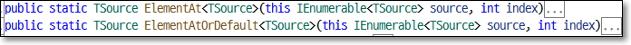
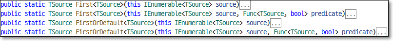
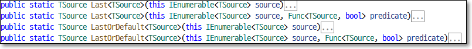
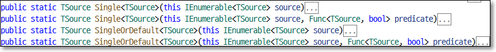
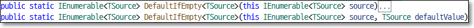

# 단일선택 : First, Last, Single, ElementAt, DefaultEmpty
Linq 컬렉션에서 단일 데이터만 선택하는 메서드들을 단일선택 연산자라고 한다.

    1. ElementAt, ElementAtOrDefault : 컬렉션에서 인덱스 번호로 단일 데이터를 선택
    2. First, FirstOrDefault         : 컬렉션에서 첫번째 데이터 선택
    3. Last, LastOrDefault           : 컬렉션에서 마지막 데이터 선택
    4. Single, SingleOrDefault       : 컬렉션에서 단일 데이터 선택
    5. DefaultIfEmpty                : 

<br>

## <font color='dodgerblue' size="6">1) ElementAt와 ElementAtOrDefault</font>   
- ### A. ElementAt, ElementAtOrDefault 란?
    Linq 컬렉션에서 인덱스 번호로 1개의 데이터를 추출.  
    
      
    
    위 2개 메서드 모두 매개변수는 1개이며 인덱스 번호. 0부터 시작.

    ElementAt은 빈 컬렉션이거나 인덱스번호가 범위를 벗어나면 ArgumentOutOfRangeException 예외를 발생시키는데 ElementAtOrDefault을 사용하면 예외대신 해당 데이터타입의 기본값 반환.

    <br>
- ### B.메서드 또는 쿼리 구문 사용 예제
        1. ElementAt 예제
        2. ElementAtOrDefault 예제
        3. Query 구문 예제

    <br>
   - **예제1: ElementAt**  
        인덱스 번호 3에 있는 데이터 선택. 

        ```cs
        using System.Linq;
        using System;
        using System.Collections.Generic;

        namespace LINQJoin
        {
            class Program
            {
                static void Main(string[] args)
                {
                    List<int> numbers = new List<int>() { 1, 20, 5, 7, 9, 10 };
                    int MethodSyntax = numbers.ElementAt(3);
                    Console.WriteLine(MethodSyntax);

                    Console.ReadKey();
                }
            }
        }
        ```
    
        <div style='background-color:#fff5b1;border:1px solid black;width:200px;font-size:13px;padding:0.5em'>
        7
        </div>    
        0부터 시작하니까 4번째 데이터인 7 리턴.     
  
        <br>

    - **예제2: ElementAtOrDefault**  
        ElementAt메서드는 인덱스 범위를 벗어나거나 또는 빈 컬렉션일 경우 ArgumentOutOfRangeException 예외가 발생하는데 이를 피하기 위해 ElementAtOrDefault를 사용. 
        
        ```cs
        using System.Linq;
        using System;
        using System.Collections.Generic;

        namespace LINQJoin
        {
            class Program
            {
                static void Main(string[] args)
                {
                    List<int> numbers = new List<int>() { 1, 2, 3, 4, 5, 6, 7, 8, 9, 10 };  
                    //int MethodSyntax = numbers.ElementAtOrDefault(12);     //에러 발생
                    int MethodSyntax = numbers.ElementAtOrDefault(12);      // 기본값 0
                    Console.WriteLine(MethodSyntax);

                    Console.ReadKey();
                }
            }
        }
        ```

        <div style='background-color:#fff5b1;border:1px solid black;width:200px;font-size:13px;padding:0.5em'>
        0
        </div>  
        인덱스번호 12은 컬렉션의 범위를 벗어나기 때문에 int 컬렉션의 기본값인 0을 반환.

        <br>

    - **예제3: Query 구문**  
        Query 구문에는 해당 기능이 존재하지 않기 때문에 혼합 구문을 사용해야 한다.
        ```cs
        using System.Linq;
        using System;
        using System.Collections.Generic;

        namespace LINQJoin
        {
            class Program
            {
                static void Main(string[] args)
                {
                    List<int> numbers = new List<int>() { 1, 2, 3, 4, 5, 6, 7, 8, 9, 10 };

                    int QuerySyntax = (from num in numbers
                                        select num).ElementAt(1);

                    int QuerySyntaxOrDefault = (from num in numbers
                                                select num).ElementAtOrDefault(1);

                    Console.WriteLine(QuerySyntax);
                    Console.WriteLine(QuerySyntaxOrDefault);
                    Console.ReadKey();
                }
            }
        }
        ```

        <div style='background-color:#fff5b1;border:1px solid black;width:200px;font-size:13px;padding:0.5em'>
        2<br>
        2<br>
        </div>  

    <br>
- ### C. 컬렉션의 item속성과 비교
    모든 컬렉션에는 item속성의 첨자를 이용하여 단일 데이터를 선택할수 있지만 역시나 범위를 벗어나면  예외가 발생한다. 
    
    ElementAt과 첨자방식 모두 기능이 동일하다. 차이점이라면 첨자방식은 System.Collections.Generic의 기본 기능이고 ElementAt은 System.Linq 네임스페이스에 있다는 것이다.

    ```cs
    using System.Linq;
    using System;
    using System.Collections.Generic;

    namespace LINQJoin
    {
        class Program
        {
            static void Main(string[] args)
            {
                List<int> numbers = new List<int>() { 1, 2, 3, 4, 5, 6, 7, 8, 9, 10 };

                int data = numbers[1];

                Console.WriteLine(data);
                Console.ReadKey();
            }
        }
    }
    ```

    <div style='background-color:#fff5b1;border:1px solid black;width:200px;font-size:13px;padding:0.5em'>
    2    
    </div>  

    <br>

## <font color='dodgerblue' size="6">2) First, FirstAtOrDefault</font>   
- ### A. First, FirstAtOrDefault 설명
    Linq 컬렉션에서 첫번째 항목을 가져온다.

      

    First는 빈 컬렉션일 경우 또는 지정된 조건식이 데이터를 반환하지 않을 경우 InvalidOperationException 예외가 발생한다. 그에 비해 FirstOrDefault는 해당 데이터타입의 기본값을 발생하기 때문에 예외처리로 인한 번거로움을 피할수 있다.

    2개 모두 각각 매개변수 없는 기본버전과 람다 조건식 매개변수가 존재하는 2개의 버전이 존재.
    
- ### B.메서드 또는 쿼리 구문 사용 예제
        1. First 예제
        2. FirstOrDefault 예제
        3. Query 구문 예제

    <br>
   - **예제1: First**  
        결과중에 첫번째 데이터를 반환

        ```cs
        using System.Linq;
        using System;
        using System.Collections.Generic;

        namespace LINQDemo
        {
            class Program
            {
                static void Main(string[] args)
                {
                    List<int> numbers = new List<int>() { 1, 2, 3, 4, 5, 6, 7, 8, 9, 10 };
                    int MethodSyntax1 = numbers.First();                        //매개변수 없는 First
                    Console.WriteLine(MethodSyntax1);
                    
                    int MethodSyntax2 = numbers.First(num => num % 3 == 0);     //조건식이 매개변수 있는 First
                    Console.WriteLine(MethodSyntax2);

                    Console.ReadKey();
                }
            }
        }        
        ```

        <div style='background-color:#fff5b1;border:1px solid black;width:200px;font-size:13px;padding:0.5em'>
        1<br>
        3<br>
        </div>  
        매개변수 없는 기본 First메서드는 컬렉션의 첫번째인 1을 반환하고  
        조건식이 매개변수인 두번째 First는 3로 딱 나눠지는 숫자 중 첫번째 결과인 3을 리턴한다.

    <br>
   - **예제2: FirstOrDefault**  
        컬렉션의 데이터가 없거나 결과가 존재하지 않는다면 예외를 반환하지 않고 기본값을 반환

        ```cs
        using System.Linq;
        using System;
        using System.Collections.Generic;
        namespace LINQDemo
        {
            class Program
            {
                static void Main(string[] args)
                {
                    //Empty Data Source
                    List<int> numbersEmpty = new List<int>() { };
                    int MethodSyntax1 = numbersEmpty.FirstOrDefault();
                    Console.WriteLine(MethodSyntax1);

                    //Specified condition doesnot return any element
                    List<int> numbers = new List<int>() { 1, 2, 3, 4, 5, 6, 7, 8, 9, 10 };
                    int MethodSyntax2 = numbers.FirstOrDefault(num => num > 7);
                    Console.WriteLine(MethodSyntax2);

                    Console.ReadKey();
                }
            }
        }
        ```
        <div style='background-color:#fff5b1;border:1px solid black;width:200px;font-size:13px;padding:0.5em'>
        0<br>
        8<br>
        </div>         
        첫번째 FirstorDefault는 컬렉션이 비어있지만 int타입의 기본값인 0을 반환.  
        두번째는 7보다 큰 결과 중에서 맨 처음인 8 리턴.

    <br>
   - **예제3: Query 구문**  
        query구문에는 First, FirstOrDefault가 존재하지 않기에 혼합방식 사용
        ```
        using System.Linq;
        using System;
        using System.Collections.Generic;
        namespace LINQDemo
        {
            class Program
            {
                static void Main(string[] args)
                {
                    List<int> numbers = new List<int>() { 1, 2, 3, 4, 5, 6, 7, 8, 9, 10 };

                    int QuerySyntax1 = (from num in numbers
                                        select num).First();

                    int QuerySyntax2 = (from num in numbers
                                        select num).FirstOrDefault();

                    Console.WriteLine(QuerySyntax1);
                    Console.WriteLine(QuerySyntax2);
                    Console.ReadKey();
                }
            }
        }
        ```
        <div style='background-color:#fff5b1;border:1px solid black;width:200px;font-size:13px;padding:0.5em'>
        1<br>
        1<br>
        </div> 


## <font color='dodgerblue' size="6">3) Last, LastAtOrDefault</font>   
- ### A. Last, LastAtOrDefault 설명
    Linq 컬렉션에서 마지막 항목을 가져온다.

      

    Last는 빈 컬렉션일 경우 또는 지정된 조건식이 데이터를 반환하지 않을 경우 InvalidOperationException 예외가 발생한다. 그에 비해 LastOrDefault는 해당 데이터타입의 기본값을 발생하기 때문에 예외처리로 인한 번거로움을 피할수 있다.

    2개 모두 각각 매개변수 없는 기본버전과 람다 조건식 매개변수가 존재하는 2개의 버전이 존재.
    
- ### B.메서드 또는 쿼리 구문 사용 예제
        1. Last 예제
        2. LastOrDefault 예제
        3. Query 구문 예제

    <br>
   - **예제1: Last**  
        결과중에 마지막 데이터를 반환

        ```cs
        using System.Linq;
        using System;
        using System.Collections.Generic;

        namespace LINQDemo
        {
            class Program
            {
                static void Main(string[] args)
                {
                    List<int> numbers = new List<int>() { 1, 2, 3, 4, 5, 6, 7, 8, 9, 10 };
                    int MethodSyntax1 = numbers.Last();
                    Console.WriteLine(MethodSyntax1);
                    
                    int MethodSyntax2 = numbers.Last(num => num % 2 == 1);
                    Console.WriteLine(MethodSyntax2);

                    Console.ReadKey();
                }
            }
        }        
        ```

        <div style='background-color:#fff5b1;border:1px solid black;width:200px;font-size:13px;padding:0.5em'>
        10<br>
        9<br>
        </div>  
        매개변수 없는 기본 Last메서드는 컬렉션의 마지막인 10을 반환하고  
        조건식이 매개변수인 두번째 Last는 2로 나눈 나머지가 1인 결과 중 마지막인 9를 리턴함을 알수 있다.

    <br>
   - **예제2: LastOrDefault**  
        컬렉션의 데이터가 없거나 결과가 존재하지 않는다면 예외를 반환하지 않고 기본값을 반환

        ```cs
        using System.Linq;
        using System;
        using System.Collections.Generic;
        namespace LINQDemo
        {
            class Program
            {
                static void Main(string[] args)
                {
                    //Empty Data Source
                    List<int> numbersEmpty = new List<int>() { };
                    int MethodSyntax1 = numbersEmpty.LastOrDefault();
                    Console.WriteLine(MethodSyntax1);

                    //Specified condition doesnot return any element
                    List<int> numbers = new List<int>() { 1, 2, 3, 4, 5, 6, 7, 8, 9, 10 };
                    int MethodSyntax2 = numbers.LastOrDefault(num => num > 7);
                    Console.WriteLine(MethodSyntax2);

                    Console.ReadKey();
                }
            }
        }
        ```
        <div style='background-color:#fff5b1;border:1px solid black;width:200px;font-size:13px;padding:0.5em'>
        0<br>
        10<br>
        </div>         
        첫번째 LastorDefault는 컬렉션이 비어있지만 int타입의 기본값인 0을 반환.  
        두번째는 7보다 큰 결과 중에서 마지막인 10 리턴.

    <br>
   - **예제3: Query 구문**  
        query구문에는 Last, LastOrDefault가 존재하지 않기에 혼합방식 사용
        ```
        using System.Linq;
        using System;
        using System.Collections.Generic;
        namespace LINQDemo
        {
            class Program
            {
                static void Main(string[] args)
                {
                    List<int> numbers = new List<int>() { 1, 2, 3, 4, 5, 6, 7, 8, 9, 10 };

                    int QuerySyntax1 = (from num in numbers
                                        select num).Last();

                    int QuerySyntax2 = (from num in numbers
                                        select num).LastOrDefault();

                    Console.WriteLine(QuerySyntax1);
                    Console.WriteLine(QuerySyntax2);
                    Console.ReadKey();
                }
            }
        }
        ```
        <div style='background-color:#fff5b1;border:1px solid black;width:200px;font-size:13px;padding:0.5em'>
        1<br>
        1<br>
        </div> 

    <br>

## <font color='dodgerblue' size="6">4) Single와 SingleAtOrDefault</font>   
- ### A. Single, SingleAtOrDefault 설명
    Linq 컬렉션에서 유일한 항목을 가져온다.

      

    Single는 컬렉션에서 유일한 값을 반환한다. 다음과 같은 경우 InvalidOperationException 예외가 발생한다. 
    
        1. 컬렉션이 비어 있거나
        2. 결과에 유일한 값이 1개보다 많을 경우
        3. 결과가 없거나

    빈 컬렉션이거나 지정된 조건식이 유일하지 않은 데이터가 존재 할 경우 예외가 발생하지만 SingleOrDefault는 해당 데이터타입의 기본값을 발생하기 때문에 예외처리로 인한 번거로움을 피할수 있다.

    단 결과에 고유한 값이 2개 존재할 경우 예외가 발생하는 것은 Single과 동일하다.

    2개 모두 각각 매개변수 없는 기본버전과 람다 조건식 매개변수가 존재하는 2개의 버전이 존재.
    
    <br>
- ### B.메서드 또는 쿼리 구문 사용 예제
        1. Single 예제
        2. SingleOrDefault 예제

    <br>
   - **예제1: Single**  
        결과중에 유일한 값 반환

        ```cs        
        using System.Linq;
        using System;
        using System.Collections.Generic;

        namespace LINQDemo
        {
            class Program
            {
                static void Main(string[] args)
                {
                    List<int> sample1 = new List<int>() { 10 };
                    int number1 = sample1.Single();
                    Console.WriteLine(number1);

                    List<int> sample2 = new List<int>() { 10, 20, 30 };
                    int number2 = sample2.Single(num => num == 20);
                    Console.WriteLine(number2);
                    
                    Console.ReadKey();
                }
            }
        }   
        ```       

        <div style='background-color:#fff5b1;border:1px solid black;width:200px;font-size:13px;padding:0.5em'>
        10<br>
        20
        </div>  
        첫번째 Single은 컬렉션에 유일한 값 10만 존재하기 때문에 10반환  
        두번째는 고유한 값이 3개 존재하지만 조건식이 20만 반환하기 때문에 예외가 발생하지 않고 20리턴

        
        InvalidOperationException 예외 발생하는 경우
        ```cs        
        using System.Linq;
        using System;
        using System.Collections.Generic;

        namespace LINQDemo
        {
            class Program
            {
                static void Main(string[] args)
                {
                    // 빈 컬렉션
                    List<int> sample1 = new List<int>() {};
                    int number1 = nusample1mbers.Single();
                    Console.WriteLine(number1);
                    
                    // 고유한 값이 3개 존재
                    List<int> sample2 = new List<int>() {10, 20, 30};
                    int number2 = sample2.Single();
                    Console.WriteLine(number2);

                    // 조건식에 맞는 결과 0건
                    List<int> sample3 = new List<int>() {10, 20, 30};
                    int number3 = sample3.Single(num => num > 40);
                    Console.WriteLine(number3);

                    Console.ReadKey();
                }
            }
        }   
        ```

    <br>
   - **예제2: SingleOrDefault**  
        컬렉션의 데이터가 없거나 결과가 존재하지 않는다면 예외를 반환하지 않고 기본값을 반환

        ```cs
        using System.Linq;
        using System;
        using System.Collections.Generic;
        namespace LINQDemo
        {
            class Program
            {
                static void Main(string[] args)
                {
                    List<int> numbersEmpty = new List<int>() { };
                    int MethodSyntax1 = numbersEmpty.SingleOrDefault();
                    Console.WriteLine(MethodSyntax1);

                    List<int> numbers = new List<int>() { 1, 2, 3, 4, 5, 6, 7, 8, 9, 10 };
                    int MethodSyntax2 = numbers.SingleOrDefault(num => num > 12);
                    Console.WriteLine(MethodSyntax2);

                    Console.ReadKey();
                }
            }
        }
        ```
        <div style='background-color:#fff5b1;border:1px solid black;width:200px;font-size:13px;padding:0.5em'>
        0<br>
        0<br>
        </div>         
        첫번째 SingleorDefault는 빈 컬렉션이지만 int의 기본값 0을 반환.  
        두번째는 12보다 큰 결과는 없지만 int의 기본값 0 리턴.

    
## <font color='dodgerblue' size="6">5) DefaultIfEmpty</font>   
- ### A. DefaultIfEmpty 설명
    Linq 컬렉션에서 결과가 비어있으면 기본값, 그러지 않으면 원래 결과 리턴

      
    첫번째 버전은 결과가 비어 있으면 무조건 해당 데이터타입의 기본값을 리턴하지만 두번째는 원하는 기본값을 지정할 수 있다.

    <br>
- ### B.메서드 또는 쿼리 구문 사용 예제
        1. DefaultIfEmpty(결과 비어 있지 않을 경우)
        2. DefaultIfEmpty(결과 비어 있음)
        3. DefaultIfEmpty(결과 비어 있고 특정 기본값 지정)

    <br>
    - **예제1: DefaultIfEmpty(비어 있지 않음)**  
        ```cs
        using System.Linq;
        using System;
        using System.Collections.Generic;

        namespace LINQDemo
        {
            class Program
            {
                static void Main(string[] args)
                {
                    List<int> numbers = new List<int>() {10, 20, 30};
                    IEnumerable<int> result = numbers.DefaultIfEmpty();
                    foreach (int num in result)
                    {
                        Console.WriteLine(num);
                    }
                    Console.ReadKey();
                }
            }
        }
        ```

        <div style='background-color:#fff5b1;border:1px solid black;width:200px;font-size:13px;padding:0.5em'>
        10<br>
        20<br>
        30<br>
        </div>      

    <br>
    - **예제2: DefaultIfEmpty(비어 있음)**  
        ```cs
        using System.Linq;
        using System;
        using System.Collections.Generic;

        namespace LINQDemo
        {
            class Program
            {
                static void Main(string[] args)
                {
                    List<int> numbers = new List<int>() {};
                    IEnumerable<int> result = numbers.DefaultIfEmpty();
                    foreach (int num in result)
                    {
                        Console.WriteLine(num);
                    }
                    Console.ReadKey();
                }
            }
        }
        ```

        <div style='background-color:#fff5b1;border:1px solid black;width:200px;font-size:13px;padding:0.5em'>
        0
        </div>      

    <br>
    - **예제3: DefaultIfEmpty(비어 있고 기본값 지정)**  
        ```cs
        using System.Linq;
        using System;
        using System.Collections.Generic;

        namespace LINQDemo
        {
            class Program
            {
                static void Main(string[] args)
                {
                    List<int> numbers = new List<int>() {};
                    IEnumerable<int> result = numbers.DefaultIfEmpty(5);
                    foreach (int num in result)
                    {
                        Console.WriteLine(num);
                    }
                    Console.ReadKey();
                }
            }
        }
        ```

        <div style='background-color:#fff5b1;border:1px solid black;width:200px;font-size:13px;padding:0.5em'>
        5
        </div>      
        결과가 비어 있고 기본값 5를 지정했다. 만약 결과가 비어 있지 않으면 기본값은 전혀 쓸모가 없다.
