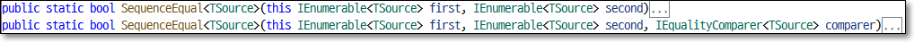

# 데이터비교 : SequenceEqual 
두 개 컬렉션의 결과가 동일한지 체크. 
동일한 갯수의 데이터가 있고 동일한 값과 동일한 순서이며 True 리턴.

다음 이미지와 같이 이 SequenceEqual 메서드에 사용할 수 있는 두 가지 오버로드된 버전이 있다.

  

보시다시피 두 번째 오버로드된 버전은 추가 IEqualityComparer 매개변수를 사용.

<br>

- ## A.메서드 또는 쿼리 구문 사용 예제
        1. 동일 갯수, 동일순서의 컬렉션 비교
        2. ElementAtOrDefault 예제
        3. Query 구문 예제
        4. 순서틀림

    <br>

   - **예제1: 동일갯수, 동일순서 컬렉션비교**  
        다음은 도시를 저장하는 두 개의 컬렉션을 만들었다. 두 컬렉션에는 동일한 수의 데이터가 동일한 순서로 존재한다. 따라서 여기서 SequenceEqual 메서드로 비교하면 결과는 True.

        ```cs
        using System.Linq;
        using System;
        using System.Collections.Generic;

        namespace LINQDemo
        {
            class Program
            {
                static void Main(string[] args)
                {
                    List<string> cityList1 = new List<string> { "Delhi", "Mumbai", "Hyderabad" };
                    List<string> cityList2 = new List<string> { "Delhi", "Mumbai", "Hyderabad" };

                    bool IsEqual = cityList1.SequenceEqual(cityList2);

                    Console.WriteLine(IsEqual);

                    Console.ReadKey();
                }
            }
        }
        ```
    
        <div style='background-color:#fff5b1;border:1px solid black;width:200px;font-size:13px;padding:0.5em'>
            True
        </div>
  
        <br>

    - **예제2:**  
        SequencesEqual 메서드에 사용되는 기본 비교자는 대소문자를 구분합니다. 따라서 아래 예에서는 값이 대소문자를 구분하므로 false를 반환.
        
        ```cs
        using System.Linq;
        using System;
        using System.Collections.Generic;

        namespace LINQDemo
        {
            class Program
            {
                static void Main(string[] args)
                {
                    List<string> cityList1 = new List<string> { "DELHI", "mumbai", "Hyderabad" };
                    List<string> cityList2 = new List<string> { "delhi", "MUMBAI", "Hyderabad" };

                    bool IsEqual = cityList1.SequenceEqual(cityList2);

                    Console.WriteLine(IsEqual);

                    Console.ReadKey();
                }
            }
        }
        ```

        <div style='background-color:#fff5b1;border:1px solid black;width:200px;font-size:13px;padding:0.5em'>
        False
        </div>  
        인덱스번호 12은 컬렉션의 범위를 벗어나기 때문에 int 컬렉션의 기본값인 0을 반환.

        <br>

    - **예제3:**  
        대소문자를 구분하지 않고 비교하려면 아래 예제와 같이 IEqualityComparer를 매개변수로 사용하는 SequenceEqual() 메서드의 다른 오버로드된 버전을 사용해야 합니다.

        ```cs
        using System.Linq;
        using System;
        using System.Collections.Generic;

        namespace LINQDemo
        {
            class Program
            {
                static void Main(string[] args)
                {
                    List<string> cityList1 = new List<string> { "DELHI", "mumbai", "Hyderabad" };
                    List<string> cityList2 = new List<string> { "delhi", "MUMBAI", "Hyderabad" };

                    bool IsEqual = cityList1.SequenceEqual(cityList2, StringComparer.OrdinalIgnoreCase);

                    Console.WriteLine(IsEqual);

                    Console.ReadKey();
                }
            }
        }
        ```

        <div style='background-color:#fff5b1;border:1px solid black;width:200px;font-size:13px;padding:0.5em'>
        True
        </div>  
        
        참고: StringComparer 클래스의 정의로 이동하면 이 클래스가 IEqualityComparer 인터페이스를 구현하는 것을 볼 수 있습니다

    - **예제4: 순서틀림**  
        다음 예제에서 SequenceEqual 메서드는 false를 반환합니다. 이는 데이터가 두 시퀀스에서 동일한 순서로 존재하지 않기 때문입니다.
        
        ```cs
        using System.Linq;
        using System;
        using System.Collections.Generic;

        namespace LINQDemo
        {
            class Program
            {
                static void Main(string[] args)
                {
                    List<string> cityList1 = new List<string> { "Delhi", "Mumbai", "Hyderabad" };
                    List<string> cityList2 = new List<string> { "Delhi", "Hyderabad", "Mumbai" };

                    bool IsEqual = cityList1.SequenceEqual(cityList2, StringComparer.OrdinalIgnoreCase);

                    Console.WriteLine(IsEqual);
                    Console.ReadKey();
                }
            }
        }
        ```

        <div style='background-color:#fff5b1;border:1px solid black;width:200px;font-size:13px;padding:0.5em'>
        False
        </div>  

    - **예제5: Query 구문**  
        이전 예제의 문제를 해결하려면 먼저 데이터를 정렬한 다음 아래 예제와 같이 SequenceEqual 메서드를 적용해야 합니다.
        
        ```cs
        using System.Linq;
        using System;
        using System.Collections.Generic;

        namespace LINQDemo
        {
            class Program
            {
                static void Main(string[] args)
                {
                    List<string> cityList1 = new List<string> { "Delhi", "Mumbai", "Hyderabad" };
                    List<string> cityList2 = new List<string> { "Delhi", "Hyderabad", "Mumbai" };

                    bool IsEqual = cityList1.OrderBy(city => city)
                            .SequenceEqual(cityList2.OrderBy(city => city), StringComparer.OrdinalIgnoreCase);

                    Console.WriteLine(IsEqual);
                    Console.ReadKey();
                }
            }
        }
        ```

        <div style='background-color:#fff5b1;border:1px solid black;width:200px;font-size:13px;padding:0.5em'>
        True
        </div>  

    <br>
- ### C. 복합 유형 작업:
    이 데모에서는 다음 학생 클래스로 작업할 것입니다. 따라서 이름이 Student.cs 인 클래스 파일을 만들고 다음 코드를 복사하여 붙여넣습니다.
    
    ```cs
    using System.Collections.Generic;
    namespace LINQDemo
    {
        public class Student
        {
            public int ID { get; set; }
            public string Name { get; set; }

            public static List<Student> GetStudents1()
            {
                List<Student> listStudents = new List<Student>()
                {
                    new Student{ID= 101,Name = "Preety"},
                    new Student{ID= 102,Name = "Priyanka"}
                };
                return listStudents;
            }

            public static List<Student> GetStudents2()
            {
                List<Student> listStudents = new List<Student>()
                {
                    new Student{ID= 101,Name = "Preety"},
                    new Student{ID= 102,Name = "Priyanka"}
                };
                return listStudents;
            }
        }
    }
    ```
    
    여기 위의 클래스에서 GetStudents1 및 GetStudents2의 두 가지 메서드를 만들었습니다. 또한 이 두 가지 방법이 동일한 데이터를 반환한다는 사실을 알게 된 경우.

    Program 클래스의 Main 메소드를 아래와 같이 수정해주세요 .

    ```cs
    using System.Linq;
    using System;
    using System.Collections.Generic;

    namespace LINQDemo
    {
        class Program
        {
            static void Main(string[] args)
            {
                List<Student> StudentList1 = Student.GetStudents1();
                List<Student> StudentList2 = Student.GetStudents2();

                bool IsEqual = StudentList1.SequenceEqual(StudentList2);

                Console.WriteLine(IsEqual);
                Console.ReadKey();
            }
        }
    }
    ```

    <div style='background-color:#fff5b1;border:1px solid black;width:200px;font-size:13px;padding:0.5em'>
    False    
    </div>  

    두 시퀀스 모두 동일한 데이터를 포함하지만 여기서는 False 로 출력을 얻습니다 . 복합 형식을 비교할 때 SequenceEqual 메서드에서 사용하는 기본 비교자는 개체 참조가 동일한지 여부만 확인하기 때문입니다.

    위의 문제를 해결하는 방법은 무엇입니까?
    위의 문제를 해결할 수 있는 방법은 여러 가지가 있습니다.

        1. IEqualityComparer 인터페이스 를 구현하는 사용자 지정 클래스를 전달할 수 있는 SequenceEqual 메서드의
            다른 오버로드된 버전을 사용해야 합니다.
        2. Equals() 및 GetHashCode() 메서드 를 재정의하는 새 익명 형식에 속성을 투영합니다 .
        3. Student 클래스에서 Equals() 및 GetHashCode() 메서드를 재정의합니다.

    <br>

    - **방법1: IEqualityComparer 구현**  
        이름이 StudentComparer.cs 인 클래스 파일을 만들고 다음 코드를 복사하여 붙여넣습니다. 보시다시피 이 클래스는 IEqualityComparer 인터페이스를 구현합니다

        ```cs
        using System.Collections.Generic;

        namespace LINQDemo
        {
            public class StudentComparer : IEqualityComparer<Student>
            {
                public bool Equals(Student x, Student y)
                {
                    return x.ID == y.ID && x.Name == y.Name;
                }

                public int GetHashCode(Student obj)
                {
                    return obj.ID.GetHashCode() ^ obj.Name.GetHashCode();
                }
            }
        }

        using System.Linq;
        using System;
        using System.Collections.Generic;

        namespace LINQDemo
        {
            class Program
            {
                static void Main(string[] args)
                {
                    List<Student> StudentList1 = Student.GetStudents1();
                    List<Student> StudentList2 = Student.GetStudents2();

                    StudentComparer studentComparer = new StudentComparer();
                    bool IsEqual = StudentList1.SequenceEqual(StudentList2, studentComparer);

                    Console.WriteLine(IsEqual);
                    Console.ReadKey();
                }
            }
        }
        ```
        위의 변경 사항으로 이제 응용 프로그램을 실행하고 True를 반환해야 합니다.

        <br>
    - **방법2: 익명 유형 사용**  
        ```cs
        using System.Linq;
        using System;
        using System.Collections.Generic;

        namespace LINQDemo
        {
            class Program
            {
                static void Main(string[] args)
                {
                    List<Student> StudentList1 = Student.GetStudents1();
                    List<Student> StudentList2 = Student.GetStudents2();

                    var IsEqual = StudentList1
                            .Select(std => new { std.ID, std.Name })
                            .SequenceEqual(StudentList2.Select(std => new { std.ID, std.Name }));
                    
                    Console.WriteLine(IsEqual);
                    Console.ReadKey();
                }
            }
        }
        ```

        <div style='background-color:#fff5b1;border:1px solid black;width:200px;font-size:13px;padding:0.5em'>
            True    
        </div>  

        <br>
    - **방법3: Student클래스에서 Equal 및 GetHashCode 메서드 재정의**  
        ```cs
        using System.Linq;
        using System;
        using System.Collections.Generic;

        namespace LINQDemo
        {
            public class Student
            {
                public int ID { get; set; }
                public string Name { get; set; }

                public static List<Student> GetStudents1()
                {
                    List<Student> listStudents = new List<Student>()
                    {
                        new Student{ID= 101,Name = "Preety"},
                        new Student{ID= 102,Name = "Priyanka"}
                    };
                    return listStudents;
                }

                public static List<Student> GetStudents2()
                {
                    List<Student> listStudents = new List<Student>()
                    {
                        new Student{ID= 101,Name = "Preety"},
                        new Student{ID= 102,Name = "Priyanka"}
                    };
                    return listStudents;
                }

                public override bool Equals(object x)
                {
                    return this.ID == ((Student)x).ID && this.Name == ((Student)x).Name;
                }

                public override int GetHashCode()
                {
                    return this.ID.GetHashCode() ^ this.Name.GetHashCode();
                }
            }            

            class Program
            {
                static void Main(string[] args)
                {
                    List<Student> StudentList1 = Student.GetStudents1();
                    List<Student> StudentList2 = Student.GetStudents2();

                    var IsEqual = StudentList1.SequenceEqual(StudentList2);
                    
                    Console.WriteLine(IsEqual);
                    Console.ReadLine();
                }
            }
        }
        ```

        <div style='background-color:#fff5b1;border:1px solid black;width:200px;font-size:13px;padding:0.5em'>
            True    
        </div>  


    <br>
